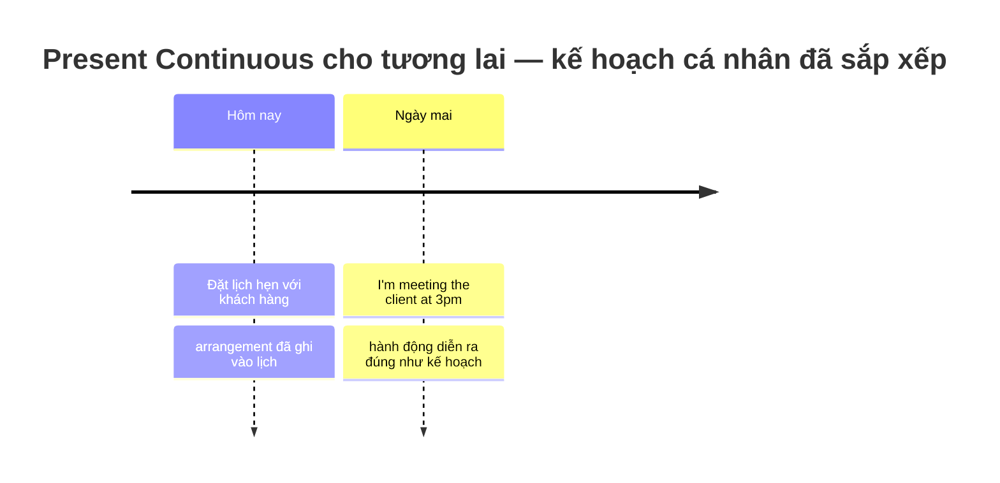
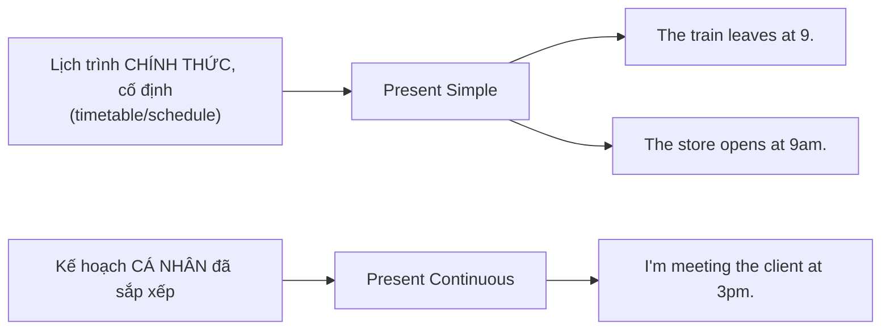
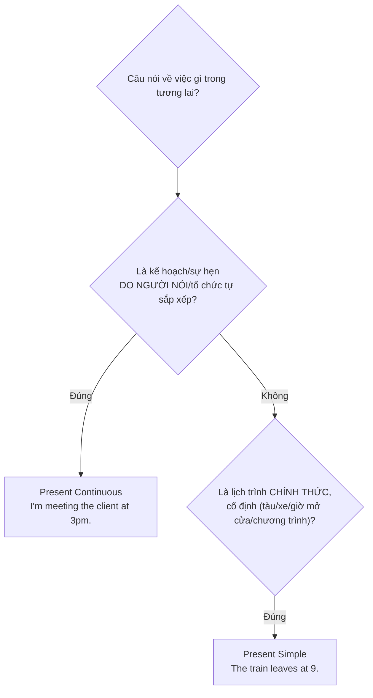

# 🗓️ Unit 19: Present Tenses for the Future (I am doing and I do)

> [!abstract] Trọng tâm Part 5 TOEIC
> - **Present Continuous (`be + V-ing`)** = **kế hoạch/sắp xếp cá nhân** đã **quyết định trước**, thường đi kèm thời gian cụ thể: *I**'m meeting** the client at 3 p.m. tomorrow.*
> - **Present Simple** = **lịch trình cố định, chính thức** (timetable) — không phải ý muốn cá nhân mà là chương trình đã niêm yết: *The **conference starts** at 9 a.m.*
> - Present Continuous trả lời câu hỏi **"Tôi/họ định làm gì?"**; Present Simple trả lời câu hỏi **"Chương trình/lịch quy định thế nào?"**
> - Hai thì có thể **xuất hiện cùng một câu**: *The **flight departs** at 9, so we**'re leaving** for the airport at 6.*
> - TOEIC hay đặt bối cảnh: thư mời họp, **itinerary** công tác, lịch **shipment**, thông báo nội bộ về **deadline**.

---

## A. Present Continuous for the future — kế hoạch, sắp xếp cá nhân

$$\mathbf{S + am/is/are + V\text{-}ing \;(+ \text{thời gian tương lai})}$$

| Đặc điểm | Giải thích | Ví dụ |
| :--- | :--- | :--- |
| Ý nghĩa | Việc **đã được quyết định và sắp xếp trước** (đặt lịch, đặt vé, hẹn gặp) | *I**'m meeting** the client at 3 p.m. tomorrow.* |
| Chủ thể | Thường là **người** (cá nhân/nhóm) chủ động lên kế hoạch | *We**'re holding** the quarterly review on Friday.* |
| Dấu hiệu thời gian | `tomorrow`, `next week`, `this evening`, `on Monday`, `at 3 p.m.` | *Ms. Lee**'s flying** to Tokyo next Monday.* |
| Có thể đổi | Gần nghĩa với `be going to`, nhưng nhấn mạnh **sự sắp xếp đã có sẵn** (đã đặt chỗ, đã ghi vào lịch) | *The board**'s reviewing** the budget proposal this afternoon.* |

**Ví dụ văn phòng:**
- *The sales team **is presenting** the new marketing plan at the board meeting tomorrow.*
- *I**'m attending** the annual conference in Chicago next week.*
- *We**'re finalizing** the shipment schedule with the supplier this afternoon.*

> [!note] Present Continuous KHÔNG dùng cho lịch trình mà bản thân không quyết định được
> ~~The train is leaving at 9.~~ (nếu ý nói **giờ tàu chạy theo lịch** — không phải kế hoạch cá nhân) → nên dùng Present Simple: **The train leaves at 9.**

---

## B. Present Simple for the future — lịch trình, thời gian biểu chính thức

$$\mathbf{S + V(s/es) \;(+ \text{thời gian tương lai})}$$

| Loại lịch trình | Ví dụ |
| :--- | :--- |
| Phương tiện di chuyển (flight, train, bus) | *The **flight departs** at 7:45 a.m. and **arrives** at 11:20 a.m.* |
| Giờ mở cửa / đóng cửa | *The registration desk **opens** at 8 and **closes** at 6.* |
| Chương trình sự kiện đã công bố | *The **conference starts** on Monday and **ends** on Wednesday.* |
| Hạn chót đã quy định | *The **deadline for** the proposal **falls** on the last Friday of the quarter.* |

**Ví dụ văn phòng:**
- *The shuttle bus **leaves** the hotel every hour on the hour.*
- *Our fiscal year **ends** on March 31.*
- *The **shipment arrives** at the warehouse on Thursday according to the carrier's schedule.*

> [!note] Vẫn có thể diễn tả ý định bằng cách nói qua lịch chính thức
> Khi bạn nói về chuyến đi cá nhân nhưng lấy mốc theo **giờ vé/lịch đã đặt**, người bản ngữ hay trộn cả hai: *My **flight leaves** at 9, so I**'m checking in** at the airport by 7.*

---

## C. Present Continuous vs Present Simple — so sánh trực tiếp

| Tiêu chí | Present Continuous | Present Simple |
| :--- | :--- | :--- |
| Nguồn quyết định | **Cá nhân/tổ chức tự sắp xếp** | **Lịch trình/chương trình có sẵn**, không do người nói quyết định |
| Có thể thay đổi? | Có thể dời lịch (arrangement) | Cố định, đã niêm yết công khai |
| Từ khóa thường gặp | `meeting`, `seeing`, `visiting`, `flying`, `starting` (kế hoạch cá nhân) | `timetable`, `schedule`, `according to`, giờ chuyến bay/tàu/cửa hàng |
| Ví dụ | *I**'m visiting** the factory on Tuesday.* | *The factory **opens** at 8 every day.* |

**Ví dụ so sánh cùng ngữ cảnh:**
- *The **conference starts** at 9 a.m. sharp* (lịch trình chính thức, không đổi) *, and I**'m arriving** an hour early to set up the booth* (kế hoạch cá nhân, có thể điều chỉnh).
- *The **shipment departs** the port on Friday* (theo lịch vận chuyển) *, so our team **is preparing** the customs documents today* (việc nhóm tự sắp xếp).

> [!caution] Các lỗi thường gặp
> 1. Dùng Present Simple cho kế hoạch cá nhân: ~~I meet the client at 3pm tomorrow.~~ → **I'm meeting the client at 3pm tomorrow.**
> 2. Dùng Present Continuous cho lịch trình cố định của phương tiện/tổ chức: ~~The flight is leaving at 7:45 every day.~~ → **The flight leaves at 7:45 every day.**
> 3. Nhầm Present Simple diễn tả thói quen chung với thì tương lai cụ thể có mốc thời gian: ~~The board reviews the budget tomorrow.~~ (khi đây là một cuộc họp đã đặt lịch riêng cho ngày mai) → **The board is reviewing the budget tomorrow.**
> 4. Quên chia động từ số ít/số nhiều ở Present Simple khi nói lịch trình: ~~The train leave at 9.~~ → **The train leaves at 9.**
> 5. Dùng `will` khi câu chỉ đơn thuần là kế hoạch đã có sẵn trong lịch (không phải quyết định tức thời) — xem thêm [[Unit 23 - I will and I'm going to]]: ~~I will meet the client at 3pm tomorrow — it's already on my calendar.~~ → **I'm meeting the client at 3pm tomorrow — it's already on my calendar.**

> [!tip] Mẹo chọn đáp án trong 5 giây
> Hỏi: **"Đây là lịch trình có sẵn (timetable/schedule) hay là ai đó tự sắp xếp?"**
> - Chủ ngữ là **phương tiện, cửa hàng, chương trình sự kiện đã công bố** → **Present Simple**.
> - Chủ ngữ là **người/nhóm người** kèm động từ chỉ hành động cá nhân (`meet`, `visit`, `fly`, `present`) + mốc thời gian cụ thể → **Present Continuous**.

---

## 🎯 Dấu hiệu nhận biết trong đề thi TOEIC Part 5 & 6

1. **Mốc thời gian tương lai cụ thể (`tomorrow`, `next Monday`, `at 3 p.m.`) + động từ chỉ hành động cá nhân** → **Present Continuous**:
   - *Mr. Carter **is presenting** the quarterly report at 3 p.m. tomorrow.*
2. **Chủ ngữ là phương tiện/cửa hàng/chương trình + động từ chỉ giờ giấc cố định** → **Present Simple**:
   - *The shuttle **departs** every 30 minutes from the main lobby.*
3. **Cụm `according to the schedule/itinerary`** → thường đi kèm **Present Simple**:
   - *According to the itinerary, the workshop **begins** at 10 a.m. and **ends** at noon.*
4. **Hai mệnh đề nối bằng `so`, `and` với một vế là lịch cố định, một vế là kế hoạch cá nhân** → chia đúng từng vế:
   - *The **flight leaves** at 9, so we**'re meeting** at the gate at 8:15.*
5. **Thư mời họp/email nội bộ nêu kế hoạch đã xác nhận** → **Present Continuous**:
   - *The finance team **is reviewing** the shipment invoices this Thursday.*

---

## 📎 Liên kết trong hệ thống

- Trước: [[Unit 18 - used to (do)]]
- Present Continuous (nền tảng của thì này): [[Unit 01 - Present Continuous (I am doing)]]
- Present Simple (nền tảng của thì này): [[Unit 02 - Present Simple (I do)]]
- So sánh với ý định/kế hoạch bằng `going to`: [[Unit 20 - I'm going to (do)]]

---
Trở về: [[English Grammar in Use MOC]] | [[TOEIC MOC]] | Bài tập: [[Unit 19 - Exercises (Present Tenses for the Future)]]
