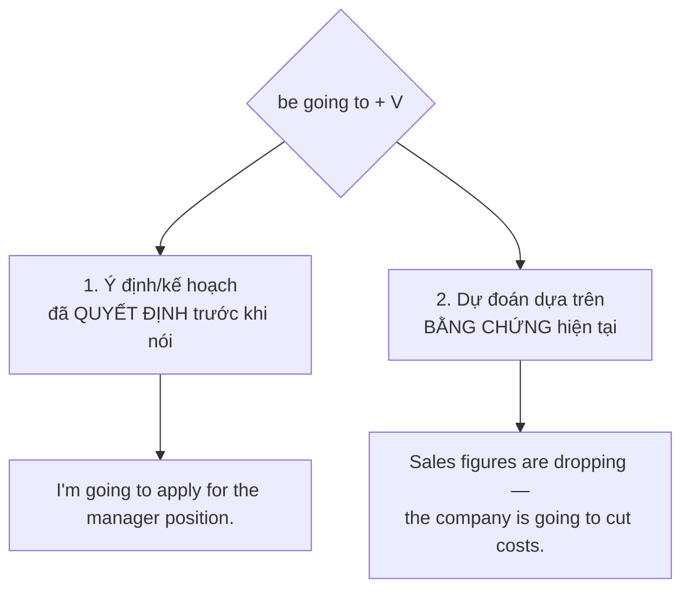
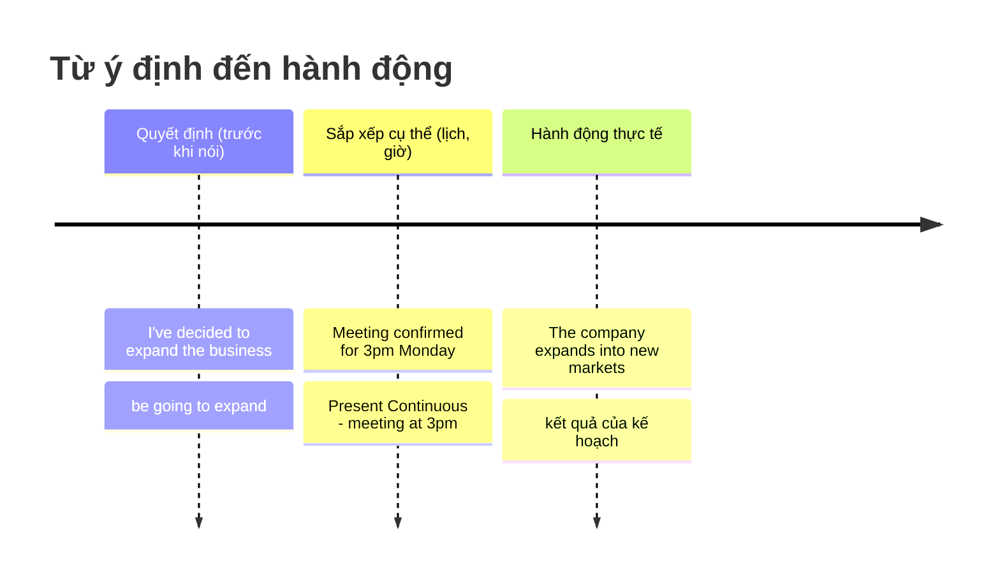

# 🚀 Unit 20: I'm going to (do)

> [!abstract] Trọng tâm Part 5 TOEIC
> - **`be going to + V`** diễn tả **hai ý nghĩa** chính: (1) **dự định/kế hoạch đã quyết định trước** khi nói — *We**'re going to launch** the new product next quarter.*; (2) **dự đoán dựa trên bằng chứng/dấu hiệu hiện tại** — *Look at those clouds — it**'s going to rain**.*
> - Công thức: **`am / is / are + going to + V (nguyên mẫu)`** — chủ ngữ số ít dùng `is`, số nhiều/`I` dùng `am/are`.
> - Khác với Present Continuous (Unit 19, dùng cho **lịch hẹn cá nhân cụ thể**), `be going to` nhấn mạnh **ý định/quyết định** dù chưa chắc đã sắp xếp cụ thể.
> - Dự đoán bằng `be going to` **luôn có bằng chứng cụ thể ở hiện tại** (mây đen, số liệu, biểu hiện) — khác với dự đoán bằng `will` (Unit 22) dựa trên **ý kiến/niềm tin chủ quan**.
> - Phủ định: **`am/is/are + not + going to + V`**; nghi vấn: **`Am/Is/Are + S + going to + V?`**.

---

## A. `be going to + V` — công thức và hai cách dùng

$$\mathbf{S + am/is/are\ (+\ not) + going\ to + V}$$

| Dạng | Cấu trúc | Ví dụ |
| :--- | :--- | :--- |
| Khẳng định | S + am/is/are + going to + V | *The board **is going to approve** the budget next week.* |
| Phủ định | S + am/is/are + not + going to + V | *We**'re not going to renew** the contract with that supplier.* |
| Nghi vấn | Am/Is/Are + S + going to + V? | ***Is** the company **going to expand** into the Asian market?* |

**1. Ý định / kế hoạch đã quyết định trước khi nói:**
- *Ms. Lopez **is going to present** the quarterly report at the meeting.*
- *We**'re going to relocate** our headquarters to Da Nang next year.*
- *The finance team **is going to review** all pending invoices this week.*

**2. Dự đoán dựa trên bằng chứng/dấu hiệu hiện tại (không phải ý kiến chủ quan):**
- *Look at the backlog of orders — the warehouse **is going to need** extra staff.*
- *The client sounds frustrated on the phone; he**'s going to cancel** the contract.*
- *Revenue has fallen for three straight quarters — the branch **is going to close**.*

> [!note] Bằng chứng phải rõ ràng, cụ thể
> `be going to` cho dự đoán đòi hỏi một **dấu hiệu quan sát được ngay lúc nói** (số liệu, tình huống, hành vi). Nếu chỉ là suy đoán chung chung không có bằng chứng cụ thể, người bản ngữ thường dùng `will` (xem Unit 22).

---

## B. So sánh với Present Continuous (Unit 19)

| Tiêu chí | Present Continuous | `be going to` |
| :--- | :--- | :--- |
| Nhấn mạnh | **Sự sắp xếp cụ thể** — đã có thời gian/địa điểm | **Ý định/quyết định** — có thể chưa sắp xếp chi tiết |
| Ví dụ | *I**'m meeting** the client at 3 p.m. tomorrow.* (đã hẹn giờ, địa điểm cụ thể) | *I**'m going to meet** the client sometime this week.* (mới quyết định, chưa chốt lịch) |
| Dùng chung được? | Có — nhiều trường hợp hai dạng đều đúng nghĩa tương tự với dự định cá nhân | Có, đặc biệt với động từ chỉ chuyển động (`go`, `come`, `leave`) |

- *We**'re going to hire** two new interns.* ≈ *We**'re hiring** two new interns next month.* (cả hai đều đúng nếu đã có kế hoạch)
- Nhưng **chỉ `be going to`** dùng được cho dự đoán từ bằng chứng: ~~It's raining tomorrow~~ (sai nếu chỉ là dự đoán) → **It**'s going to rain**.**

---

## C. Cấu trúc với động từ chỉ chuyển động và các dạng viết tắt

| Điểm cần lưu ý | Ví dụ |
| :--- | :--- |
| Với `go`/`come`, thường bỏ `going to go` → dùng Present Continuous thay thế | *I**'m going** to the conference tomorrow.* (thay vì *I'm going to go to the conference*) |
| `was/were going to` = dự định trong quá khứ **nhưng không thực hiện được** | *We **were going to sign** the deal, but the client withdrew.* |
| Dạng viết tắt trang trọng trong văn bản | *The committee **is going to** finalize the budget.* (không rút gọn `is` → `'s` trong văn bản formal) |

- *The CEO **was going to attend** the conference, but her flight was cancelled.*
- *They **were going to outsource** production, but they changed their minds after the cost analysis.*

> [!note] `was/were going to` — kế hoạch bị hủy
> Đây là dấu hiệu Part 5/6 rất hay gặp: mệnh đề `was/were going to + V` thường đi kèm `but` để chỉ **kế hoạch đã lên nhưng không xảy ra**.

---

## 🎯 Dấu hiệu nhận biết trong đề thi TOEIC Part 5 & 6

1. **Có mốc thời gian tương lai + ý quyết định rõ ràng** ("next month", "next quarter") kèm động từ chỉ hành động đã lên kế hoạch:
   - *The company **is going to launch** a new product line next quarter.*
2. **Có bằng chứng/số liệu cụ thể ngay trong câu** (dấu hiệu dự đoán):
   - *Given the rising demand, the factory **is going to increase** production capacity.*
3. **Cấu trúc `was/were going to` + `but`** → kế hoạch quá khứ không thành hiện thực:
   - *The board **was going to approve** the merger, but negotiations broke down.*
4. **Phân biệt với Present Continuous**: nếu câu có giờ/địa điểm cụ thể đã sắp xếp → ưu tiên Present Continuous; nếu chỉ là ý định/quyết định chung → `be going to`.
5. **Chủ ngữ số ít/số nhiều quyết định `is` hay `are`** — lỗi ngữ pháp cơ bản thường bị cài vào đáp án nhiễu:
   - *The department **is going to relocate**...* (số ít) vs *The employees **are going to relocate**...* (số nhiều)

> [!caution] Các lỗi thường gặp
> 1. Thiếu `to`: ~~We're going launch the product.~~ → **We're going to launch the product.**
> 2. Sai `be` theo chủ ngữ: ~~The team are going to submit the report.~~ (nếu coi team là số ít) → **The team is going to submit the report.**
> 3. Dùng `will` cho dự đoán có bằng chứng rõ ràng ngay trước mắt: ~~Look at the sky, it will rain.~~ → **Look at the sky, it's going to rain.**
> 4. Dùng động từ nguyên mẫu sai chỗ: ~~The firm is going expand its market.~~ → **The firm is going to expand its market.**
> 5. Nhầm quá khứ đơn với kế hoạch bị hủy: ~~We went to sign the deal, but the client withdrew.~~ → **We were going to sign the deal, but the client withdrew.**

> [!tip] Mẹo chọn đáp án trong 5 giây
> Thấy **`be going to`** trong đáp án → kiểm tra hai điều: (1) chủ ngữ khớp `am/is/are`; (2) sau `to` là **động từ nguyên mẫu** không chia. Nếu câu có `but` ngay sau `was/were going to`, gần như chắc chắn đáp án đúng nói về **kế hoạch bị hủy**.

---

## 📎 Liên kết trong hệ thống

- Trước: [[Unit 19 - Present Tenses for the Future (I am doing and I do)]] — Present Continuous/Simple cho tương lai vs `be going to` cho ý định.
- Thì Hiện tại đơn (lịch trình cố định): [[Unit 02 - Present Simple (I do)]]
- Thì Hiện tại tiếp diễn (sắp xếp cá nhân): [[Unit 01 - Present Continuous (I am doing)]]

---
Trở về: [[English Grammar in Use MOC]] | [[TOEIC MOC]] | Bài tập: [[Unit 20 - Exercises (I'm going to)]]
