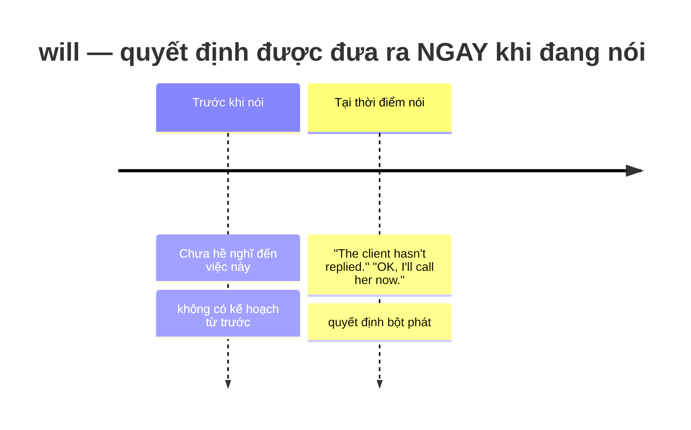
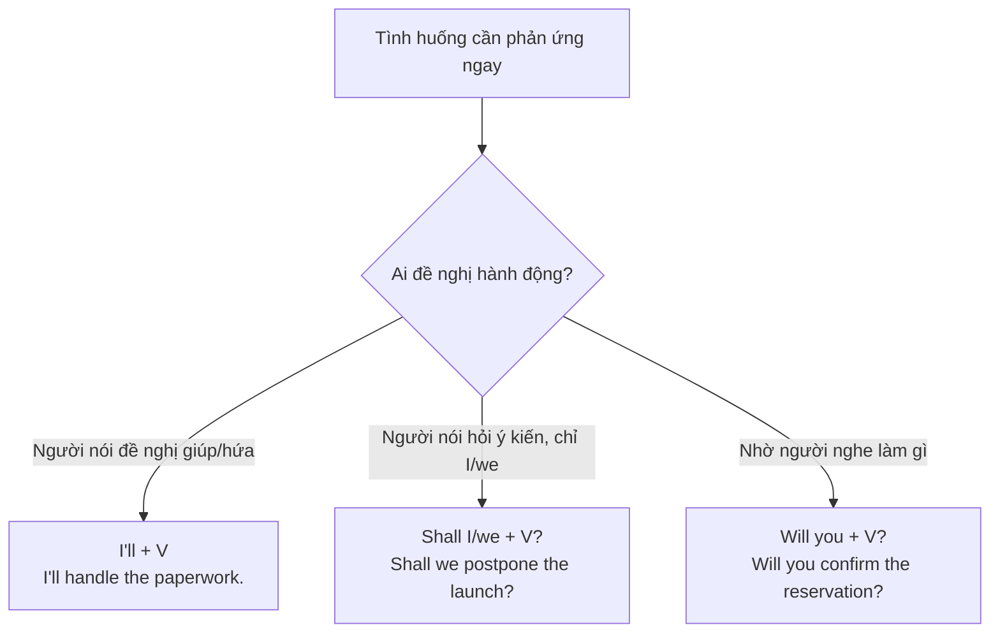

# 🤝 Unit 21: will and shall (1)

> [!abstract] Trọng tâm Part 5 TOEIC
> - **`will + V`** diễn tả một **quyết định được đưa ra ngay tại thời điểm nói** (chưa hề dự định trước) — *"The printer is out of paper." "OK, **I'll refill** it."*
> - **Lời đề nghị giúp đỡ (offer):** *"I**'ll carry** those boxes for you."*
> - **Lời hứa (promise):** *I **promise** I**'ll send** the invoice by Friday.*
> - **Lời yêu cầu (request)** dùng *Will you …?*: *"**Will you** close the door, please?"*
> - **`Shall I…? / Shall we…?`** — CHỈ dùng với chủ ngữ **I / we** để **đề nghị** hoặc **rủ rê/gợi ý**: *"**Shall I** book the meeting room?"*, *"**Shall we** start the presentation?"*

---

## A. `will` cho quyết định tức thời — phân biệt với kế hoạch đã định

$$\mathbf{S + will/'ll + V\ (bare\ infinitive)}$$

| Tình huống | Câu nói | Vì sao dùng `will` |
| :--- | :--- | :--- |
| Nhận ra vấn đề ngay lúc nói | *"We're out of toner." "**I'll order** some more."* | Quyết định nảy ra tức thì, chưa hề lên kế hoạch |
| Đề nghị giúp đỡ | *"This box looks heavy." "**I'll help** you carry it."* | Phản xạ tự nhiên khi thấy tình huống |
| Trả lời điện thoại/email đột xuất | *"Someone should answer that." "**I'll get** it."* | Không có ý định từ trước cuộc gọi |

> [!note] So sánh nhanh với Unit 20 (`be going to`)
> - *"I**'m going to call** the supplier this afternoon."* → **đã lên kế hoạch từ trước** khi nói.
> - *"Oh, I forgot to call the supplier. **I'll call** her right now."* → **quyết định ngay lúc này**, vừa nhớ ra là làm.

---

## B. Đề nghị, lời hứa, yêu cầu, và lời đe dọa với `will`/`shall`

| Chức năng | Cấu trúc | Ví dụ |
| :--- | :--- | :--- |
| **Đề nghị giúp đỡ (offer)** | `I'll + V` | *"**I'll email** the client the revised quote right away."* |
| **Lời hứa (promise)** | `I promise (that) I'll + V` | *I **promise** I**'ll finish** the report before the deadline.* |
| **Yêu cầu lịch sự (request)** | `Will you + V …?` | *"**Will you** forward this contract to Legal, please?"* |
| **Lời đe dọa/cảnh báo (threat)** | `will + V` (thường ở câu điều kiện) | *If the shipment is late again, **we'll switch** to another vendor.* |
| **Đề nghị/gợi ý (chỉ với I/we)** | `Shall I/we + V …?` | *"**Shall I** print the agenda for the meeting?"* / *"**Shall we** reschedule the call to 3 p.m.?"* |

**Thêm ví dụ văn phòng (ETS-style):**
- *"The client wants to reschedule the meeting." "OK, **I'll notify** the rest of the team."*
- *"**Shall I** forward the invoice to the accounting department?" "Yes, please."*
- *"**Will you** double-check the figures in this quarterly report before I submit it?"*
- *We **won't** be able to meet the deadline unless the vendor confirms the shipment today.*

> [!note] `shall` trong tiếng Anh hiện đại
> `Shall` gần như chỉ còn xuất hiện với **I/we** trong câu đề nghị/gợi ý (*Shall I…? / Shall we…?*). Với các chủ ngữ khác, người bản ngữ dùng `will`, không dùng `shall`.

---

## C. `will` vs `won't` — quyết định và từ chối

| Câu | Nghĩa |
| :--- | :--- |
| *I**'ll confirm** the appointment this afternoon.* | Quyết định làm ngay bây giờ. |
| *I **won't sign** the contract until the terms are revised.* | Từ chối/quyết định KHÔNG làm — cũng là quyết định tức thời, chỉ ở dạng phủ định. |
| *The vendor **won't deliver** the shipment before Monday.* | Dự đoán/khẳng định về việc không xảy ra (xem thêm Unit 22). |

> [!caution] 5 cạm bẫy thường gặp
> 1. Nhầm quyết định tức thời với kế hoạch đã định: ~~I already decided, I will call her tomorrow~~ (khi đã lên kế hoạch từ trước) → **I'm going to call her tomorrow.** *(xem Unit 20/23)*
> 2. Dùng `shall` với chủ ngữ khác `I/we`: ~~**Shall** the manager approve the budget?~~ → **Will the manager approve the budget?**
> 3. Thiếu `I'll` khi đề nghị giúp đỡ, dùng sai thì hiện tại: ~~I help you with that.~~ → **I'll help you with that.**
> 4. Nhầm yêu cầu lịch sự `Will you…?` thành câu hỏi thông tin đơn thuần — ngữ điệu/ngữ cảnh quyết định nghĩa "nhờ vả" chứ không phải hỏi khả năng.
> 5. Quên rằng lời hứa luôn cần `will`, không dùng Present Simple: ~~I promise I send the invoice by Friday.~~ → **I promise I'll send the invoice by Friday.**

> [!tip] Mẹo chọn đáp án trong 5 giây
> Thấy tình huống "**vừa mới phát hiện ra / vừa được yêu cầu ngay lúc đó**" (thường có `OK, …`, `Don't worry, …`, dấu ngoặc kép hội thoại) → chọn **`will/'ll`**. Thấy câu hỏi chỉ có chủ ngữ **I** hoặc **we** kèm ý "đề nghị/gợi ý" → chọn **`Shall`**.

---

## 🎯 Dấu hiệu nhận biết trong đề thi TOEIC Part 5 & 6

1. **Hội thoại/email có phản ứng tức thời** trước một vấn đề vừa nêu ra → `will/'ll`:
   - *"The client called to complain." "**I'll look** into it right away."*
2. **Lời hứa hoàn thành công việc** (thường có `promise`, `guarantee`, `assure`):
   - *We **guarantee** that the order **will arrive** within five business days.*
3. **Câu hỏi đề nghị/gợi ý chỉ với I/we**:
   - *"**Shall we** move the meeting to conference room B?"*
4. **Yêu cầu lịch sự với `Will you…?`** trong email/memo công sở:
   - *"**Will you** please confirm receipt of this purchase order?"*
5. **Câu điều kiện chứa lời đe dọa/cảnh báo** (`if` + hiện tại, `will/won't` ở mệnh đề chính — xem thêm Unit 25):
   - *If the supplier **misses** the deadline again, **we'll terminate** the contract.*
6. **Phân biệt với `be going to`** (Unit 20/23): nếu câu có dấu hiệu **đã lên kế hoạch từ trước** (`already decided`, `plan to`) → không chọn `will`.

---

## 📎 Liên kết trong hệ thống

- Trước: [[Unit 20 - I'm going to (do)]] — `be going to` cho kế hoạch đã quyết định trước, khác với quyết định tức thời của `will`.
- So sánh trực tiếp `will` và `going to`: [[Unit 23 - I will and I'm going to]]
- Present Simple cho lịch trình/thời khóa biểu cố định: [[Unit 02 - Present Simple (I do)]]
- Past Simple — sự việc xảy ra một lần trong quá khứ: [[Unit 05 - Past Simple (I did)]]

---
Trở về: [[English Grammar in Use MOC]] | [[TOEIC MOC]] | Bài tập: [[Unit 21 - Exercises (will and shall 1)]]
