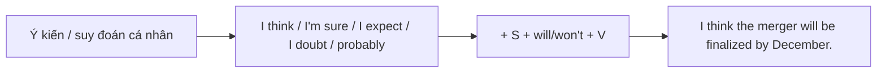
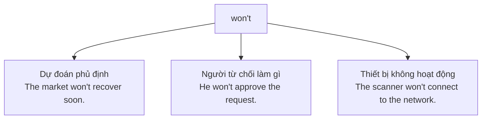

# 🔮 Unit 22: will and shall (2)

> [!abstract] Trọng tâm Part 5 TOEIC
> - **`will` diễn tả dự đoán/ý kiến** (không phải quyết định tức thời như Unit 21): *I **think** the new branch **will open** next quarter.*
> - Thường đi kèm các cụm nêu ý kiến: **I think / I don't think / I'm sure / I expect / I doubt / I suppose / probably** — các cụm này quyết định vị trí của `probably` trong câu.
> - **`won't`** = dự đoán **phủ định** ("sẽ không") HOẶC **từ chối/không chịu** làm gì: *The printer **won't** turn on.* (nó "không chịu" hoạt động).
> - **So sánh `will` (ý kiến/dự đoán) với `be going to` (dựa trên bằng chứng hiện tại)** — Unit 20 dùng bằng chứng cụ thể, Unit 22 dùng suy đoán/quan điểm cá nhân.
> - **`I think` / `I'm sure` + will** rất phổ biến trong email và báo cáo công sở khi đưa ra nhận định về tương lai của công ty, dự án, thị trường.

---

## A. Dự đoán và ý kiến với `will` / `won't`

$$\mathbf{I\ think/I'm\ sure/probably + S + will/won't + V}$$

| Cụm dẫn ý kiến | Nghĩa | Ví dụ |
| :--- | :--- | :--- |
| **I think … will** | Tôi nghĩ … sẽ | *I **think** the merger **will** be finalized by December.* |
| **I don't think … will** | Tôi không nghĩ … sẽ | *I **don't think** the vendor **will** deliver the shipment on time.* |
| **I'm sure … will** | Tôi chắc chắn … sẽ | *I**'m sure** the board **will** approve the new budget.* |
| **I expect … will** | Tôi cho là … sẽ | *I **expect** the quarterly revenue **will** increase.* |
| **I doubt … will** | Tôi ngờ rằng … sẽ không | *I **doubt** the candidate **will** accept a lower salary.* |
| **I suppose … will** | Tôi cho rằng … sẽ | *I **suppose** the headquarters **will** relocate eventually.* |
| **probably** | Có lẽ | *The shipment **will probably** arrive a day late.* / *The board **probably won't** approve it.* |

**Vị trí của `probably`:**
- Câu khẳng định: đứng **sau `will`** → *The revenue **will probably** increase this quarter.*
- Câu phủ định: đứng **trước `won't`** → *The revenue **probably won't** increase this quarter.*

> [!note] Không dùng `that` sau `I think/I'm sure` trong văn phong thi TOEIC
> Trong bài thi, các cụm này thường xuất hiện không có `that`: *I think the deadline will be extended.* (không bắt buộc có `that` trước mệnh đề).

---

## B. `won't` — dự đoán phủ định và từ chối/không chịu hoạt động

| Nghĩa | Ví dụ | Giải thích |
| :--- | :--- | :--- |
| **Dự đoán phủ định** ("sẽ không") | *I don't think the client **will sign** the contract this week.* | Ý kiến cá nhân rằng điều gì đó sẽ không xảy ra. |
| **Từ chối làm gì (người)** | *The supplier **won't** lower the price, no matter how we negotiate.* | Người **không chịu**, kiên quyết từ chối. |
| **Thiết bị "không chịu" hoạt động** | *The photocopier **won't** print double-sided documents.* | Vật không hoạt động như mong muốn — như thể nó "từ chối". |

- *I'm sure the invoice **won't** be processed before Friday.* (dự đoán)
- *The finance manager **won't** sign off on unapproved expenses.* (từ chối)
- *This printer **won't** recognize the new toner cartridge.* (không chịu hoạt động)

---

## C. `will` (ý kiến) vs `be going to` (bằng chứng hiện tại) — ôn nhanh

| | `will` — ý kiến/dự đoán cá nhân | `be going to` — dựa trên bằng chứng hiện tại |
| :--- | :--- | :--- |
| Cơ sở | Suy nghĩ, cảm nhận, không có bằng chứng rõ ràng | Dấu hiệu/bằng chứng đã thấy ngay lúc nói |
| Dấu hiệu nhận biết | `I think`, `I'm sure`, `probably`, `I expect` | Tình huống quan sát được (đơn hàng dồn dập, mây đen, số liệu đã có) |
| Ví dụ | *I **think** sales **will** improve next year.* | *Look at these order numbers — sales **are going to** improve.* |

> [!note] Cả hai đều đúng ngữ pháp, khác nhau về **căn cứ** đưa ra dự đoán, không phải về thì.

---

## 🎯 Dấu hiệu nhận biết trong đề thi TOEIC Part 5 & 6

1. **Có `I think / I'm sure / I expect / I doubt / I suppose` ngay trước mệnh đề** → chọn `will/won't`, không chọn `am/is/are going to`:
   - *I **expect** the new headquarters **will** be completed by 2027.*
2. **Có `probably`** → xác định vị trí đúng: sau `will`, trước `won't`:
   - *The candidate **will probably** accept the offer.* / *The candidate **probably won't** accept the offer.*
3. **Chủ ngữ là người, câu mang nghĩa "kiên quyết không chịu"** → `won't` (từ chối):
   - *The landlord **won't** extend the lease under the current terms.*
4. **Chủ ngữ là thiết bị/máy móc + không hoạt động đúng chức năng** → `won't`:
   - *The scanner **won't** read barcodes on damaged packages.*
5. **Câu có bằng chứng cụ thể ngay trong câu (số liệu, tình huống quan sát được)** → ưu tiên `be going to` (Unit 20), không phải `will`:
   - *Based on this quarter's figures, revenue **is going to** exceed the target.*

> [!caution] 6 cạm bẫy thường gặp
> 1. Dùng `will` khi có bằng chứng rõ ràng ngay trong câu: ~~Look at the order backlog — sales will improve.~~ → **Look at the order backlog — sales are going to improve.**
> 2. Đặt sai vị trí `probably`: ~~The board will not probably approve the budget.~~ → **The board probably won't approve the budget.**
> 3. Thiếu chủ ngữ/trợ động từ sau cụm ý kiến: ~~I think will the deadline be extended.~~ → **I think the deadline will be extended.**
> 4. Nhầm `won't` (dự đoán/từ chối) với `don't` (thói quen): ~~The vendor don't deliver on time.~~ → **The vendor won't deliver on time.**
> 5. Dùng `will` cho quyết định đã lên kế hoạch từ trước (nên dùng `going to`, xem Unit 23): ~~We will launch the product next month, as planned for months.~~ → **We are going to launch the product next month, as planned for months.**
> 6. Thêm `that` không tự nhiên rồi bỏ sót `will`: ~~I'm sure that the shipment arrive late.~~ → **I'm sure (that) the shipment will arrive late.**

> [!tip] Mẹo chọn đáp án trong 5 giây
> Thấy **`I think / I'm sure / I expect / I doubt / probably`** đứng gần chỗ trống → đáp án gần như chắc chắn là **`will`** hoặc **`won't`**, không phải `am/is/are going to`. Nếu câu có **số liệu/bằng chứng cụ thể** ngay trước đó → nghiêng về `be going to`.

---

## 📎 Liên kết trong hệ thống

- Trước: [[Unit 21 - will and shall 1]] — `will` cho quyết định tức thời, so với `will` cho ý kiến/dự đoán ở Unit này.
- `be going to` cho dự đoán dựa trên bằng chứng: [[Unit 20 - I'm going to (do)]]
- Thì hiện tại đơn diễn tả sự thật/thói quen (đối lập với ý kiến dự đoán): [[Unit 01 - Present Continuous (I am doing)]]
- Thì quá khứ đơn (ôn kiến thức nền về hình thái động từ): [[Unit 05 - Past Simple (I did)]]

---
Trở về: [[English Grammar in Use MOC]] | [[TOEIC MOC]] | Bài tập: [[Unit 22 - Exercises (will and shall 2)]]
