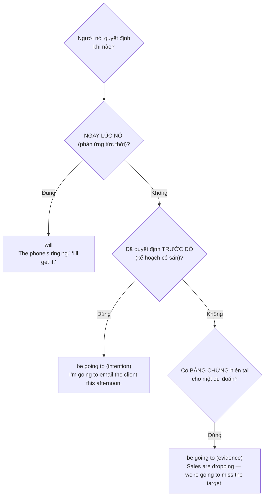

# ⚖️ Unit 23: I will and I'm going to

> [!abstract] Trọng tâm Part 5 TOEIC
> - **`will`** = quyết định **ngay tại thời điểm nói** (chưa hề nghĩ tới trước đó): *"The printer is out of paper." "OK, **I'll order** more."*
> - **`be going to`** = quyết định **đã có từ trước** khi nói (dự định đã lên kế hoạch): *I**'m going to submit** the proposal tomorrow — I decided last week.*
> - **`be going to`** còn dùng để **dự đoán dựa trên bằng chứng hiện tại**: *Look at those clouds — it**'s going to rain**.*
> - Trong văn bản TOEIC, cụm **already, as I said, as planned, as agreed** báo hiệu `be going to`; cụm **let me, I think I'll, OK, I'll** báo hiệu `will` (quyết định tức thời).
> - Sau khi quyết định đã được nói ra bằng `will`, các lần nhắc lại sau đó về **cùng kế hoạch đó** sẽ chuyển sang dùng `be going to` (vì lúc này nó đã là một kế hoạch có sẵn).

---

## A. Điểm khác biệt cốt lõi: thời điểm ra quyết định

| | `will` | `be going to` |
| :--- | :--- | :--- |
| Khi nào quyết định được đưa ra | **Ngay lúc nói** — chưa từng nghĩ tới trước đó | **Trước khi nói** — đã lên kế hoạch/quyết định rồi |
| Bản chất | Phản ứng tức thời, tự nguyện, đề nghị, hứa hẹn | Ý định đã định sẵn, hoặc dự đoán có bằng chứng |
| Câu tín hiệu thường gặp | *OK, I'll…* / *I think I'll…* / *Don't worry, I'll…* | *I've already decided…* / *I'm going to…, as planned* |
| Ví dụ | *"We need more chairs for the meeting." "**I'll bring** some from my office."* | *"Why are you calling IT?" "**I'm going to report** a network issue — I decided this morning."* |

**Ví dụ đối lập trực tiếp (văn phòng):**
- *"I've forgotten to bring my laptop." "Don't worry, **I'll lend** you mine."* (quyết định tức thời, giúp đỡ ngay)
- *"I**'m going to buy** a new laptop next month — I already ordered it online."* (đã quyết định từ trước)
- *"The client hasn't replied yet." "OK, **I'll follow up** by phone."* (quyết định ngay khi nghe tin)
- *The board **is going to approve** the merger next week — it was confirmed in yesterday's memo.* (kế hoạch đã định)

---

## B. `be going to` cho dự đoán có bằng chứng — và cách `will` khác với nó

| Loại dự đoán | Cấu trúc | Ví dụ |
| :--- | :--- | :--- |
| Dự đoán dựa trên **bằng chứng hiện tại** (nhìn thấy, con số thực tế) | `be going to` | *Revenue is falling fast — the company **is going to face** a budget cut.* |
| Dự đoán dựa trên **quan điểm, ý kiến cá nhân** (không có bằng chứng cụ thể) | `will` (+ *I think/I'm sure/probably*) | *I **think** sales **will improve** next quarter.* |

> [!note] Cả hai đều nói về tương lai nhưng khác NGUỒN GỐC dự đoán
> `be going to` dựa trên **cái đang thấy ngay bây giờ** (dấu hiệu cụ thể); `will` dựa trên **suy nghĩ, kinh nghiệm, dự đoán chủ quan**. So sánh:
> - *Look at the schedule — the shipment **is going to be** late.* (bằng chứng: lịch trình cho thấy rõ)
> - *I **think** the shipment **will be** late.* (ý kiến, chưa chắc có bằng chứng cụ thể)

**Thêm ví dụ văn phòng:**
- *The server has crashed three times today — IT **is going to replace** it.* (bằng chứng rõ ràng)
- *I'm sure the new manager **will improve** team morale.* (quan điểm cá nhân)
- *Based on this quarter's figures, the company **is going to expand** overseas.* (bằng chứng: số liệu)

---

## C. Khi cả hai gần như tương đương — và khi tuyệt đối không thể thay thế

| Tình huống | Dùng được cả hai? | Ghi chú |
| :--- | :--- | :--- |
| Nói về ý định chung chung ở tương lai xa, không nhấn mạnh thời điểm quyết định | Có, gần tương đương | *I**'ll** visit the branch office next year.* ≈ *I**'m going to** visit the branch office next year.* |
| Phản ứng/quyết định NGAY lúc nói (offer, promise, spontaneous) | **Chỉ `will`** | *"I'm late for the meeting." "**I'll drive** you."* (không dùng ~~I'm going to drive you~~ ở đây) |
| Kế hoạch đã sắp xếp trước, có thể nói rõ đã quyết định khi nào | **Chỉ `be going to`** (hoặc Present Continuous nếu đã có lịch cụ thể) | *I**'m going to meet** the auditors tomorrow — I arranged it last week.* |
| Dự đoán có bằng chứng cụ thể trước mắt | **Chỉ `be going to`** | *Look — the printer **is going to jam** again.* |

> [!caution] Bẫy thường gặp — phân biệt will vs going to
> 1. Quyết định đã có kế hoạch nhưng chọn nhầm `will`: ~~I will submit the report tomorrow, as I planned last week.~~ → **I'm going to submit the report tomorrow, as I planned last week.**
> 2. Phản ứng tức thời nhưng chọn nhầm `be going to`: ~~"The phone is ringing." "I'm going to get it."~~ → **"The phone is ringing." "I'll get it."**
> 3. Dự đoán có bằng chứng rõ ràng nhưng dùng `will`: ~~Look at those dark clouds — it will rain.~~ → **Look at those dark clouds — it's going to rain.**
> 4. Nhầm ý kiến chủ quan sang `be going to`: ~~I'm going to think the merger will succeed.~~ → **I think the merger will succeed.**
> 5. Lời hứa/đề nghị dùng nhầm `be going to`: ~~Don't worry, I'm going to help you with the presentation.~~ → **Don't worry, I'll help you with the presentation.**

> [!tip] Mẹo chọn đáp án trong 5 giây
> Tìm từ khóa trong câu: **"as planned / already decided / as agreed / based on…"** → chọn **`be going to`**. Tìm câu hội thoại có **phản hồi tức thời, lời đề nghị, lời hứa** ("OK, I'll…", "Don't worry, I'll…") → chọn **`will`**. Có **bằng chứng cụ thể nhìn thấy được** (số liệu, dấu hiệu) → **`be going to`**; có **"I think/I'm sure/probably"** → **`will`**.

---

## 🎯 Dấu hiệu nhận biết trong đề thi TOEIC Part 5 & 6

1. **Câu hội thoại/email có phản hồi tức thời** (offer, promise) → `will`:
   - *"We're short-staffed today." "**I'll cover** the front desk this afternoon."*
2. **Cụm từ chỉ kế hoạch đã định trước** (`already`, `as planned`, `as agreed`, `next week as scheduled`) → `be going to`:
   - *As **agreed** in the contract, the vendor **is going to deliver** the equipment by Friday.*
3. **Bằng chứng cụ thể trong câu** (số liệu giảm/tăng, dấu hiệu quan sát được) → `be going to`:
   - *Given the current delays, the project **is going to miss** its deadline.*
4. **Động từ chỉ ý kiến/dự đoán chủ quan** (`I think`, `I'm sure`, `I expect`, `probably`) → `will`:
   - *I **expect** the board **will approve** the budget next Monday.*
5. **Passage điền vào chỗ trống (Part 6) yêu cầu tính nhất quán ngữ cảnh** — nếu đoạn trước đã nói "we have decided/arranged", câu sau PHẢI dùng `be going to`, không dùng `will`:
   - *We have already arranged the venue. The company **is going to hold** the annual conference in Da Nang.*

---

## 📎 Liên kết trong hệ thống

- Trước: [[Unit 22 - will and shall 2]] — dự đoán và ý kiến với `will` (`I think`, `probably`).
- So sánh trực tiếp với: [[Unit 20 - I'm going to (do)]] — ý định và dự đoán có bằng chứng.
- So sánh trực tiếp với: [[Unit 21 - will and shall 1]] — quyết định tức thời, lời hứa, đề nghị với `will`.
- Thì Quá khứ đơn (đối chiếu cách diễn đạt quyết định đã xảy ra): [[Unit 05 - Past Simple (I did)]]

---
Trở về: [[English Grammar in Use MOC]] | [[TOEIC MOC]] | Bài tập: [[Unit 23 - Exercises (I will and I'm going to)]]
