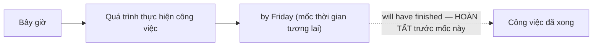
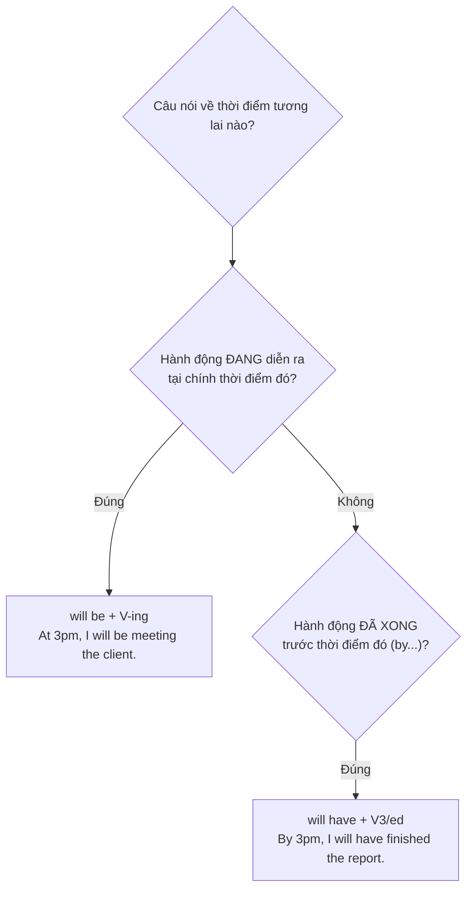

# ⏱️ Unit 24: will be doing and will have done

> [!abstract] Trọng tâm Part 5 TOEIC
> - **`will be + V-ing`** (Tương lai tiếp diễn) = một hành động **đang diễn ra tại một thời điểm cụ thể trong tương lai**: *This time tomorrow, I **will be flying** to Tokyo.*
> - **`will be + V-ing`** còn diễn tả **sự việc đã được sắp xếp/dự kiến xảy ra như một lẽ tự nhiên** (không phải một quyết định) — khác với `will` chỉ ý định ở Unit 21-23: *Don't call at 9 a.m. — I **'ll be presenting** the quarterly report.*
> - **`will have + V3/ed`** (Tương lai hoàn thành) = một hành động **sẽ hoàn tất trước một thời điểm/mốc cụ thể trong tương lai**, thường đi với **`by`, `by the time`, `by then`**: *We **will have finished** the audit **by Friday**.*
> - **Phân biệt nhanh:** đang diễn ra tại mốc tương lai → `will be doing`; đã xong trước mốc tương lai → `will have done`.
> - Cả hai đều dùng **`will`** cho mọi ngôi (không chia theo chủ ngữ), rút gọn `'ll` trong văn nói/email thân mật.

---

## A. `will be doing` — Tương lai tiếp diễn

$$\mathbf{S + will\ be + V\text{-}ing}$$

| Loại câu | Cấu trúc | Ví dụ |
| :--- | :--- | :--- |
| Khẳng định | S + will be + V-ing | *At 3 p.m. tomorrow, I **will be meeting** the new supplier.* |
| Phủ định | S + won't be + V-ing | *Ms. Lopez **won't be attending** the conference next week.* |
| Nghi vấn | Will + S + be + V-ing? | ***Will** you **be using** the meeting room at noon?* |

```mermaid
timeline
    title will be doing — hành động đang diễn ra TẠI một thời điểm tương lai
    Bây giờ : Hôm nay : chưa bắt đầu
    9:00 sáng mai : Cuộc họp bắt đầu : hành động khởi động
    10:00 sáng mai (mốc được hỏi) : I will be attending the meeting : ĐANG diễn ra tại mốc này
    11:00 sáng mai : Cuộc họp kết thúc : hành động hoàn tất
```

**Hai cách dùng chính:**
1. **Hành động đang diễn ra tại một thời điểm xác định trong tương lai** (tương tự Present Continuous "at the moment"):
   - *This time next week, our team **will be presenting** the new product line.*
   - *Don't call the warehouse before 8 a.m. — the staff **will still be unloading** the delivery truck.*
2. **Sự việc đã được lên kế hoạch/sẽ diễn ra như một tiến trình bình thường** (không phải quyết định của người nói ngay lúc nói — khác `will` ở Unit 21):
   - *I**'ll be sending** the invoice tomorrow, as usual.* (việc thường lệ, không phải quyết định tức thời)
   - *The CEO **will be visiting** the branch office next Monday.* (lịch trình đã sắp xếp)

> [!note] `will be doing` để hỏi lịch trình một cách lịch sự
> *Will you **be attending** the workshop on Friday?* nghe **tự nhiên và lịch sự hơn** *Will you attend...?* vì nó hỏi về một kế hoạch đã có sẵn, không phải yêu cầu một quyết định.

---

## B. `will have done` — Tương lai hoàn thành

$$\mathbf{S + will\ have + V_3/ed}$$

| Loại câu | Cấu trúc | Ví dụ |
| :--- | :--- | :--- |
| Khẳng định | S + will have + V3/ed | *We **will have finished** the audit by Friday.* |
| Phủ định | S + won't have + V3/ed | *The shipment **won't have arrived** by the time the store opens.* |
| Nghi vấn | Will + S + have + V3/ed? | ***Will** the team **have completed** the report by 5 p.m.?* |



- **Diễn tả một hành động sẽ HOÀN TẤT trước một mốc thời gian cụ thể trong tương lai**, thường đi kèm **`by`, `by then`, `by the time`**:
  - *By the end of this quarter, the company **will have opened** three new branches.*
  - *The consultants **will have submitted** their recommendations **by next Monday**.*
  - *By the time you read this email, I **will have left** the office.*
- Có thể kết hợp với **Perfect Continuous** để nhấn mạnh khoảng thời gian kéo dài đến mốc tương lai:
  - *By next year, Mr. Chen **will have worked** at this company **for two decades**.*

> [!note] So sánh với Past Perfect (Unit 15)
> `will have done` là "bản sao ở tương lai" của `had done`: `had done` nhìn ngược từ một mốc **quá khứ**, còn `will have done` nhìn tới từ hiện tại đến một mốc **tương lai**. Cả hai đều diễn tả **"đã hoàn tất trước một mốc thời gian khác"**.

---

## C. So sánh `will be doing` vs `will have done`

| Tiêu chí | `will be doing` | `will have done` |
| :--- | :--- | :--- |
| Ý nghĩa | Đang **diễn ra** tại thời điểm tương lai | Đã **hoàn tất** trước thời điểm tương lai |
| Dấu hiệu thời gian | *at this time tomorrow, this time next week* | *by, by then, by the time, by next…* |
| Trọng tâm | Quá trình, hành động chưa xong | Kết quả, hành động đã xong |
| Ví dụ | *At 9 a.m., I **will be flying** to Seoul.* | *By 9 a.m., I **will have landed** in Seoul.* |



- *At 5 p.m., the technician **will be repairing** the printer.* (đang sửa lúc 5 giờ)
- *By 5 p.m., the technician **will have repaired** the printer.* (5 giờ đã sửa xong)
- *Ms. Nguyen **will be reviewing** the contract when you arrive.* (đang xem xét khi bạn đến)
- *Ms. Nguyen **will have reviewed** the contract by the time you arrive.* (đã xem xét xong trước khi bạn đến)

---

## 🎯 Dấu hiệu nhận biết trong đề thi TOEIC Part 5 & 6

1. **Cụm `at + [giờ/thời điểm] + tomorrow/next week`** → tín hiệu của `will be doing`:
   - *At this time next week, the sales team **will be negotiating** the new contract.*
2. **Cụm `by + [thời điểm]`, `by the time`, `by then`** → tín hiệu của `will have done`:
   - *By the end of the fiscal year, the firm **will have expanded** into two new markets.*
   - *By the time the inspector arrives, the crew **will have completed** the repairs.*
3. **Hỏi lịch trình lịch sự** (thay vì hỏi quyết định) → `Will you be + V-ing…?`:
   - *Will you **be attending** the shareholders' meeting on Thursday?*
4. **Kết hợp với khoảng thời gian (`for + duration`) + mốc tương lai** → `will have + V3` (đôi khi `will have been + V-ing`):
   - *By next month, she **will have worked** here **for five years**.*
5. **Phân biệt với Present Perfect (Unit 07-08)**: Present Perfect nhìn từ hiện tại về quá khứ (`have done`); `will have done` nhìn từ hiện tại tới một mốc **tương lai**.
   - *The report **has been** submitted.* (đã xong, tính đến bây giờ) vs. *The report **will have been** submitted by Friday.* (sẽ xong tính đến thứ Sáu)

> [!caution] Các lỗi thường gặp
> 1. Dùng Present Continuous cho hành động tại mốc tương lai xa: ~~At this time tomorrow, I am flying to Tokyo.~~ → **At this time tomorrow, I will be flying to Tokyo.**
> 2. Quên `have` trong tương lai hoàn thành: ~~By Friday, we will finished the report.~~ → **By Friday, we will have finished the report.**
> 3. Dùng `will do` thay vì `will have done` khi có `by`: ~~By 2027, the company will open five branches.~~ → **By 2027, the company will have opened five branches.**
> 4. Nhầm `will be doing` (đang diễn ra) với `will have done` (đã xong): ~~By 5 p.m., the technician will be repairing the printer (already finished).~~ → **By 5 p.m., the technician will have repaired the printer.**
> 5. Sai trật tự động từ: ~~The consultants will have submit their report.~~ → **The consultants will have submitted their report.**
> 6. Dùng `will` đơn giản khi câu nhấn mạnh quá trình tại một mốc cụ thể: ~~Don't call at 9 — I will present the report.~~ → **Don't call at 9 — I'll be presenting the report.**

> [!tip] Mẹo chọn đáp án trong 5 giây
> - Thấy **`by / by the time / by then`** → chọn ngay **`will have + V3/ed`**.
> - Thấy **`at + giờ cụ thể + tomorrow/next…`** (không có `by`) → chọn **`will be + V-ing`**.
> - Thấy khoảng thời gian **`for + duration`** đi cùng mốc tương lai → thường là **`will have + V3/ed`** (đôi khi `will have been + V-ing`).
> - Đáp án thiếu `have` hoặc thiếu `be` trước V-ing → loại ngay, đó là bẫy sai cấu trúc.

---

## 📎 Liên kết trong hệ thống

- Trước: [[Unit 23 - I will and I'm going to]] — quyết định tức thời (`will`) vs kế hoạch đã định (`going to`); Unit 24 mở rộng sang hai dạng phức tạp hơn của `will`.
- Cấu trúc soi gương ở quá khứ (`had done` → tiền thân của `will have done`): [[Unit 15 - Past Perfect (I had done)]]
- Khía cạnh tiếp diễn (`was doing` → tiền thân của `will be doing`): [[Unit 06 - Past Continuous (I was doing)]]

---
Trở về: [[English Grammar in Use MOC]] | [[TOEIC MOC]] | Bài tập: [[Unit 24 - Exercises (will be doing and will have done)]]
