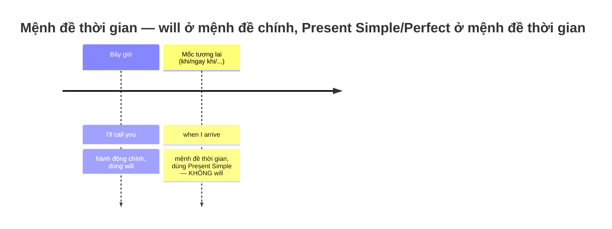
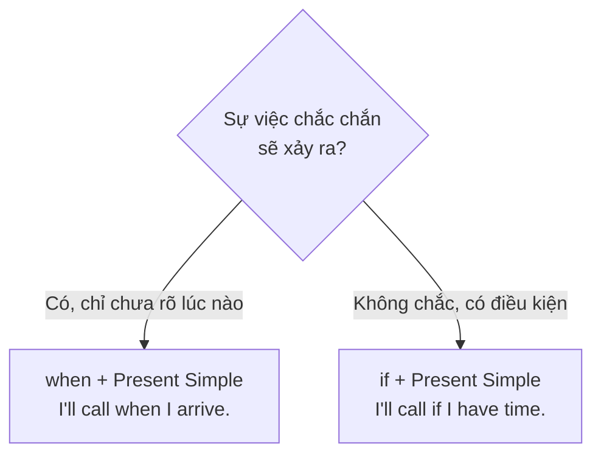
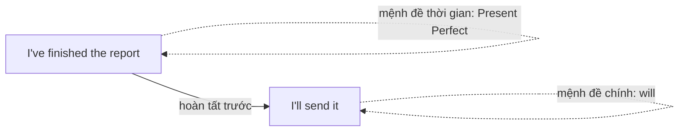

# ⏰ Unit 25: when I do / when I've done (if and when)

> [!abstract] Trọng tâm Part 5 TOEIC
> - Sau các liên từ chỉ **thời gian tương lai** — **`when`, `before`, `after`, `until/till`, `as soon as`, `by the time`** — **KHÔNG dùng `will`**, dù ý nghĩa vẫn là tương lai: *I**'ll call** you **when I arrive**.* (không ~~when I will arrive~~)
> - Dùng **Present Simple** cho hành động xảy ra **cùng lúc/ngay khi** mốc tương lai đó; dùng **Present Perfect** khi hành động phải **hoàn tất trước** hành động chính: *I**'ll send** the report **when I**'**ve finished** it.*
> - **`if` (nếu — có thể xảy ra hoặc không) khác `when` (khi — chắc chắn sẽ xảy ra):** *I**'ll submit** the invoice **if I receive** it today.* (chưa chắc nhận được) vs *I**'ll submit** the invoice **when I receive** it.* (chắc chắn sẽ nhận được, chỉ là chưa biết lúc nào)
> - Mệnh đề `if`/thời gian cũng **không dùng `will`**, kể cả khi diễn tả kết quả tương lai: *If the shipment **arrives** late, we**'ll miss** the deadline.*
> - Quy tắc này áp dụng cho **cả câu điều kiện loại 1** (`if + Present Simple, will + V`) lẫn **mệnh đề trạng ngữ chỉ thời gian** — TOEIC Part 5 thường đặt `will` làm bẫy ngay sau các liên từ này.

---

## A. Mệnh đề thời gian tương lai: `when / before / after / until / as soon as / by the time`

$$\text{S} + \textbf{will} + \text{V} \; + \; [\textbf{when/before/after/until/as soon as/by the time}] + \text{S} + \textbf{Present Simple/Perfect}$$

| Liên từ | Nghĩa | Ví dụ |
| :--- | :--- | :--- |
| **when** | khi | *I**'ll call** you **when I arrive** at the airport.* |
| **before** | trước khi | ***Before** you **submit** the invoice, double-check the total.* |
| **after** | sau khi | *We**'ll finalize** the contract **after** the legal team **approves** it.* |
| **until / till** | cho đến khi | *The order **won't ship** **until** we **receive** payment.* |
| **as soon as** | ngay khi | *I**'ll email** you **as soon as** the shipment **arrives**.* |
| **by the time** | vào lúc (đã xong) | ***By the time** the client **calls**, we**'ll have finalized** the quarterly report.* |

> [!note] Vì sao không dùng `will` sau các liên từ này?
> Về ngữ pháp, mệnh đề `when/before/after/until/as soon as/by the time` mô tả **mốc để xác định thời điểm** cho hành động chính, không phải một dự đoán hay quyết định riêng — nên tiếng Anh coi nó như một sự thật đã "chốt" và dùng **thì hiện tại**, dù ý nghĩa vẫn nằm ở tương lai.

- *Please **submit** the invoice **before** the deadline **passes**.*
- *We**'ll renew** the contract **as soon as** the manager **approves** it.*
- ***Until** the shipment **is confirmed**, please **do not close** the order.*

---

## B. `if` (có thể xảy ra) vs `when` (chắc chắn xảy ra)

| | `if` | `when` |
| :--- | :--- | :--- |
| Ý nghĩa | **Có thể** xảy ra, có thể không | **Chắc chắn** sẽ xảy ra, chỉ chưa rõ lúc nào |
| Ví dụ | *I**'ll submit** the invoice **if I receive** it today.* (chưa chắc nhận được hôm nay) | *I**'ll submit** the invoice **when I receive** it.* (chắc chắn sẽ nhận được) |
| Ví dụ khác | *If the shipment **is delayed**, we**'ll notify** the client.* (có thể không bị trễ) | *When the shipment **arrives**, we**'ll notify** the client.* (chắc chắn sẽ đến) |

- Cả `if` lẫn `when` đều tuân theo **cùng một quy tắc**: mệnh đề sau chúng dùng **Present Simple/Perfect**, KHÔNG dùng `will`.
- *If the client **doesn't approve** the quarterly budget, we**'ll postpone** the project.*
- *When the accounting team **has finalized** the invoice, they**'ll send** it to the client.*

---

## C. Present Perfect trong mệnh đề thời gian — hành động phải hoàn tất trước

Khi hành động trong mệnh đề thời gian phải **hoàn thành xong** trước khi hành động chính xảy ra (đặc biệt với `before`, `after`, `by the time`, `when`, `as soon as`), có thể dùng **Present Perfect** thay vì Present Simple để nhấn mạnh sự hoàn tất:

| Cấu trúc | Ví dụ |
| :--- | :--- |
| ...**when** + Present Perfect, ... **will** + V | *I**'ll send** the report **when I**'**ve finished** it.* |
| **By the time** + Present Simple, ... **will have** + V3 | ***By the time** the client **calls**, we**'ll have finalized** the quarterly report.* |
| ...**after** + Present Perfect, ... **will** + V | *We**'ll ship** the order **after** we**'ve approved** the invoice.* |

- *As soon as accounting **has approved** the invoice, the payment **will be processed**.*
- *We **won't renew** the contract **until** legal **has reviewed** every clause.*

---

## 🎯 Dấu hiệu nhận biết trong đề thi TOEIC Part 5 & 6

1. **Chỗ trống ngay sau `when/before/after/until/as soon as/by the time`** và có đáp án chứa `will` → **loại ngay**, chọn Present Simple/Perfect:
   - *We will notify all vendors as soon as the new policy \_\_\_\_\_\_ (takes/will take) effect.* → **takes**
2. **Câu có `if` + mệnh đề chính chứa `will`** → mệnh đề `if` luôn ở Present Simple:
   - *If the shipment \_\_\_\_\_\_ (arrives/will arrive) late, the client will be notified immediately.* → **arrives**
3. **Phân biệt `if` và `when` theo mức độ chắc chắn** trong ngữ cảnh câu:
   - *\_\_\_\_\_\_ (If/When) the fiscal year ends in December, the finance team will begin the audit.* → chắc chắn xảy ra hằng năm → **When**
4. **`by the time` + mệnh đề chính có `will have + V3`** (Future Perfect) — dấu hiệu của hành động hoàn tất trước một mốc:
   - *By the time the auditors arrive, the accounting team will have finalized every quarterly invoice.*
5. **`until/till`** thường đi với phủ định ở mệnh đề chính (`won't … until …`):
   - *The vendor won't process the shipment until the invoice has been approved.*

> [!caution] 6 cạm bẫy thường gặp
> 1. Dùng `will` ngay sau `when`: ~~I'll call you when I will arrive.~~ → **I'll call you when I arrive.**
> 2. Dùng `will` sau `as soon as`: ~~As soon as I will finish the report, I'll send it.~~ → **As soon as I finish the report, I'll send it.**
> 3. Dùng `will` sau `by the time`: ~~By the time you will get here, we will have left.~~ → **By the time you get here, we will have left.**
> 4. Dùng `will` trong mệnh đề `if`: ~~If it will rain, the event will be cancelled.~~ → **If it rains, the event will be cancelled.**
> 5. Nhầm `if` với `when` khi sự việc chắc chắn xảy ra: ~~I'll submit the invoice if the month ends.~~ (tháng nào cũng kết thúc, chắc chắn xảy ra) → **I'll submit the invoice when the month ends.**
> 6. Quên dùng Present Perfect khi cần nhấn mạnh sự hoàn tất trước: ~~When I finish the audit, I'll send the results.~~ (vẫn đúng, nhưng khi cần nhấn mạnh xong hẳn) → **When I've finished the audit, I'll send the results.**

> [!tip] Mẹo chọn đáp án trong 5 giây
> Nhìn từ ngay **trước chỗ trống**:
> - Là **`when / before / after / until / as soon as / by the time / if`** → **loại ngay mọi đáp án có `will`**, chọn Present Simple (hoặc Present Perfect nếu nhấn mạnh hoàn tất).
> - `will` chỉ xuất hiện ở **mệnh đề chính** (kết quả), không bao giờ ở mệnh đề thời gian/điều kiện.

---

## 📎 Liên kết trong hệ thống

- Trước: [[Unit 24 - will be doing and will have done]] — `will have done` (Future Perfect) chính là dạng dùng ở mệnh đề chính khi kết hợp với `by the time`.
- Mốc thời gian, `for` và `since`: [[Unit 12 - for and since (when and how long)]]
- Quyết định tức thời với `will`: [[Unit 21 - will and shall 1]]

---
Trở về: [[English Grammar in Use MOC]] | [[TOEIC MOC]] | Bài tập: [[Unit 25 - Exercises (when I do and if and when)]]
