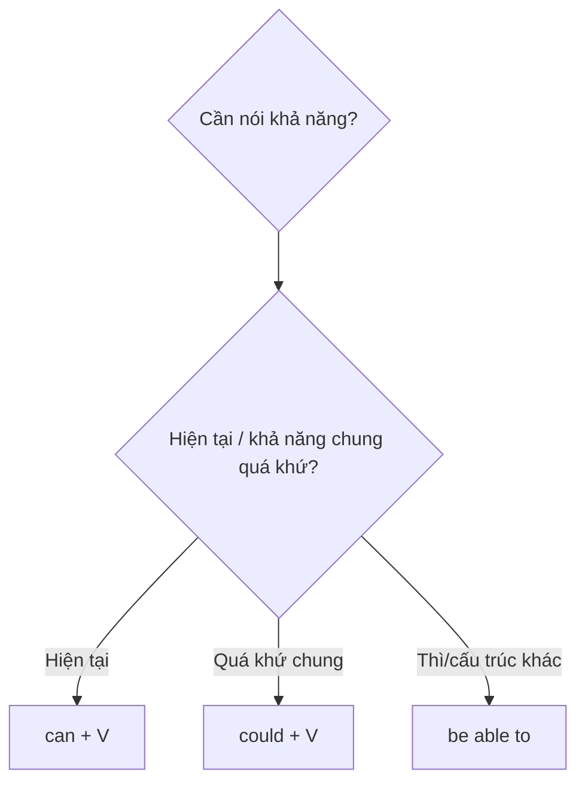

# 🛠️ Unit 26: can, could and (be) able to

> [!abstract] Trọng tâm Part 5 TOEIC
> - `can + V` diễn tả khả năng hiện tại; `could + V` diễn tả khả năng chung trong quá khứ.
> - `be able to` dùng được ở các thì và cấu trúc mà `can/could` không có dạng: `will be able to`, `have been able to`, `to be able to`.
> - Với một tình huống quá khứ cụ thể đã thành công, ưu tiên `was/were able to` hoặc `managed to`, không dùng `could`.
> - Phủ định `couldn’t` dùng tự nhiên cho cả khả năng chung lẫn một lần không làm được.

---

## A. `can` và `could`: khả năng hiện tại / quá khứ

| Ý nghĩa | Cấu trúc | Ví dụ TOEIC |
| :--- | :--- | :--- |
| Khả năng hiện tại | `can + V` | *Our technician **can repair** the printer today.* |
| Khả năng chung trong quá khứ | `could + V` | *Before the upgrade, the system **could process** only 100 orders per hour.* |
| Không có khả năng | `cannot/can’t`, `could not/couldn’t` | *The applicant **couldn’t attend** the interview.* |

`Can/could` là modal verbs nên theo sau bằng động từ nguyên mẫu không `to` và không thêm `-s`.

## B. `be able to`: thay thế khi `can` không có dạng phù hợp

| Ngữ cảnh | Dạng đúng | Ví dụ |
| :--- | :--- | :--- |
| Tương lai | `will be able to` | *Customers **will be able to track** orders online.* |
| Hiện tại hoàn thành | `have/has been able to` | *We **have been able to reduce** delivery times.* |
| Sau `to` | `to be able to` | *You need **to be able to use** spreadsheets.* |

## C. Thành công trong một tình huống quá khứ cụ thể

- Khả năng chung: *She **could speak** French when she joined the company.*
- Một lần cụ thể đã thành công: *Despite the outage, IT **was able to restore** the server before noon.*
- Phủ định: *IT **couldn’t restore** the backup.* — `couldn’t` vẫn dùng được cho sự việc cụ thể.

> [!caution] Cạm bẫy thường gặp
> 1. ~~The new software will can handle more users.~~ → **The new software will be able to handle more users.**
> 2. ~~We could resolve the complaint yesterday.~~ (một lần cụ thể đã thành công) → **We were able to resolve the complaint yesterday.**
> 3. ~~She can to operate the machine.~~ → **She can operate the machine.**

> [!tip] Mẹo chọn đáp án trong 5 giây
> Thấy `will`, `have/has`, `to` trước chỗ trống → thường chọn một dạng của **`be able to`**, không chọn `can/could`.

---

## 🎯 Dấu hiệu nhận biết trong đề thi TOEIC Part 5 & 6

1. `now/currently` + khả năng → `can + V`.
2. Khả năng chung trong quá khứ với `when`, `before`, `as a child` → `could + V`.
3. `will`, `have/has`, hoặc `to` cần dạng biến đổi → `be able to`.
4. Một sự cố cụ thể nhưng cuối cùng xử lý thành công → `was/were able to` hoặc `managed to`.

## 📎 Liên kết trong hệ thống

- Trước: [[Unit 25 - when I do and when I've done (if and when)]]
- Sau: [[Unit 27 - could (do) and could have (done)]]
- Từ vựng liên quan: [[TOEIC Core Vocabulary]]

---
Trở về: [[English Grammar in Use MOC]] | [[TOEIC MOC]] | Bài tập: [[Unit 26 - Exercises (can could and be able to)]]
