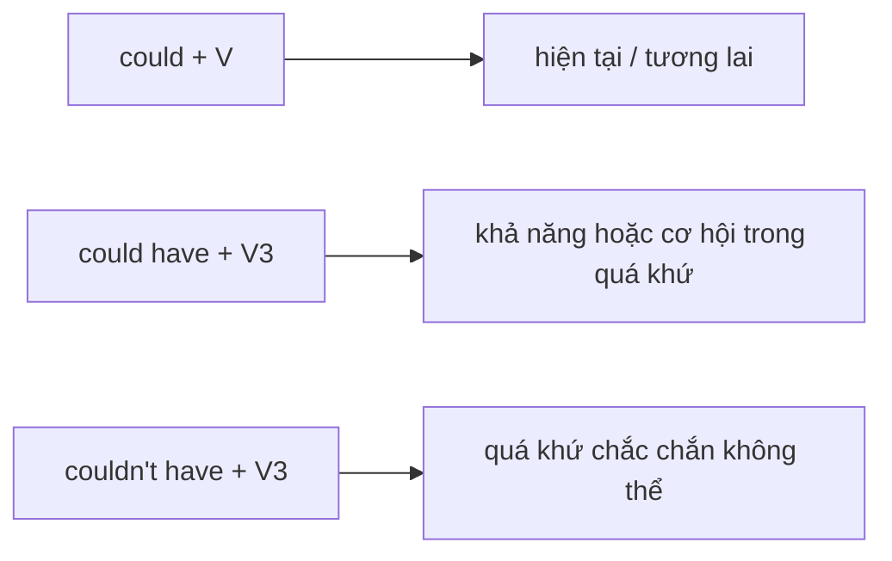

# 💡 Unit 27: could (do) and could have (done)

> [!abstract] Trọng tâm Part 5 TOEIC
> - `could + V` dùng cho khả năng hiện tại/tương lai chưa chắc chắn hoặc một đề xuất.
> - `could have + V3` nói một việc quá khứ có thể xảy ra nhưng đã không xảy ra, hoặc một khả năng về quá khứ.
> - `couldn’t have + V3` diễn tả điều chắc chắn không thể đã xảy ra.
> - Phân biệt `could do` (bây giờ/tương lai) với `could have done` (quá khứ).

---

## A. `could + V`: khả năng hoặc đề xuất hiện tại/tương lai

| Cách dùng | Ví dụ |
| :--- | :--- |
| Khả năng | *The delay **could affect** tomorrow’s delivery schedule.* |
| Đề xuất | *We **could hold** the meeting online.* |
| Yêu cầu lịch sự | ***Could** you **send** the revised invoice?* |

## B. `could have + V3`: quá khứ có thể nhưng không xảy ra

- *We **could have saved** more money by booking earlier.* (đã không đặt sớm)
- *The missing attachment **could have caused** the confusion.* (một khả năng trong quá khứ)
- *You **could have called** the client before cancelling the order.* (phê bình nhẹ)

## C. `couldn’t have + V3`

Dùng khi người nói tin rằng một điều trong quá khứ là không thể:

- *The intern **couldn’t have approved** the payment; only the director has access.*
- *The package **couldn’t have arrived** yesterday because it was shipped this morning.*

> [!caution] Cạm bẫy thường gặp
> 1. ~~We could have finish earlier.~~ → **We could have finished earlier.**
> 2. ~~The delay could affected sales tomorrow.~~ → **The delay could affect sales tomorrow.**
> 3. ~~He couldn’t have approve the invoice.~~ → **He couldn’t have approved the invoice.**

> [!tip] Mẹo chọn đáp án trong 5 giây
> Xác định thời gian trước: **hiện tại/tương lai → `could + V`**; **quá khứ → `could have + V3`**.

---

## 🎯 Dấu hiệu nhận biết trong đề thi TOEIC Part 5 & 6

1. `tomorrow`, `next week`, hoặc đề xuất → `could + V`.
2. `yesterday`, `last week`, `earlier` và việc không xảy ra → `could have + V3`.
3. Bằng chứng cho thấy việc quá khứ bất khả thi → `couldn’t have + V3`.
4. Câu phê bình “đáng lẽ có thể…” → `could have + V3`.

## 📎 Liên kết trong hệ thống

- Trước: [[Unit 26 - can, could and (be) able to]]
- Sau: [[Unit 28 - must and can’t]]
- Từ vựng liên quan: [[TOEIC Core Vocabulary]]

---
Trở về: [[English Grammar in Use MOC]] | [[TOEIC MOC]] | Bài tập: [[Unit 27 - Exercises (could and could have)]]
