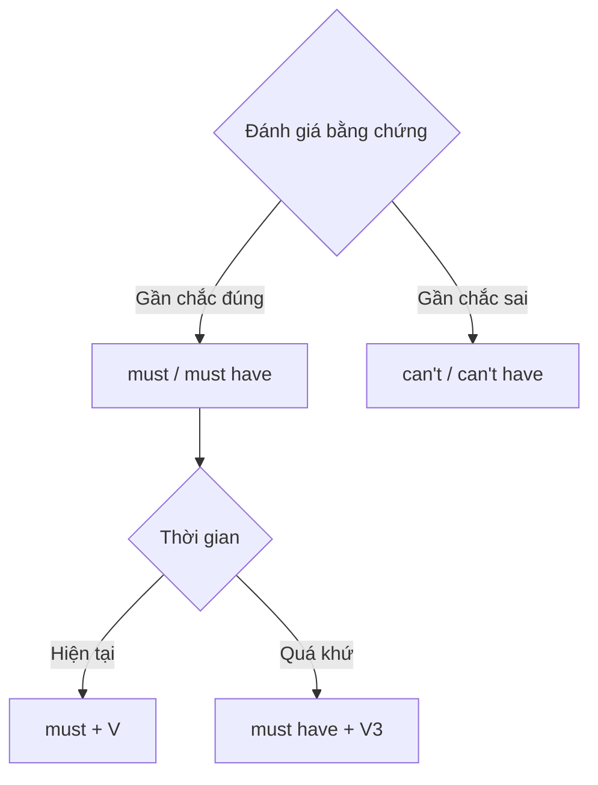

# 🔎 Unit 28: must and can’t

> [!abstract] Trọng tâm Part 5 TOEIC
> - `must + V` diễn tả suy luận gần như chắc chắn đúng ở hiện tại.
> - `can’t + V` diễn tả suy luận gần như chắc chắn không đúng ở hiện tại.
> - Với quá khứ dùng `must have + V3` và `can’t/couldn’t have + V3`.
> - Đây là `must` suy luận, khác `must` nghĩa vụ ở Unit 31–32.

---

## A. Suy luận hiện tại: `must be/do` và `can’t be/do`

| Mức chắc chắn | Cấu trúc | Ví dụ |
| :--- | :--- | :--- |
| Gần như chắc chắn đúng | `must + V` | *The lights are on; someone **must be** in the office.* |
| Gần như chắc chắn sai | `can’t + V` | *This **can’t be** the final invoice; it has no signature.* |

## B. Suy luận quá khứ

| Cấu trúc | Ý nghĩa | Ví dụ |
| :--- | :--- | :--- |
| `must have + V3` | chắc hẳn đã | *The courier **must have left** already.* |
| `can’t/couldn’t have + V3` | không thể đã | *Accounting **can’t have approved** this unsigned form.* |

## C. Dạng tiếp diễn trong suy luận

- Hiện tại: *She **must be meeting** the client now.*
- Quá khứ: *They **must have been waiting** for the revised contract.*
- Phủ định: *He **can’t be using** the conference room; it is locked.*

> [!caution] Cạm bẫy thường gặp
> 1. ~~She must to be in a meeting.~~ → **She must be in a meeting.**
> 2. ~~They must have leave already.~~ → **They must have left already.**
> 3. ~~This mustn’t be the right file.~~ (suy luận) → **This can’t be the right file.**

> [!tip] Mẹo chọn đáp án trong 5 giây
> Suy luận **đúng** → `must`; suy luận **không thể đúng** → `can’t`. Có mốc quá khứ → thêm `have + V3`.

---

## 🎯 Dấu hiệu nhận biết trong đề thi TOEIC Part 5 & 6

1. Câu đưa ra bằng chứng rồi kết luận chắc chắn → `must`.
2. Câu có bằng chứng phủ định mạnh → `can’t`.
3. Kết luận về `yesterday/already/last night` → `must have` hoặc `can’t have`.
4. Không dùng `mustn’t` để suy luận “không thể”; `mustn’t` là cấm đoán.

## 📎 Liên kết trong hệ thống

- Trước: [[Unit 27 - could (do) and could have (done)]]
- Sau: [[Unit 29 - may and might 1]]
- Từ vựng liên quan: [[TOEIC Core Vocabulary]]

---
Trở về: [[English Grammar in Use MOC]] | [[TOEIC MOC]] | Bài tập: [[Unit 28 - Exercises (must and can't)]]
