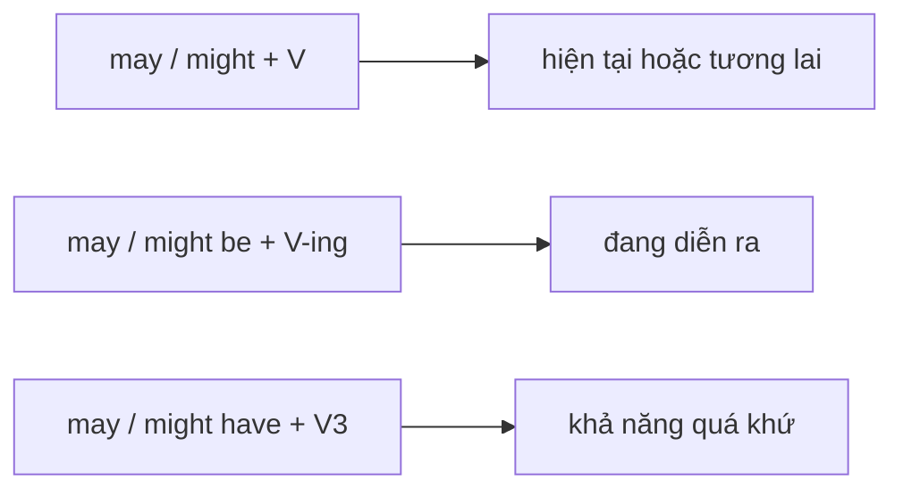

# 🌦️ Unit 29: may and might 1

> [!abstract] Trọng tâm Part 5 TOEIC
> - `may/might + V` diễn tả khả năng hiện tại hoặc tương lai; `might` thường dè dặt hơn nhưng nhiều trường hợp thay thế nhau.
> - Phủ định là `may not / might not + V`.
> - Dạng tiếp diễn: `may/might be + V-ing`; dạng quá khứ: `may/might have + V3`.
> - Không thêm `to`, không chia `-s` sau `may/might`.

---

## A. Khả năng hiện tại và tương lai

| Cấu trúc | Ví dụ |
| :--- | :--- |
| `may/might + V` | *The supplier **may increase** its prices next month.* |
| `may/might not + V` | *The shipment **might not arrive** before Friday.* |
| `may/might be + adjective/noun` | *The revised schedule **may be** more practical.* |

## B. Hành động đang diễn ra và khả năng quá khứ

- *The manager **may be interviewing** a candidate now.*
- *The email **might have gone** to the spam folder.*
- *The figures **may not have been updated** yet.*

## C. `may` và `might`

Hai từ thường thay thế nhau khi nói khả năng. `Might` có thể cho cảm giác ít chắc chắn hơn:

- *The board **may approve** the proposal.*
- *The board **might approve** the proposal, but more data is needed.*

> [!caution] Cạm bẫy thường gặp
> 1. ~~The supplier may increases prices.~~ → **The supplier may increase prices.**
> 2. ~~The shipment might not to arrive.~~ → **The shipment might not arrive.**
> 3. ~~She may have went home.~~ → **She may have gone home.**

> [!tip] Mẹo chọn đáp án trong 5 giây
> Sau `may/might`: dùng **V nguyên mẫu**; nếu suy đoán quá khứ, chèn **`have + V3`**.

---

## 🎯 Dấu hiệu nhận biết trong đề thi TOEIC Part 5 & 6

1. Các từ `perhaps`, `possibly`, `not certain` báo hiệu khả năng → `may/might`.
2. Khả năng về kế hoạch tương lai → `may/might + V`.
3. `now/at the moment` → có thể dùng `may/might be + V-ing`.
4. `already/yesterday` → `may/might have + V3`.

## 📎 Liên kết trong hệ thống

- Trước: [[Unit 28 - must and can’t]]
- Sau: [[Unit 30 - may and might 2]]
- Từ vựng liên quan: [[TOEIC Core Vocabulary]]

---
Trở về: [[English Grammar in Use MOC]] | [[TOEIC MOC]] | Bài tập: [[Unit 29 - Exercises (may and might 1)]]
