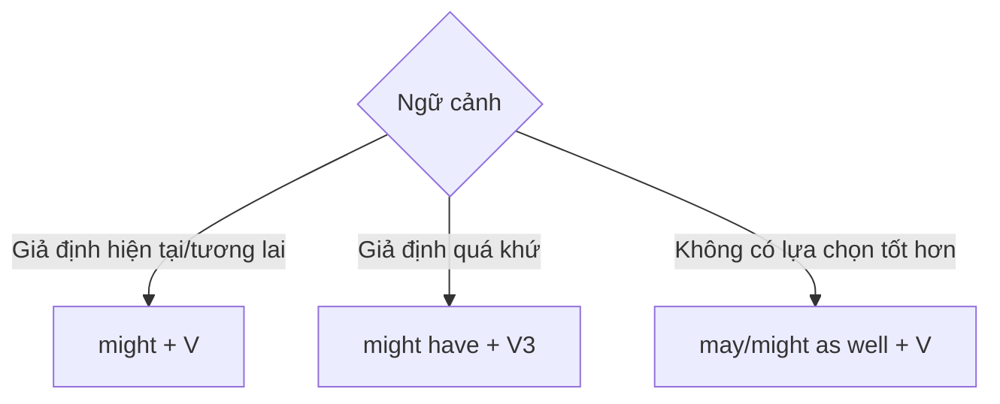

# 🧭 Unit 30: may and might 2

> [!abstract] Trọng tâm Part 5 TOEIC
> - `might + V` thường dùng cho tình huống giả định, đặc biệt sau `if`.
> - `may/might as well + V` nghĩa là “cũng nên”, khi không có lựa chọn tốt hơn.
> - `might have + V3` diễn tả kết quả quá khứ có thể đã khác trong một tình huống giả định.
> - `may` còn dùng để xin/cho phép trang trọng: `May I…?`

---

## A. `might` trong tình huống giả định

- *If the supplier lowered its price, we **might place** a larger order.*
- *If the system had been tested, the error **might have been detected** earlier.*

`Might` phù hợp khi kết quả chỉ là một khả năng, không chắc chắn.

## B. `may/might as well`

Dùng khi một hành động là lựa chọn hợp lý vì không có lựa chọn tốt hơn:

- *The meeting has been cancelled, so we **might as well return** to the office.*
- *Since the report is almost finished, we **may as well submit** it today.*

## C. Xin và cho phép với `may`

- *May I leave the documents at reception?*
- *Employees may use the training room after 3 p.m.*

Trong giao tiếp thông thường, `can` phổ biến hơn; `may` trang trọng và thường xuất hiện trong thông báo/quy định.

> [!caution] Cạm bẫy thường gặp
> 1. ~~We might as well to postpone the meeting.~~ → **We might as well postpone the meeting.**
> 2. ~~If prices fell, we may placed a larger order.~~ → **If prices fell, we might place a larger order.**
> 3. ~~The error might have detect earlier.~~ → **The error might have been detected earlier.**

> [!tip] Mẹo chọn đáp án trong 5 giây
> Nhìn cụm **`as well`** ngay sau chỗ trống → chọn `may/might`; sau đó dùng **V nguyên mẫu**.

---

## 🎯 Dấu hiệu nhận biết trong đề thi TOEIC Part 5 & 6

1. `if + past simple` với kết quả không chắc chắn → `might + V`.
2. `if + past perfect` với kết quả quá khứ → `might have + V3`.
3. `since` + tình huống không còn lựa chọn tốt → `might as well + V`.
4. Xin phép trang trọng trong email/thông báo → `May I…?` hoặc `may + V`.

## 📎 Liên kết trong hệ thống

- Trước: [[Unit 29 - may and might 1]]
- Sau: [[Unit 31 - have to and must]]
- Từ vựng liên quan: [[TOEIC Core Vocabulary]]

---
Trở về: [[English Grammar in Use MOC]] | [[TOEIC MOC]] | Bài tập: [[Unit 30 - Exercises (may and might 2)]]
