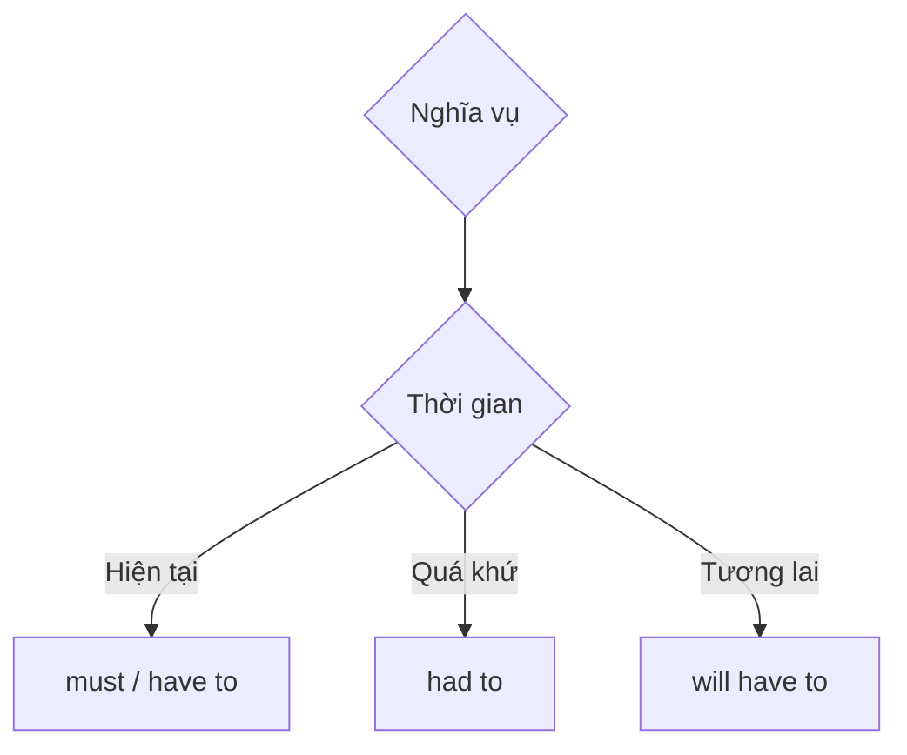

# 📋 Unit 31: have to and must

> [!abstract] Trọng tâm Part 5 TOEIC
> - `have to` và `must` đều diễn tả nghĩa vụ; `must` thường thể hiện yêu cầu/ý kiến trực tiếp của người nói.
> - `have to` thường nhấn mạnh quy định hoặc hoàn cảnh bên ngoài và dùng được ở mọi thì.
> - Quá khứ/tương lai dùng `had to` / `will have to`, không dùng `must` cho dạng quá khứ thông thường.
> - Phủ định khác nghĩa: `mustn’t` = bị cấm; `don’t have to` = không bắt buộc.

---

## A. `must` và `have to` ở hiện tại

| Dạng | Sắc thái | Ví dụ |
| :--- | :--- | :--- |
| `must + V` | yêu cầu mạnh / người nói thấy cần | *I **must finish** this report today.* |
| `have to + V` | quy định / hoàn cảnh bên ngoài | *Employees **have to wear** ID badges.* |

Trong nhiều câu, hai dạng đều có thể dùng; TOEIC thường kiểm tra cấu trúc và thì hơn là sắc thái tinh tế.

## B. Các thì của `have to`

- Quá khứ: *We **had to postpone** the launch.*
- Tương lai: *New hires **will have to complete** safety training.*
- Hiện tại hoàn thành: *The company **has had to reduce** expenses.*

## C. Phủ định: cấm đoán vs không cần thiết

| Cấu trúc | Nghĩa | Ví dụ |
| :--- | :--- | :--- |
| `mustn’t + V` | không được phép | *Visitors **mustn’t enter** the warehouse alone.* |
| `don’t/doesn’t have to + V` | không bắt buộc | *You **don’t have to print** the form.* |

> [!caution] Cạm bẫy thường gặp
> 1. ~~We must to submit the form.~~ → **We must submit the form.**
> 2. ~~Yesterday we must cancel the meeting.~~ → **Yesterday we had to cancel the meeting.**
> 3. ~~You mustn’t attend if you are busy.~~ (không bắt buộc) → **You don’t have to attend if you are busy.**

> [!tip] Mẹo chọn đáp án trong 5 giây
> Có mốc **quá khứ/tương lai** → ưu tiên dạng của `have to`. Phân biệt: **mustn’t = cấm**, **don’t have to = tùy chọn**.

---

## 🎯 Dấu hiệu nhận biết trong đề thi TOEIC Part 5 & 6

1. `company policy`, `regulations`, `required` → thường dùng `have to`.
2. `yesterday/last week` → `had to`.
3. `next month` → `will have to`.
4. Câu biển báo/cấm đoán → `mustn’t`; không bắt buộc → `don’t have to`.

## 📎 Liên kết trong hệ thống

- Trước: [[Unit 30 - may and might 2]]
- Sau: [[Unit 32 - must mustn’t needn’t]]
- Từ vựng liên quan: [[TOEIC Core Vocabulary]]

---
Trở về: [[English Grammar in Use MOC]] | [[TOEIC MOC]] | Bài tập: [[Unit 31 - Exercises (have to and must)]]
