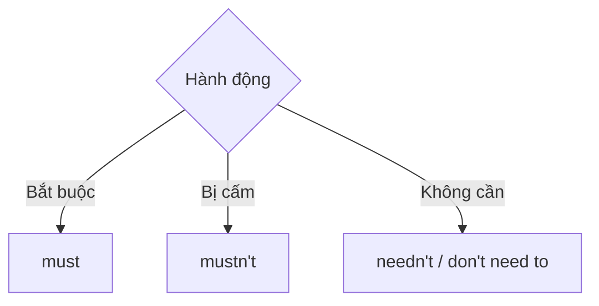

# 🚫 Unit 32: must mustn’t needn’t

> [!abstract] Trọng tâm Part 5 TOEIC
> - `must + V` = phải làm; `mustn’t + V` = tuyệt đối không được làm.
> - `needn’t + V` = không cần làm; gần nghĩa `don’t need to / don’t have to`.
> - `needn’t have + V3` = đã làm nhưng thực ra không cần.
> - `didn’t need to + V` chỉ nói không cần; thường không khẳng định hành động có xảy ra hay không.

---

## A. `must`, `mustn’t`, `needn’t`

| Cấu trúc | Nghĩa | Ví dụ |
| :--- | :--- | :--- |
| `must + V` | bắt buộc | *All invoices **must include** a purchase-order number.* |
| `mustn’t + V` | bị cấm | *You **mustn’t disclose** client data.* |
| `needn’t + V` | không cần | *You **needn’t bring** a printed copy.* |

## B. `needn’t` và `don’t need to`

Hai dạng đều có nghĩa không cần thiết:

- *You **needn’t attend** both workshops.*
- *You **don’t need to attend** both workshops.*

## C. `needn’t have done` vs `didn’t need to do`

- *We **needn’t have printed** 100 copies.* → đã in, nhưng lãng phí vì không cần.
- *We **didn’t need to print** 100 copies.* → không có nhu cầu; câu không nhất thiết cho biết đã in hay chưa.

Trong bài thi, dấu hiệu “đã làm rồi nhưng hóa ra không cần” gần như luôn dẫn đến `needn’t have + V3`.

> [!caution] Cạm bẫy thường gặp
> 1. ~~You mustn’t submit a paper copy; online is enough.~~ → **You needn’t submit a paper copy; online is enough.**
> 2. ~~We needn’t have print so many brochures.~~ → **We needn’t have printed so many brochures.**
> 3. ~~Employees don’t need share passwords.~~ → **Employees mustn’t share passwords.** (bị cấm)

> [!tip] Mẹo chọn đáp án trong 5 giây
> Hỏi: **cấm** hay chỉ **không cần**? Cấm → `mustn’t`; không cần → `needn’t/don’t have to`.

---

## 🎯 Dấu hiệu nhận biết trong đề thi TOEIC Part 5 & 6

1. `required/mandatory` → `must`.
2. `prohibited/not allowed/confidential` → `mustn’t`.
3. `optional/no need` → `needn’t` hoặc `don’t need to`.
4. Đã làm xong rồi và phát hiện không cần → `needn’t have + V3`.

## 📎 Liên kết trong hệ thống

- Trước: [[Unit 31 - have to and must]]
- Sau: [[Unit 33 - should 1]]
- Từ vựng liên quan: [[TOEIC Core Vocabulary]]

---
Trở về: [[English Grammar in Use MOC]] | [[TOEIC MOC]] | Bài tập: [[Unit 32 - Exercises (must mustn't needn't)]]
