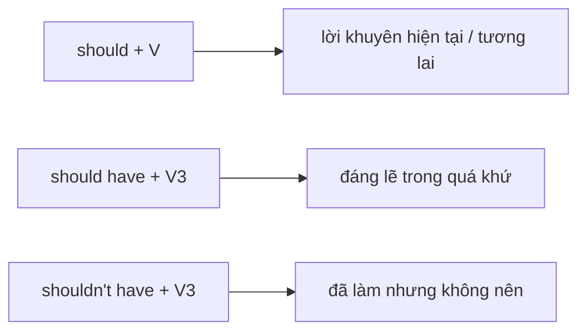

# ✅ Unit 33: should 1

> [!abstract] Trọng tâm Part 5 TOEIC
> - `should + V` và `ought to + V` dùng để khuyên hoặc nói điều đúng/nên làm.
> - `shouldn’t + V` diễn tả lời khuyên không nên làm.
> - `should have + V3` = đáng lẽ nên làm nhưng đã không làm; `shouldn’t have + V3` = đã làm nhưng không nên.
> - `should` nhẹ hơn `must` và không diễn tả nghĩa vụ tuyệt đối.

---

## A. Lời khuyên và ý kiến

| Cấu trúc | Ví dụ |
| :--- | :--- |
| `should + V` | *You **should confirm** the appointment by email.* |
| `shouldn’t + V` | *Staff **shouldn’t leave** confidential files unattended.* |
| `ought to + V` | *The supplier **ought to provide** a replacement.* |

## B. `should have done`: nhìn lại quá khứ

- *We **should have checked** the figures before publication.* (đã không kiểm tra)
- *You **shouldn’t have sent** the draft to the client.* (đã gửi, nhưng không nên)

## C. `should` vs `must`

- *You **should attend** the optional workshop.* → lời khuyên.
- *You **must attend** the mandatory safety briefing.* → bắt buộc.

TOEIC thường cung cấp từ `recommended/advisable` cho `should`, còn `required/mandatory` cho `must`.

> [!caution] Cạm bẫy thường gặp
> 1. ~~You should to confirm the booking.~~ → **You should confirm the booking.**
> 2. ~~We should have check the figures.~~ → **We should have checked the figures.**
> 3. ~~Employees should attend the mandatory safety briefing.~~ → **Employees must attend the mandatory safety briefing.**

> [!tip] Mẹo chọn đáp án trong 5 giây
> `recommended/advisable` → `should`; `mandatory/required` → `must`. Có sự tiếc nuối quá khứ → `should have + V3`.

---

## 🎯 Dấu hiệu nhận biết trong đề thi TOEIC Part 5 & 6

1. `recommend`, `advisable`, `a good idea` → `should + V`.
2. Lời khuyên phủ định → `shouldn’t + V`.
3. `but` cho biết hành động quá khứ đã không làm → `should have + V3`.
4. Hành động quá khứ đã làm và bị phê bình → `shouldn’t have + V3`.

## 📎 Liên kết trong hệ thống

- Trước: [[Unit 32 - must mustn’t needn’t]]
- Sau: [[Unit 34 - should 2]]
- Từ vựng liên quan: [[TOEIC Core Vocabulary]]

---
Trở về: [[English Grammar in Use MOC]] | [[TOEIC MOC]] | Bài tập: [[Unit 33 - Exercises (should 1)]]
