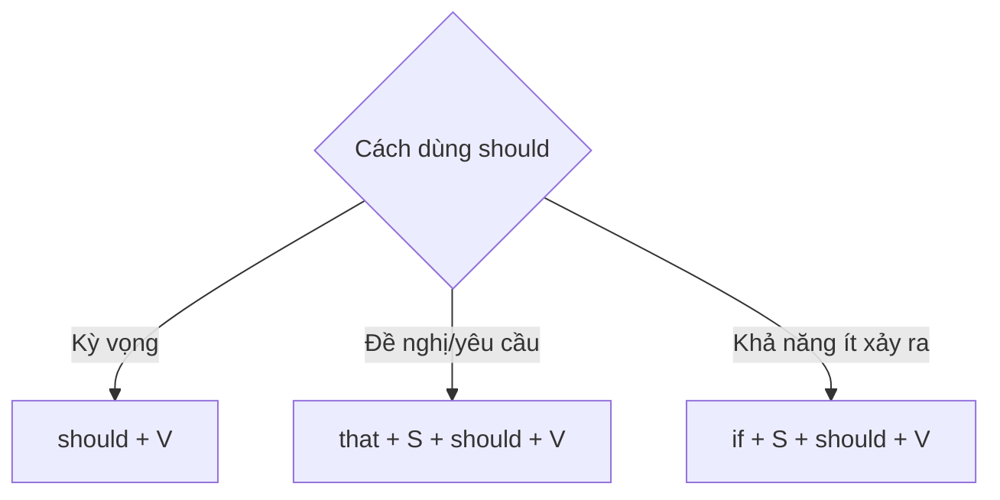

# 📈 Unit 34: should 2

> [!abstract] Trọng tâm Part 5 TOEIC
> - `should + V` diễn tả điều được kỳ vọng sẽ xảy ra: “chắc là / dự kiến là”.
> - Sau `suggest`, `recommend`, `insist`, `demand` có thể dùng `that + S + should + V`.
> - `if + S + should + V` diễn tả khả năng ít xảy ra hoặc trang trọng hơn.
> - `I should…` có thể dùng để nói điều hợp lý hoặc lời khuyên nhẹ cho bản thân.

---

## A. `should` = điều dự kiến / có khả năng hợp lý

- *The package **should arrive** by Friday.*
- *The new software **should improve** processing speed.*
- *There **should be** enough seats for all participants.*

Đây không phải lời khuyên; người nói dự đoán dựa trên kế hoạch hoặc thông tin hiện có.

## B. Sau `suggest / recommend / insist / demand`

| Động từ | Cấu trúc | Ví dụ |
| :--- | :--- | :--- |
| suggest / recommend | `that + S + should + V` | *We recommend that each applicant **should submit** two references.* |
| insist / demand | `that + S + should + V` | *The client insisted that the error **should be corrected** immediately.* |

Trong Anh-Mỹ, có thể bỏ `should`: *We recommend that each applicant submit…*

## C. `if … should …`

Dùng trong điều kiện trang trọng hoặc khi khả năng xảy ra thấp:

- *If you **should need** further assistance, contact reception.*
- *Should you **have** any questions, please email HR.* (đảo ngữ trang trọng)

> [!caution] Cạm bẫy thường gặp
> 1. ~~The package should arrives Friday.~~ → **The package should arrive Friday.**
> 2. ~~We recommend that he should submits two references.~~ → **We recommend that he should submit two references.**
> 3. ~~Should you have any questions, you contacted HR.~~ → **Should you have any questions, contact HR.**

> [!tip] Mẹo chọn đáp án trong 5 giây
> Sau `should` luôn dùng **V nguyên mẫu**. Gặp `recommend/suggest/insist/demand that` → tìm `should + V` hoặc subjunctive `V`.

---

## 🎯 Dấu hiệu nhận biết trong đề thi TOEIC Part 5 & 6

1. `expected`, `by Friday`, `according to schedule` → `should + V` mang nghĩa kỳ vọng.
2. `recommend/suggest/insist/demand that` → `should + V`.
3. `If you should…` hoặc đảo ngữ `Should you…` → điều kiện trang trọng.
4. Sau `should` không thêm `to`, không chia `-s`.

## 📎 Liên kết trong hệ thống

- Trước: [[Unit 33 - should 1]]
- Sau: ⚠️ Unit 35 — *I’d better … it’s time …* chưa được viết
- Từ vựng liên quan: [[TOEIC Core Vocabulary]]

---
Trở về: [[English Grammar in Use MOC]] | [[TOEIC MOC]] | Bài tập: [[Unit 34 - Exercises (should 2)]]
