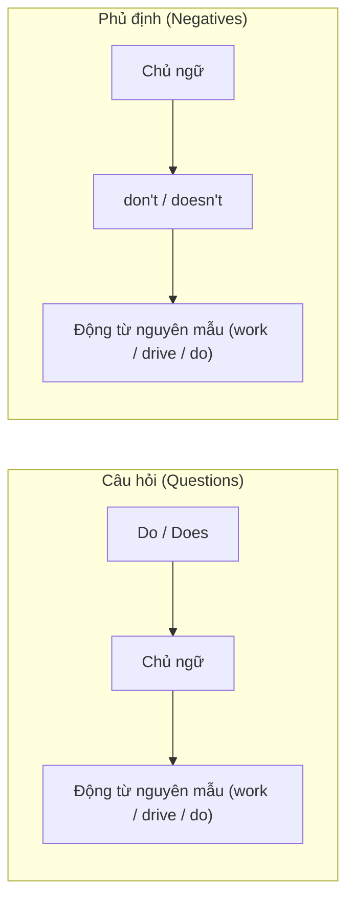

# 📖 Unit 2: Present Simple (I do) — Thì Hiện Tại Đơn

> [!abstract] Trích xuất từ sách *English Grammar in Use (Raymond Murphy)*
> Tổng hợp toàn bộ lý thuyết, quy tắc ngữ pháp, ví dụ thực tế và các lưu ý đặc biệt từ **Unit 2**.

---

## A. Tình Huống Mẫu & Bản Chất Của Thì (Example Situation)

> [!example] Ví dụ minh họa:
> * **Alex is a bus driver**, but now he is in bed asleep. He is **not driving** a bus. (He is asleep.)
> * *but* He **drives** a bus. He is a bus driver.

* **Bản chất:** `drive(s)`, `work(s)`, `do(es)` là thì **Present Simple**. Nó diễn tả nghề nghiệp, bản chất hoặc hành động lặp đi lặp lại trong cuộc sống, **không nhất thiết phải đang diễn ra ngay tại thời điểm nói**.

### Bảng chia động từ cơ bản:
| Chủ ngữ | Dạng động từ | Ví dụ |
| :--- | :--- | :--- |
| **I / we / you / they** | Động từ nguyên mẫu ($V_{inf}$) | `drive` / `work` / `do` |
| **he / she / it** | Thêm `-s` hoặc `-es` ($V_{s/es}$) | `drives` / `works` / `does` |

---

## B. Cách Dùng 1: Sự Thật Hiển Nhiên & Những Điều Chung (Things in General)

Thì hiện tại đơn được dùng để nói về:
1. Những sự việc xảy ra thường xuyên hoặc lặp đi lặp lại.
2. Những chân lý, sự thật chung trong cuộc sống.

> [!quote] Ví dụ thực tế:
> - *Nurses **look** after patients in hospitals.* (Y tá chăm sóc bệnh nhân trong bệnh viện - tính chất công việc chung)
> - *I usually **go** away at weekends.* (Tôi thường đi chơi vào cuối tuần - thói quen lặp lại)
> - *The earth **goes** round the sun.* (Trái đất quay quanh mặt trời - chân lý khoa học)
> - *The cafe **opens** at 7.30 in the morning.* (Quán cà phê mở cửa lúc 7h30 sáng - lịch trình cố định)

### Quy tắc biến đổi đuôi:
- `I work` $\rightarrow$ `he works`
- `they teach` $\rightarrow$ `my sister teaches`
- `you go` $\rightarrow$ `it goes`
- `I have` $\rightarrow$ `he has`

---

## C. Thể Phủ Định & Câu Hỏi với Trợ Động Từ (do / does)

Để đặt câu hỏi hoặc câu phủ định trong thì hiện tại đơn, ta **bắt buộc** mượn trợ động từ `do` hoặc `does`:

### Bảng cấu trúc chi tiết:
* **Câu hỏi:**
  * `do` + `I / we / you / they` + `work? / drive? / do?`
  * `does` + `he / she / it` + `work? / drive? / do?`
* **Phủ định:**
  * `I / we / you / they` + `don't` + `work / drive / do`
  * `he / she / it` + `doesn't` + `work / drive / do`

> [!example] Ví dụ:
> - *I come from Canada. Where **do you come** from?*
> - *I **don't go** away very often.*
> - *What **does this word mean**?* (⚠️ **Không nói:** *What means this word?*)
> - *Rice **doesn't grow** in cold climates.*

### Lưu ý quan trọng: `do` vừa làm trợ động từ, vừa làm động từ chính
- *“What **do** you **do**?”* — *“I work in a shop.”* (`do` đầu là trợ động từ, `do` sau là làm việc)
- *He’s always so lazy. He **doesn't do** anything to help.*

---

## D. Cách Dùng 2: Tần Suất Xảy Ra Hành Động (How Often)

Dùng thì hiện tại đơn để nói về mức độ thường xuyên bạn làm một việc gì đó:
- *I **get** up at 8 o’clock **every morning**.*
- *How often **do you go** to the dentist?*
- *Julie **doesn't drink** tea **very often**.*
- *Robert usually **goes** away **two or three times a year**.*

---

## E. Trường Hợp Đặc Biệt: Động Từ Thực Hiện Hành Vi (Performative Verbs)

Đôi khi ta thực hiện một hành động **bằng chính lời nói** tại thời điểm đó (hứa, đề xuất, xin lỗi...). 
Trong trường hợp này, ta dùng **Hiện Tại Đơn**, **KHÔNG dùng Hiện Tại Tiếp Diễn**:

> [!tip] Dùng: `I promise ...` / `I suggest ...`
> - *I **promise** I won’t be late.* (❌ Không nói: *I'm promising*)
> - *“What do you suggest I do?”* — *“I **suggest** that you...”*

Các động từ tương tự:
* `I apologise ...` (Tôi xin lỗi...)
* `I advise ...` (Tôi khuyên...)
* `I insist ...` (Tôi khăng khăng...)
* `I agree ...` (Tôi đồng ý...)
* `I refuse ...` (Tôi từ chối...)

---

## 🔗 Liên Kết & Bài Học Kế Tiếp
- [[TOEIC MOC]]: Mục lục tổng hợp toàn bộ các bài học tiếng Anh.
- So sánh Hiện tại đơn & Hiện tại tiếp diễn: `Unit 3-4` *(Sắp tạo)*.
- Thì hiện tại dùng cho tương lai: `Unit 19` *(Sắp tạo)*.
