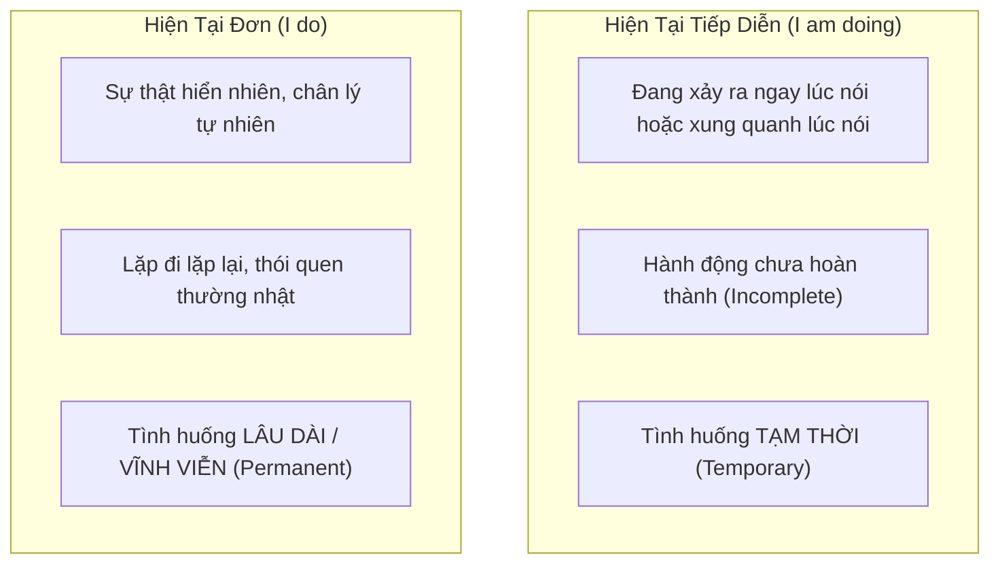

# ⚖️ Unit 3: Present Continuous and Present Simple 1 (I am doing and I do)

> [!abstract] Trọng tâm Part 5 TOEIC
> Unit này giải quyết câu hỏi cốt tử: **Khi nào dùng Hiện Tại Tiếp Diễn (`am/is/are + V-ing`), khi nào dùng Hiện Tại Đơn (`V / V-s/es`)?**

---

## A. Bảng So Sánh Toàn Diện (Comparison Matrix)

### 1. Đang diễn ra vs. Sự thật hiển nhiên / Thói quen
| Hiện Tại Tiếp Diễn (`am/is/are + V-ing`) | Hiện Tại Đơn (`V / V-s/es`) |
| :--- | :--- |
| *The water **is boiling**. Be careful.* (Nước **đang sôi ùng ục** ngay lúc này $\rightarrow$ cẩn thận!) | *Water **boils** at 100 degrees Celsius.* (Nước sôi ở $100^\circ\text{C}$ $\rightarrow$ chân lý khoa học bất biến) |
| *Listen to those people. What language **are they speaking**?* (Họ **đang nói** tiếng gì thế kia?) | *Excuse me, **do you speak** English?* (Bạn **có biết nói** tiếng Anh không? $\rightarrow$ khả năng tổng quát) |
| *Let's go out. It **isn't raining** now.* (Trời tạnh mưa rồi, ra ngoài thôi $\rightarrow$ ngay lúc này) | *It **doesn't rain** very much in summer.* (Mùa hè trời không mưa nhiều $\rightarrow$ quy luật thời tiết) |
| *'I'm busy.' — 'What **are you doing**?'* (Bận gì đấy? Đang làm cái gì đấy?) | *What **do you usually do** at weekends?* (Cuối tuần bạn thường làm gì? $\rightarrow$ thói quen) |
| *I**'m getting** hungry. Let's go and eat.* (Bụng tôi bắt đầu đói cồn cào rồi $\rightarrow$ tiến trình thay đổi) | *I always **get** hungry in the afternoon.* (Chiều nào tôi cũng thấy đói $\rightarrow$ thói quen) |
| *Kate wants to work in Italy, so she**'s learning** Italian.* (Cô ấy **đang học** tiếng Ý $\rightarrow$ dự án xung quanh thời điểm nói) | *Most people **learn** to swim when they are children.* (Phần lớn mọi người học bơi khi còn nhỏ $\rightarrow$ sự thật chung) |
| *The population of the world **is increasing** very fast.* (Dân số thế giới **đang tăng vọt** $\rightarrow$ xu hướng biến đổi) | *Every day the population of the world **increases** by about 200,000.* (Mỗi ngày dân số tăng 200.000 người $\rightarrow$ số liệu thống kê đều đặn) |

---

### 2. Tạm thời (Temporary) vs. Lâu dài / Vĩnh viễn (Permanent)
Đây là bẫy ngữ pháp cực kỳ phổ biến trong TOEIC:

> [!tip] Quy tắc vàng phân biệt:
> * **Tạm thời (Temporary - dùng Tiếp Diễn):** Một tình huống chỉ diễn ra trong vài ngày, vài tuần, rồi sẽ kết thúc.
>   * *I**'m living** with some friends until I find a place of my own.* (Tôi **tạm ở nhờ** nhà bạn cho đến khi tìm được nhà riêng).
>   * *You**'re working** hard today. — Yes, I have a lot to do.* (Hôm nay bạn làm việc cật lực thế $\rightarrow$ chỉ riêng hôm nay có nhiều việc).
> * **Lâu dài / Ổn định (Permanent - dùng Hiện Tại Đơn):**
>   * *My parents **live** in London. They have lived there all their lives.* (Bố mẹ tôi sống ở London $\rightarrow$ định cư cả đời).
>   * *Joe isn't lazy. He **works** hard most of the time.* (Joe chăm chỉ $\rightarrow$ bản chất con người anh ấy luôn như vậy).

---

## B. Cấu Trúc Đặc Biệt: `I always do` vs. `I'm always doing`

Cả hai đều đi với trạng từ `always`, nhưng sắc thái ý nghĩa hoàn toàn khác nhau:

### 1. `I always do something` (Thói quen bình thường)
* Nghĩa: Tôi **luôn luôn** làm việc đó mỗi lần (100% các lần).
* *Ví dụ:* *I **always go** to work by car.* (Lần nào đi làm tôi cũng đi bằng ô tô).
* ❌ *Không nói:* *I'm always going...*

### 2. `I'm always doing something` (Than phiền / Chỉ trích / Quá mức bình thường)
* Nghĩa: Việc đó xảy ra **quá thường xuyên**, nhiều hơn mức bình thường, khiến người nói **khó chịu hoặc than phiền**.
* *Ví dụ hình ảnh:* Cô gái lục tung túi xách tìm chìa khóa:
  > *“I’ve lost my keys again. I**'m always losing** them!”*  
  > (Lại mất chìa khóa rồi! Suốt ngày làm mất chìa khóa thôi! $\rightarrow$ than phiền bản thân đãng trí quá mức).
* *Ví dụ khác:*
  * *Paul is never satisfied. He**'s always complaining**.* (= Paul phàn nàn quá nhiều, không bao giờ hài lòng).
  * *You**'re always looking** at your phone. Don't you have anything else to do?* (Sao lúc nào mày cũng cắm mặt vào điện thoại thế? Không có việc gì khác để làm à?).

---

## 🎯 Ứng Dụng Trong Bài Thi TOEIC (Test Tips)
1. **Dấu hiệu nhận biết Tiếp Diễn:**
   * Các từ chỉ sự biến đổi, xu hướng: `increase`, `decrease`, `rise`, `fall`, `grow`, `change`, `improve`.
   * Các mệnh đề có: `Look!`, `Listen!`, `at the moment`, `now`, `currently`, `this week/month` (tạm thời).
2. **Dấu hiệu nhận biết Hiện Tại Đơn:**
   * Các trạng từ tần suất: `always`, `usually`, `often`, `seldom`, `rarely`, `every day/year`.

---
Trở về: [[English Grammar in Use MOC]] | [[TOEIC MOC]] | [[Home]]
