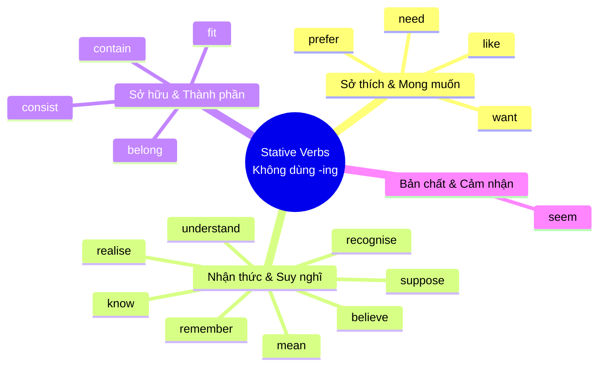

# 🧠 Unit 4: Present Continuous and Present Simple 2 (I am doing and I do)

> [!abstract] Trọng tâm Part 5 TOEIC
> - **Nguyên tắc vàng:** Có những động từ chỉ **trạng thái, cảm xúc, nhận thức, sở hữu (Stative Verbs)** hầu như **KHÔNG bao giờ chia ở thì tiếp diễn** (Continuous - `-ing`), mà phải dùng thì **Hiện Tại Đơn**.
> - Điểm bẫy Part 5: Phân biệt các từ có 2 nghĩa (vừa là trạng thái vừa là hành động như `think`, `see`, `taste`, `be being`).

---

## A. Động từ không dùng ở thì Tiếp Diễn (Stative Verbs)

Các động từ diễn tả trạng thái nhận thức, cảm xúc, quan hệ sở hữu:

> **Ví dụ:**
> - *I'm hungry. I **want** something to eat.* (KHÔNG NÓI: *~~I'm wanting~~*)
> - ***Do you understand** what I **mean**?* (KHÔNG NÓI: *~~Are you understanding what I'm meaning?~~*)
> - *Anna **doesn't seem** very happy right now.* (KHÔNG NÓI: *~~isn't seeming~~*)

---

## B. Trường hợp đặc biệt: `think`

Động từ `think` có 2 nghĩa với cách dùng khác nhau hoàn toàn:

| Nghĩa của `think` | Thì sử dụng | Ví dụ |
| :--- | :--- | :--- |
| **Tin rằng / Cho rằng / Quan điểm** (= *believe / have an opinion*) | **Hiện tại đơn** (KHÔNG dùng `-ing`) | - *I **think** Mary is Canadian, but I'm not sure.* - *What **do you think** of my idea?* |
| **Đang cân nhắc / Đang suy ngẫm** (= *consider / reflect*) | **Hiện tại tiếp diễn** (Dùng `-ing` được) | - *I**'m thinking** about what happened.* - *Nicky **is thinking** of giving up her job.* |

---

## C. Động từ giác quan & cảm giác: `see, hear, smell, taste, look, feel`

### 1. `see / hear / smell / taste`
Thường dùng **Hiện tại đơn** (không chia tiếp diễn khi nói về tri giác tự nhiên):
- ***Do you see** that man over there?* (KHÔNG DÙNG: *~~are you seeing~~*)
- *The room **smells**. Let's open a window.*
- *This soup **doesn't taste** very good.*

### 2. `look` và `feel` (Vẻ ngoài & cảm xúc ngay lúc này)
Có thể dùng **cả Hiện tại đơn HOẶC Hiện tại tiếp diễn**:
- *You **look** well today.* = *You**'re looking** well today.*
- *How **do you feel** now?* = *How **are you feeling** now?*

> [!caution] Ngoại lệ thói quen
> Khi nói về thói quen thường xuyên, chỉ dùng **Hiện tại đơn**:
> - *I usually **feel** tired in the morning.* (KHÔNG NÓI: *~~I'm usually feeling~~*)

---

## D. Cấu trúc đặc biệt: `am/is/are being + Adj` (Tạm thời cư xử)

Phân biệt giữa bản chất tính cách (thường xuyên) và hành vi tạm thời ngay lúc này:

| Cấu trúc | Ý nghĩa | Ví dụ so sánh |
| :--- | :--- | :--- |
| **`am/is/are + Adj`** | **Bản chất lâu dài / Thói quen tính cách** | *He never thinks about other people. He **is very selfish**.* (Bản chất anh ta là người ích kỷ) |
| **`am/is/are being + Adj`** | **Đang cư xử / Hành xử tạm thời lúc này** (có thể kiểm soát được hành vi) | *I can't understand why he **is being so selfish**. He isn't usually like that.* (Bình thường không thế, tự dưng lúc này lại ích kỷ thế) |

> [!important] Lưu ý:
> Chỉ dùng `being` cho những hành vi **con người có thể tự chủ/kiểm soát được** (như ích kỷ, cẩn thận, ngu ngốc, bất lịch sự).
> - ✅ *I'm **being very careful**.* (Tôi đang rất cẩn thận)
> - ❌ *Sam ~~is being ill~~.* $\rightarrow$ ✅ *Sam **is ill**.* (Bị ốm không thể tự kiểm soát nên không dùng `being`).
> - ❌ *~~Are you being tired?~~* $\rightarrow$ ✅ ***Are you tired?***

---
Trở về: [[Unit 03 - Present Continuous and Present Simple 1]] | [[English Grammar in Use MOC]] | [[TOEIC MOC]] | Bài tập: [[Unit 04 - Exercises (Present Continuous and Present Simple 2)]]
