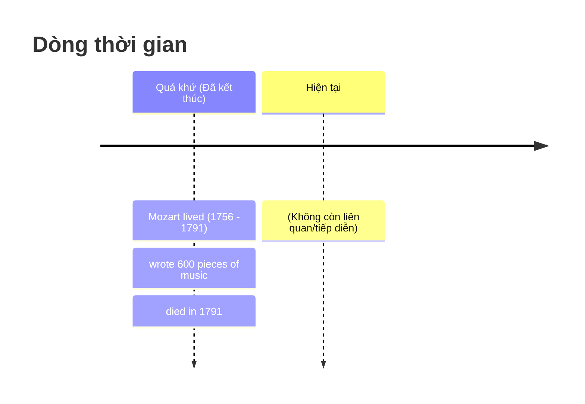

# ⏳ Unit 5: Past Simple (I did)

> [!abstract] Trọng tâm Part 5 TOEIC
> - Thì **Quá khứ đơn (Past Simple)** diễn tả hành động **đã bắt đầu và kết thúc hoàn toàn trong quá khứ**, có thời gian xác định rõ ràng.
> - Điểm bẫy Part 5: Dấu hiệu nhận biết thời gian quá khứ (`yesterday`, `last night/week/year`, `ago`, `in + năm trong quá khứ`), động từ bất quy tắc và phân biệt động từ to be (`was/were`).

---

## A. Bản chất thì Quá Khứ Đơn (Context & Usage)

> **Ví dụ điển hình:**
> *Wolfgang Amadeus Mozart **was** an Austrian musician and composer. He **lived** from 1756 to 1791. He **started** composing at the age of five and **wrote** more than 600 pieces of music. He **was** only 35 years old when he **died**.*
> $\rightarrow$ Toàn bộ các động từ `lived`, `started`, `wrote`, `was`, `died` đều ở **Past Simple** vì sự việc đã hoàn tất trọn vẹn trong quá khứ.

---

## B. Dạng thức động từ: Có quy tắc (Regular) & Bất quy tắc (Irregular)

### 1. Động từ có quy tắc (Regular verbs: `V + ed`)
Thường kết thúc bằng đuôi `-ed`:
- `work` $\rightarrow$ `worked`: *I work in a travel agency now. Before that I **worked** in a department store.*
- `invite` $\rightarrow$ `invited`, `decide` $\rightarrow$ `decided`: *They **invited** us to their party, but we **decided** not to go.*
- `stop` $\rightarrow$ `stopped`: *The police **stopped** me on my way home last night.*
- `study` $\rightarrow$ `studied`: *Laura passed her exam because she **studied** very hard.*

> [!tip] Quy tắc thêm đuôi `-ed` (Spelling rules)
> - Động từ tận cùng bằng **-e**: chỉ cần thêm `-d` (*live $\rightarrow$ lived*).
> - 1 nguyên âm + 1 phụ âm cuối (âm tiết nhấn mạnh): **nhân đôi phụ âm** (*stop $\rightarrow$ stopped*, *plan $\rightarrow$ planned*).
> - Phụ âm + **-y**: đổi thành **-ied** (*study $\rightarrow$ studied*, *try $\rightarrow$ tried*).

### 2. Động từ bất quy tắc (Irregular verbs)
Không thêm `-ed` mà biến đổi hình thức riêng (cần học thuộc cột 2 trong bảng Bất quy tắc):
- `write` $\rightarrow$ **`wrote`**: *Mozart **wrote** more than 600 pieces of music.*
- `see` $\rightarrow$ **`saw`**: *We **saw** Alice in town a few days ago.*
- `go` $\rightarrow$ **`went`**: *I **went** to the cinema three times last week.*
- `shut` $\rightarrow$ **`shut`** (không đổi): *It was cold, so I **shut** the window.*

---

## C. Thể Nghi vấn (Questions) & Phủ định (Negatives)

Trong câu hỏi và phủ định, dùng trợ động từ **`did` / `didn't` + động từ nguyên mẫu (infinitive)**:

| Khẳng định (Positive) | Câu hỏi (Questions) | Phủ định (Negatives) |
| :--- | :--- | :--- |
| I / She / They **enjoyed** | **Did** you / she / they **enjoy**? | I / She / They **didn't enjoy** |
| I / She / They **saw** | **Did** you / she / they **see**? | I / She / They **didn't see** |
| I / She / They **went** | **Did** you / she / they **go**? | I / She / They **didn't go** |

> [!caution] Cạm bẫy kinh điển trong bài thi
> Khi đã mượn trợ động từ `did` hoặc `didn't`, động từ chính **BẮT BUỘC trở về nguyên mẫu (V-inf)**:
> - ❌ *I didn't ~~bought~~ anything.* $\rightarrow$ ✅ *I **didn't buy** anything.*
> - ❌ *Did you ~~went~~ out?* $\rightarrow$ ✅ ***Did you go** out?*

### Động từ chính là `do`:
Khi `do` đóng vai trò động từ chính, vẫn mượn trợ động từ `did`:
- *What **did** you **do** at the weekend?* (Không nói: *What did you at the weekend?*)
- *I **didn't do** anything.* (Không nói: *I didn't anything.*)

---

## D. Động từ To Be ở quá khứ: `was / were`

Động từ `to be` (`am/is/are`) chuyển sang quá khứ là **`was`** hoặc **`were`** (Không dùng trợ động từ `did` với `to be`):

| Chủ ngữ | Khẳng định / Phủ định | Câu hỏi |
| :--- | :--- | :--- |
| **I / he / she / it** | **was / wasn't** | **Was** (I / he / she / it)...? |
| **we / you / they** | **were / weren't** | **Were** (we / you / they)...? |

> **Ví dụ:**
> - *I **was** annoyed because they **were** late.*
> - ***Was** the weather good when you **were** on holiday?*
> - *They **weren't** able to come because they **were** so busy.*
> - *I **wasn't** hungry, so I didn't eat anything.*
> - *Did you go out last night or **were** you too tired?*

---

## 🎯 Dấu hiệu nhận biết trong đề thi TOEIC
Gặp các từ này, ưu tiên ngay thì **Quá Khứ Đơn**:
1. **yesterday** (*yesterday morning, yesterday afternoon*)
2. **last** + thời gian: *last night, last week, last month, last year*
3. khoảng thời gian + **ago**: *two days ago, ten minutes ago, a few years ago*
4. **in** + năm trong quá khứ: *in 1990, in 2020*
5. Mệnh đề thời gian với **when**: *When I was a child, when he arrived...*

---
Trở về: [[English Grammar in Use MOC]] | [[TOEIC MOC]]
