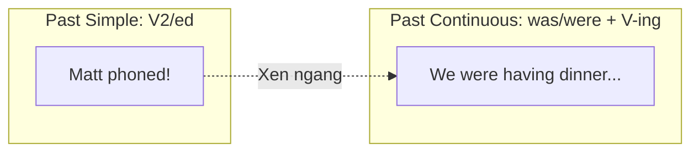

# ⏳ Unit 6: Past Continuous (I was doing)

> [!abstract] Trọng tâm Part 5 TOEIC
> - Thì **Quá khứ tiếp diễn (Past Continuous)** diễn tả một hành động **đang diễn ra tại một thời điểm xác định trong quá khứ** (*in the middle of an action*).
> - Cặp thì kinh điển trong đề thi TOEIC: **Hành động đang diễn ra (Past Continuous) thì có hành động khác xen vào (Past Simple)**, thường đi với liên từ `when`, `while`, `as`.
> - Phân biệt rõ: **Hành động đang dang dở** (*was doing*) vs. **Hành động đã hoàn tất trọn vẹn** (*did*).

---

## A. Bản chất thì Quá Khứ Tiếp Diễn (Context & Form)

Cấu trúc cơ bản:
$$\mathbf{S + was / were + V\text{-ing}}$$

| Chủ ngữ (Subject) | Khẳng định (Positive) | Phủ định (Negative) | Câu hỏi (Question) |
| :--- | :--- | :--- | :--- |
| **I / He / She / It** | was doing / working | wasn't (was not) doing | Was (he/she/it) doing? |
| **We / You / They** | were doing / working | weren't (were not) doing | Were (we/you/they) doing? |

```mermaid
timeline
    title Dòng thời gian Past Continuous
    10:00 (Bắt đầu chơi) : Karen and Joe started playing tennis
    10:30 (Đang diễn ra) : They were playing tennis (in the middle of playing)
    11:30 (Kết thúc) : They finished playing tennis
    Hiện tại : (Đã xong trong quá khứ)
```

> **Ví dụ điển hình:**
> *Yesterday Karen and Joe played tennis. They started at 10 o'clock and finished at 11.30. So, at 10.30 they **were playing** tennis.*  
> $\rightarrow$ `They were playing` = họ đang ở giữa chừng trận đấu (*in the middle of playing*), hành động chưa kết thúc tại mốc 10h30.

- *This time last year I **was living** in Hong Kong.* (Thời điểm này năm ngoái tôi đang sống ở Hồng Kông).
- *What **were you doing** at 10 o'clock last night?* (Lúc 10 giờ tối qua bạn đang làm gì?).
- *I waved to Helen, but she **wasn't looking**.* (Tôi vẫy tay chào Helen nhưng cô ấy không nhìn về phía tôi).

---

## B. So sánh: Quá Khứ Tiếp Diễn (`I was doing`) vs Quá Khứ Đơn (`I did`)

| Quá khứ tiếp diễn (`was/were + V-ing`) | Quá khứ đơn (`V-ed / V2`) |
| :--- | :--- |
| **Hành động đang diễn ra dở dang** (*in the middle of an action*) | **Hành động đã hoàn tất trọn vẹn** (*complete action*) |
| *We **were walking** home when I met Dan.*<br>(Đang trên đường đi bộ về nhà thì gặp Dan). | *We **walked** home after the party last night.*<br>(Chúng tôi đã đi bộ về nhà - đi từ đầu tới cuối). |
| *Kate **was watching** TV when we arrived.*<br>(Kate đang xem dở TV khi chúng tôi tới nơi). | *Kate **watched** TV a lot when she was ill last year.*<br>(Kate đã xem TV rất nhiều khi bị ốm năm ngoái). |

---

## C. Sự kết hợp hành động trong quá khứ (`when`, `while`, `as`)

### 1. Một hành động xen vào giữa một hành động đang diễn ra
Dùng thì **Quá khứ đơn (Past Simple)** cho hành động xen vào, và **Quá khứ tiếp diễn (Past Continuous)** cho hành động nền đang diễn ra:
- *Matt phoned **while** we **were having** dinner.* (Matt gọi điện khi chúng tôi đang ăn tối).
- *It **was raining** **when** I got up.* (Trời đang mưa khi tôi thức dậy).
- *I hurt my back **while** I **was working** in the garden.* (Tôi bị đau lưng khi đang làm vườn).



### 2. Các hành động xảy ra nối tiếp nhau (Action after action)
Khi một sự việc xảy ra **sau** một sự việc khác, **cả hai đều dùng Quá khứ đơn (Past Simple)**:
- *I **was walking** along the road when I **saw** Dan. So I **stopped**, and we **talked** for a while.*  
  (Đang đi thì thấy Dan $\rightarrow$ thấy xong thì dừng lại $\rightarrow$ dừng lại rồi nói chuyện).

> [!caution] Cạm bẫy phân biệt ngữ nghĩa trong đề thi
> So sánh 2 câu sau:
> - *When Karen arrived, we **were having** dinner.*  
>   $\rightarrow$ Chúng tôi đã bắt đầu ăn trước khi Karen tới; khi cô ấy đến thì chúng tôi **đang ăn dở**.
> - *When Karen arrived, we **had** dinner.*  
>   $\rightarrow$ Karen đến trước, rồi sau đó chúng tôi **mới cùng nhau ăn tối**.

---

## D. Động từ trạng thái (Stative Verbs) không chia tiếp diễn

Tương tự như ở thì Hiện tại tiếp diễn (Unit 4), các **động từ chỉ trạng thái, tri giác, sở hữu** (`know`, `want`, `like`, `believe`, `understand`, `belong`...) **KHÔNG** chia ở dạng Quá khứ tiếp diễn:
- ❌ *We were good friends. We ~~were knowing~~ each other well.*  
  $\rightarrow$ ✅ *We were good friends. We **knew** each other well.*
- ❌ *I was enjoying the party, but Chris ~~was wanting~~ to go home.*  
  $\rightarrow$ ✅ *I was enjoying the party, but Chris **wanted** to go home.*

---

## 🎯 Dấu hiệu nhận biết trong đề thi TOEIC Part 5 & 6

1. **Thời điểm cụ thể trong quá khứ:**
   - `at [giờ cụ thể] yesterday / last night` (*at 9 PM yesterday, at 10 o'clock last night*).
   - `at this/that time last week / last year` (*at this time yesterday*).
2. **Cấu trúc liên từ chỉ thời gian:**
   - `While + S + was/were + V-ing, S + V-ed` *(While Mr. Park was reviewing the contract, the client called)*.
   - `When + S + V-ed, S + was/were + V-ing` *(When the fire alarm rang, employees were attending a seminar)*.
   - `As + S + was/were + V-ing...`
3. **Hai hành động song song diễn ra cùng lúc trong quá khứ:**
   - `While S1 + was/were + V-ing, S2 + was/were + V-ing` (*While she was typing the report, her manager was checking the invoices*).

---
Trở về: [[English Grammar in Use MOC]] | [[TOEIC MOC]] | Bài tập: [[Unit 06 - Exercises (Past Continuous)]]
