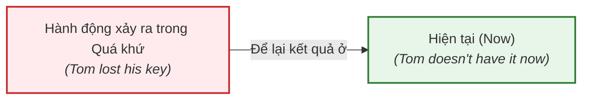

# ⏳ Unit 7: Present Perfect 1 (I have done)

> [!abstract] Trọng tâm Part 5 TOEIC
> - Thì **Hiện tại hoàn thành (Present Perfect)** diễn tả một hành động xảy ra trong quá khứ nhưng **kết quả hoặc ảnh hưởng vẫn còn gắn liền với hiện tại** (*connection with now*).
> - Cung cấp **thông tin mới** (*new information*), thông báo tin tức hoặc sự việc vừa xảy ra.
> - Bộ ba trạng từ vàng trong đề thi TOEIC: **`just`** (vừa mới), **`already`** (đã... rồi), **`yet`** (chưa — dùng trong câu phủ định và câu hỏi).
> - Điểm bẫy Part 5: Phân biệt **`been to`** (đã đi và đã về) vs **`gone to`** (đã đi và hiện chưa về).

---

## A. Cấu trúc cơ bản (Form)

$$\mathbf{S + have / has + V_3 / V\text{-ed}}$$

| Chủ ngữ (Subject) | Khẳng định (Positive) | Viết tắt (Short form) | Phủ định (Negative) | Câu hỏi (Question) |
| :--- | :--- | :--- | :--- | :--- |
| **I / We / You / They** | have finished / lost | **I've** / **We've** finished | haven't (have not) | **Have** you finished? |
| **He / She / It** | has finished / lost | **He's** / **She's** finished | hasn't (has not) | **Has** he finished? |

> [!tip] Dạng quá khứ phân từ ($V_3$ / Past Participle)
> - **Có quy tắc (Regular):** thêm `-ed` (*cleaned*, *decided*, *improved*).
> - **Bất quy tắc (Irregular):** biến đổi riêng, cần học thuộc cột 3 (*lost*, *done*, *written*, *seen*, *shrunk*, *broken*).

---

## B. Bản chất: Mối liên kết chặt chẽ với Hiện Tại (Connection with Now)

Khác với Quá khứ đơn (chấm dứt hoàn toàn trong quá khứ), thì Hiện tại hoàn thành luôn có **sợi dây liên kết với hiện tại**:

> **So sánh thực tế:**
> - *Tom **has lost** his key.* $\rightarrow$ Tom làm mất chìa khóa và **hiện tại vẫn chưa tìm thấy** (*he doesn't have it now*).
> - *He told me his name, but I**'ve forgotten** it.* $\rightarrow$ Tôi đã quên tên anh ấy và **hiện tại không nhớ ra được** (*I can't remember it now*).
> - *Sally is still here. She **hasn't gone** out.* $\rightarrow$ Sally **hiện vẫn đang ở đây** (*she is here now*).
> - *I can't find my bag. **Have you seen** it?* $\rightarrow$ Bạn có biết chiếc túi **hiện đang ở đâu** không?

### Cung cấp thông tin mới (New Information / News)
Khi thông báo một sự kiện vừa xảy ra hoặc đưa ra thông tin cập nhật:
- *Ow! I**'ve cut** my finger.* (Ái chà! Tôi vừa đứt tay rồi).
- *The road is closed. There **has been** an accident.* (Đường bị cấm. Vừa có một vụ tai nạn xảy ra).
- *Police **have arrested** two men in connection with the robbery.* (Cảnh sát đã bắt giữ hai người đàn ông liên quan đến vụ cướp).

---

## C. Cạm bẫy TOEIC: Phân biệt `been to` và `gone to`

| Cụm từ | Ý nghĩa | Vị trí hiện tại của chủ thể |
| :--- | :--- | :--- |
| **`have/has been to`** | Đã đến nơi nào đó và **đã trở về** | Hiện đang ở nhà / ở nơi nói chuyện |
| **`have/has gone to`** | Đã đi đến nơi nào đó và **chưa trở về** | Hiện vẫn đang ở đó hoặc đang trên đường đi |

*Ví dụ:*
- *James is on holiday. He **has gone to** Italy.* $\rightarrow$ James đang ở Ý hoặc trên đường bay sang Ý.
- *Amy is back home now. She **has been to** Italy.* $\rightarrow$ Amy đã đi Ý chơi và hiện **đã quay trở về nhà**.

---

## D. Bộ ba trạng từ: `just`, `already`, `yet`

### 1. `just` = cách đây một khoảng thời gian rất ngắn (*a short time ago*)
Vị trí: đứng giữa `have/has` và động từ chính ($V_3$).
- *'Are you hungry?' — 'No, I**'ve just had** lunch.'* (Không, tôi vừa mới ăn trưa xong).
- *Hello. **Have you just arrived**?* (Chào bạn. Bạn vừa mới tới à?).

### 2. `already` = sớm hơn dự kiến (*sooner than expected*)
Vị trí: đứng giữa `have/has` và $V_3$ (hoặc ở cuối câu).
- *'Don't forget to pay the bill.' — 'I**'ve already paid** it.'* (Đừng quên trả hóa đơn nhé. — Tôi đã trả nó rồi).
- *'What time is Mark leaving?' — 'He**'s already left**.'* (Mark đi mấy giờ? — Anh ấy đã rời đi rồi).

### 3. `yet` = cho đến tận bây giờ (*until now*)
Dùng khi người nói **đang trông đợi một sự việc sẽ xảy ra**.  
Vị trí: **thường đứng ở cuối câu** trong **câu phủ định** và **câu hỏi**:
- *Has it stopped raining **yet**?* (Trời đã tạnh mưa chưa?).
- *I've written the email, but I **haven't sent** it **yet**.* (Tôi soạn email rồi nhưng chưa gửi đi).

> [!note] Điểm khác biệt Anh - Mỹ (American English)
> Trong tiếng Anh giao tiếp của người Mỹ, thì **Past Simple** cũng rất phổ biến với *just, already, yet*:
> - *He's gone out* HOẶC *He went out*.
> - *I've just had lunch* HOẶC *I just had lunch*.
> - *I haven't sent it yet* HOẶC *I didn't send it yet*.  
> Tuy nhiên, trong bài thi chuẩn hóa **TOEIC Part 5**, các từ nhận diện như `already`, `yet`, `just` vẫn là dấu hiệu ưu tiên hàng đầu của thì **Hiện Tại Hoàn Thành**.

---

## 🎯 Dấu hiệu nhận biết trong đề thi TOEIC Part 5 & 6

1. **Trạng từ đứng giữa câu:** `just`, `already`, `recently`, `lately`.
2. **Trạng từ đứng cuối câu hỏi & phủ định:** `yet`.
3. **Cụm từ chỉ kết quả ở hiện tại:**
   - Khi mệnh đề trước nêu kết quả hiện tại (*The door is locked...*), mệnh đề sau dùng Present Perfect (*...because everyone has left*).
   - *Please note that prices **have increased** due to shipping costs.* (Giá cả đã tăng lên).

---
Trở về: [[English Grammar in Use MOC]] | [[TOEIC MOC]] | Bài tập: [[Unit 07 - Exercises (Present Perfect 1)]]
