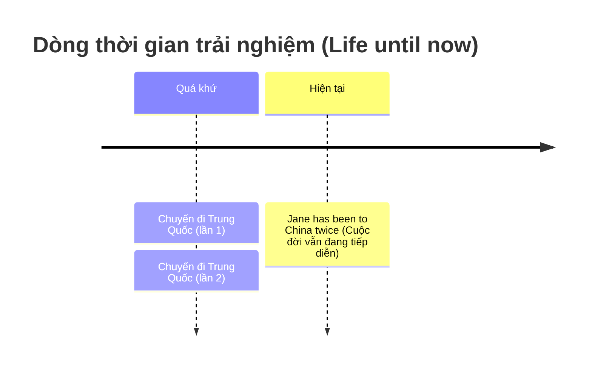

# ⏳ Unit 8: Present Perfect 2 (I have done)

> [!abstract] Trọng tâm Part 5 TOEIC
> - **Trải nghiệm tính đến hiện tại:** Nói về những việc đã từng làm hoặc chưa từng làm trong đời (`ever`, `never`, `the most... I've ever...`).
> - **Khoảng thời gian chưa kết thúc:** Dùng với các mốc thời gian vẫn đang tiếp diễn ở hiện tại (`today`, `this week`, `this morning`, `this year`).
> - **Cụm từ chỉ tiến trình tính tới nay:** `recently` (gần đây), `so far` (cho đến nay), `in the last few days` (trong vài ngày qua), `since` (kể từ khi).
> - Cấu trúc đề thi cực chuộng: **`It is the first / second time + S + have/has + V3`** (Lần đầu tiên / lần thứ hai ai đó làm gì).

---

## A. Trải nghiệm suốt cuộc đời tính đến nay (Life Experience)

Khi nói về những việc xảy ra trong suốt khoảng thời gian từ quá khứ kéo dài đến hiện tại (ví dụ: cuộc đời của một người), ta dùng thì **Hiện Tại Hoàn Thành**:

> **Hội thoại mẫu:**
> - *DAVE: **Have you travelled** a lot, Jane?*
> - *JANE: Yes, I**'ve been to** lots of places.*
> - *DAVE: Really? **Have you ever been** to China?*
> - *JANE: Yes, I**'ve been to** China twice.*
> - *DAVE: What about India?*
> - *JANE: No, I **haven't been** to India.*

### Các cấu trúc trải nghiệm phổ biến:
- **`Have you ever + V3...?`** (Bạn đã từng bao giờ...?):
  - *Have you ever eaten caviar?* (Bạn đã từng ăn trứng cá muối bao giờ chưa?)
- **`S + have/has never + V3`** (Chưa từng bao giờ):
  - *We've never had a car.* (Chúng tôi chưa bao giờ sở hữu ô tô cả).
- **Cấu trúc so sánh nhất (Superlative + ever):**
  - *It's the most boring movie I**'ve ever seen**.* (Đó là bộ phim chán nhất mà tôi từng xem).
  - *What's the most beautiful place you**'ve ever visited**?* (Nơi đẹp nhất bạn từng đến thăm là nơi nào?)

> [!note] Quy ước `been (to)`
> Trong ngữ cảnh này, **`been to = visited`** (đã từng đặt chân tới / tham quan):
> - *I've never been to Canada. Have you been there?*

---

## B. Khoảng thời gian chưa kết thúc & Kéo dài tới nay

### 1. Các trạng từ chỉ tiến trình tiếp diễn tới thời điểm nói
- **`recently` / `lately`** (gần đây):
  - *Have you heard anything from Ben **recently**?* (Dạo gần đây bạn có nghe tin tức gì về Ben không?)
- **`in the last / past few days (weeks, months)`** (trong vài ngày qua):
  - *I've met a lot of people **in the last few days**.*
- **`so far`** (cho đến nay):
  - *Everything is going well. There haven't been any problems **so far**.* (Mọi chuyện đều suôn sẻ. Cho đến nay chưa có vấn đề nào phát sinh cả).
- **`since + mốc thời gian`** (kể từ khi):
  - *It has rained every day **since I arrived**.* (Trời mưa mỗi ngày kể từ khi tôi đến đây).
- **`for a long time` / `for ages`** (đã lâu lắm rồi):
  - *We haven't seen each other **for a long time**.* (Lâu lắm rồi chúng ta không gặp nhau).

### 2. Đi với `today`, `this morning`, `this week`, `this year`
Dùng thì Hiện tại hoàn thành khi **khoảng thời gian này chưa kết thúc tại thời điểm nói**:
- *I**'ve drunk** four cups of coffee **today**.* (Hôm nay tôi đã uống 4 cốc cà phê — và ngày hôm nay vẫn chưa hết).
- *Have you had a holiday **this year**?* (Năm nay bạn đã đi nghỉ chưa? — năm nay vẫn đang tiếp diễn).
- *I **haven't seen** Tom **this morning**. Have you?* (Nói vào lúc 10h sáng — buổi sáng vẫn chưa kết thúc).

> [!caution] Cạm bẫy phân biệt với Quá Khứ Đơn
> So sánh cùng mốc `this morning`:
> - Lúc 10h30 sáng (buổi sáng **chưa kết thúc**): *I **haven't seen** Tom this morning.*
> - Lúc 3h00 chiều (buổi sáng **đã kết thúc** hoàn toàn): *I **didn't see** Tom this morning.*

---

## C. Cấu trúc đặc biệt: `It's the first time...`

Khi muốn diễn tả đây là lần thứ mấy một việc gì đó xảy ra:

$$\mathbf{It\text{'s the } (first / second / third...) \text{ time} + S + have / has + V_3}$$

- *Don is having a driving lesson. It's his first lesson.*  
  $\rightarrow$ *It's the **first time he has driven** a car.* (Không dùng: ~~drives~~).  
  $\rightarrow$ Có thể diễn đạt cách khác: *He **has never driven** a car before.*
- *Sarah has lost her passport again. This is the **second time this has happened**.* (Không dùng: ~~happens~~).
- *Andy is phoning his girlfriend again. It's the **third time he's phoned** her this evening.*

---

## 🎯 Dấu hiệu nhận biết trong đề thi TOEIC Part 5 & 6

1. **Cụm giới từ chỉ giai đoạn gần đây (Cực kỳ hay thi Part 5):**
   - `over / during / in / for + the past / last + [khoảng thời gian]`
   - Ví dụ: *over the past decade*, *in the last two years*, *during the last few months* $\rightarrow$ **100% chọn Hiện Tại Hoàn Thành**.
2. **Các từ nối thời gian:**
   - `since + mốc thời gian quá khứ / S + V-ed` *(Sales have grown rapidly since Mr. Evans became CEO)*.
   - `so far` / `up to now` / `until now` / `as of yet`.
3. **Cấu trúc số lần:**
   - `It's the first / second / only time + S + has/have + V3`.
   - `...once / twice / several times / three times`.

---
Trở về: [[English Grammar in Use MOC]] | [[TOEIC MOC]] | Bài tập: [[Unit 08 - Exercises (Present Perfect 2)]]
