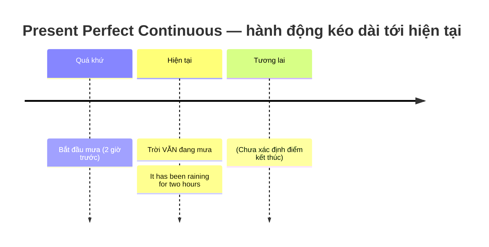

# 🔁 Unit 9: Present Perfect Continuous (I have been doing)

> [!abstract] Trọng tâm Part 5 TOEIC
> - **Hành động bắt đầu ở quá khứ và kéo dài liên tục tới hiện tại** (hoặc vừa mới dừng lại): `have / has been + V-ing`.
> - **Nhấn mạnh QUÁ TRÌNH và THỜI LƯỢNG**, không nhấn mạnh kết quả — đây là điểm khác biệt cốt lõi với `Present Perfect Simple`.
> - **Đi kèm `for` / `since` / `how long`** trong đa số câu hỏi Part 5: *has been working*, *have been increasing*, *has been operating*.
> - **Suy đoán nguyên nhân từ dấu hiệu ở hiện tại:** *She's out of breath. She has been running.*
> - Bẫy kinh điển: **động từ trạng thái (stative verbs) KHÔNG chia tiếp diễn** — ~~has been knowing~~ $\rightarrow$ **has known**.

---

## A. Công thức & Dòng thời gian

$$\mathbf{S + have / has + been + V\text{-}ing}$$

| Loại câu | Cấu trúc | Ví dụ |
| :--- | :--- | :--- |
| Khẳng định | S + have/has been + V-ing | *It **has been raining** for two hours.* |
| Phủ định | S + have/has not been + V-ing | *I **haven't been sleeping** well recently.* |
| Nghi vấn | Have/Has + S + been + V-ing? | ***How long have** you **been working** here?* |

> **So sánh trực tiếp với thì Hiện tại tiếp diễn:**
> - *It **is raining**.* (Bây giờ trời đang mưa — chỉ nói hiện tại, không nói kéo dài bao lâu).
> - *It **has been raining** for two hours.* (Trời mưa **đã hai tiếng đồng hồ** và vẫn đang mưa — nhấn mạnh khoảng thời gian).

---

## B. Ba cách dùng chính

### 1. Hành động kéo dài liên tục từ quá khứ đến hiện tại (còn tiếp diễn)
- *It's raining. It started two hours ago. It **has been raining** for two hours.*
- *We **have been waiting** for the bus for twenty minutes.* (Chúng tôi đã chờ xe buýt 20 phút rồi — giờ vẫn đang chờ).
- *How long **have** you **been learning** English?* — *I**'ve been learning** it for six months.*

### 2. Hành động vừa mới dừng, để lại kết quả/dấu hiệu ở hiện tại
Đây là dạng **cực kỳ hay gặp trong Part 1, 2 và Part 6** — nhìn dấu hiệu suy ra hành động vừa xảy ra:
- *She**'s been running**.* (= Cô ấy đang thở dốc / mồ hôi nhễ nhại).
- *A: Why are you so dirty? — B: I**'ve been working** in the garden.*
- *A: Sorry I'm late. — B: That's all right. I**'ve been reading** the newspaper.*

### 3. Hành động lặp đi lặp lại nhiều lần trong một khoảng thời gian dài
- *She**'s been playing** tennis since she was eight.* (Cô ấy chơi quần vợt từ năm 8 tuổi — chơi rất nhiều lần, không phải một lần).
- *He**'s been watching** a lot of films recently.* (Dạo này anh ấy xem rất nhiều phim).
- *The company**'s share price has been increasing** steadily since the merger.*

---

## C. Bảng phân biệt nhanh — chọn thì nào trong Part 5?

| Dấu hiệu trong câu | Thì phải chọn | Ví dụ |
| :--- | :--- | :--- |
| `for / since / how long` + **hành động kéo dài, chưa có kết quả rõ** | **Present Perfect Continuous** | *The machine **has been operating** since 6 A.M.* |
| `for / since / how long` + **trạng thái, sở hữu, cảm giác** | **Present Perfect Simple** | *I**'ve known** her for ten years.* |
| `for / since` + **kết quả/số lượng hoàn thành** | **Present Perfect Simple** | *Sales **have increased** by 20% this year.* |
| Nói việc **đang xảy ra ngay lúc nói** | Present Continuous | *The manager **is talking** on the phone now.* |
| Mốc thời gian **đã kết thúc** (`yesterday`, `last week`, `in 2020`) | Past Simple | *We **launched** the product last month.* |

### Xu hướng & thay đổi (rất hay thi Part 5/6)
Khi nói một tình trạng **đang thay đổi dần**, ETS rất chuộng Hiện tại hoàn thành tiếp diễn:
- *Prices **have been rising** sharply.* / *Traffic **has been getting** worse.*
- *Our profits **have been improving** over the last three quarters.*

---

## 🎯 Dấu hiệu nhận biết trong đề thi TOEIC Part 5 & 6

1. **Cụm thời gian mở đầu câu** — nhìn là biết ngay:
   - `for + khoảng thời gian` (*for three years*), `since + mốc` (*since 2019*, *since he joined*).
   - `over / during / in / for the past / last + [khoảng thời gian]` $\rightarrow$ ưu tiên **have/has been + V-ing** nếu động từ diễn tả hành động.
2. **`How long ... ?`** trong câu hỏi Part 5/6: *How long **has** the construction work **been going on**?*
3. **Chủ ngữ số ít/số nhiều** — quyết định `has` hay `have`:
   - *The technicians **have** been repairing the server.*
   - *The technician **has** been repairing the server.*
4. **Câu có kết quả ở hiện tại** (mệt, bẩn, ướt, hết tiền...): *He**'s been working** all night, so he looks exhausted.*

> [!caution] 4 cạm bẫy thường gặp
> 1. **Chia tiếp diễn động từ trạng thái** (sai kinh điển):
>    - ~~I have been knowing him for years.~~ $\rightarrow$ **I have known him for years.**
>    - Các động từ cần nhớ: `know, like, love, hate, want, need, believe, belong, own, possess, consist, contain, seem, understand`.
> 2. **Nhầm với Hiện tại hoàn thành đơn khi có kết quả hoàn tất:**
>    - *I**'ve been reading** the report.* (Tôi đang đọc, **chưa xong**).
>    - *I**'ve read** the report.* (Tôi **đã đọc xong**).
> 3. **Nhầm với Quá khứ đơn khi có mốc thời gian đã kết thúc:**
>    - ~~We have been launching the campaign last month.~~ $\rightarrow$ **We launched the campaign last month.**
> 4. **Sai dạng phân từ:** luôn là `been + V-ing`, không phải `been + V3` và cũng không phải `have being`.
>    - ~~has being working~~ / ~~has been worked~~ $\rightarrow$ **has been working**.

> [!tip] Mẹo chọn đáp án trong 5 giây
> Thấy **`for / since / how long`** + chủ ngữ là **người/vật đang thực hiện hành động** $\rightarrow$ quét đáp án tìm **`has/have been + V-ing`**.
> Nếu trong 4 đáp án không có dạng tiếp diễn, hoặc động từ là **stative verb** $\rightarrow$ chọn **`has/have + V3`**.

---

## 📎 Liên kết trong hệ thống

- So sánh chi tiết với Hiện tại hoàn thành đơn: [[Unit 10 - Present Perfect Continuous and Simple (I have been doing and I have done)]]
- Nền tảng thì Hiện tại hoàn thành: [[Unit 07 - Present Perfect 1 (I have done)]] · [[Unit 08 - Present Perfect 2 (I have done)]]

---
Trở về: [[English Grammar in Use MOC]] | [[TOEIC MOC]] | Bài tập: [[Unit 09 - Exercises (Present Perfect Continuous)]]
