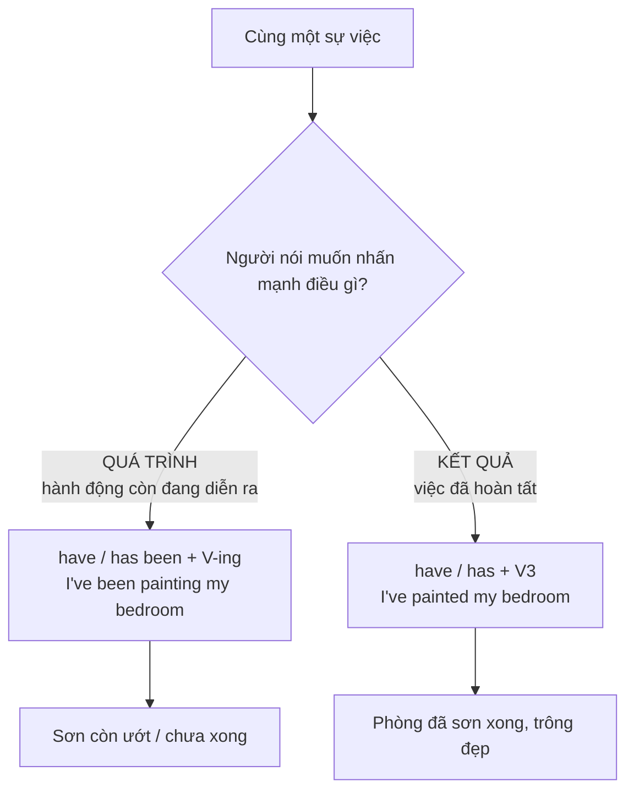

# ⚖️ Unit 10: Present Perfect Continuous and Simple (I have been doing and I have done)

> [!abstract] Trọng tâm Part 5 TOEIC
> - **`I have been doing` = nhấn mạnh HÀNH ĐỘNG / QUÁ TRÌNH** (chưa chắc đã xong, hoặc vừa mới dừng).
> - **`I have done` = nhấn mạnh KẾT QUẢ / SỰ HOÀN TẤT** (đã xong, có thành quả cụ thể).
> - Đây là **cặp đáp án gây nhiễu phổ biến nhất** trong Part 5: đề cho cả `has been V-ing` và `has V3`, phải đọc vế sau để quyết định.
> - Với `how long / for / since`: **cả hai thì đều đúng**, khác nhau ở sắc thái (đang tiếp diễn vs đã hoàn tất).
> - **Stative verbs** (`know, like, have, belong...`) chỉ dùng dạng đơn: *I**'ve known** her for years.*

---

## A. Nguyên tắc cốt lõi: HÀNH ĐỘNG vs KẾT QUẢ

| Cặp câu | Nghĩa | Nhấn mạnh |
| :--- | :--- | :--- |
| *I**'ve been painting** my bedroom.* | Tôi đang sơn phòng ngủ. | **Hành động**, sơn còn ướt, chưa xong hẳn. |
| *I**'ve painted** my bedroom.* | Tôi đã sơn xong phòng ngủ. | **Kết quả**, phòng đã đẹp, hoàn tất. |
| *My hands are dirty. I**'ve been repairing** my bike.* | Tay tôi bẩn vì vừa sửa xe. | **Nguyên nhân** dẫn tới tình trạng hiện tại. |
| *My bike is OK now. I**'ve repaired** it.* | Xe tôi đã ổn rồi, tôi sửa xong rồi. | **Kết quả** đã đạt được. |
| *She**'s been writing** a novel.* | Cô ấy đang viết một cuốn tiểu thuyết. | Còn viết, **chưa xong**. |
| *She**'s written** a novel.* | Cô ấy đã viết xong một cuốn tiểu thuyết. | **Đã hoàn thành**. |

> [!tip] Cách nhận diện trong đề thi
> Đọc **vế sau** của câu để đoán ý người nói:
> - Vế sau nói **kết quả đã xong** (`so we can send it now`, `the room looks nice`) $\rightarrow$ **have/has + V3**.
> - Vế sau nói **dấu hiệu/nguyên nhân còn đang diễn ra** (`that's why she's out of breath`, `the paint is still wet`) $\rightarrow$ **have/has been + V-ing**.

---

## B. Với `how long` / `for` / `since` — cả hai thì đều dùng được

| Câu | Sắc thái |
| :--- | :--- |
| *How long **have** you **been reading** that book?* | Hỏi về **quá trình** đọc (bạn đọc cuốn đó bao lâu rồi, còn đang đọc). |
| *How long **have** you **read** that book?* $\approx$ *How long **have** you **had** that book?* | Hỏi về **trạng thái sở hữu** (bạn có cuốn sách đó bao lâu rồi). |
| *I**'ve been learning** English for six months.* | Tôi học tiếng Anh được 6 tháng (vẫn đang học, nhấn mạnh quá trình). |
| *I**'ve learned** 300 new words this month.* | Tôi đã học được 300 từ mới trong tháng này (**kết quả/số lượng**). |

> [!note] Khác biệt then chốt
> `I have done` + **số lượng / thành quả cụ thể** (300 words, three reports, 20%)
> `I have been doing` + **khoảng thời gian / tính liên tục** (for six months, all morning, since 8 A.M.)

---

## C. Động từ trạng thái (Stative verbs) — chỉ dùng dạng ĐƠN

Một số động từ **không chia tiếp diễn**, kể cả khi có `for / since / how long`:

| Nhóm | Động từ | Ví dụ đúng |
| :--- | :--- | :--- |
| Nhận thức / suy nghĩ | `know, believe, understand, remember, mean` | *I**'ve known** her for ten years.* ~~have been knowing~~ |
| Cảm xúc / sở thích | `like, love, hate, want, need, prefer` | *He**'s liked** jazz since he was a teenager.* |
| Sở hữu / thuộc về | `have (sở hữu), own, possess, belong, consist, contain` | *This building **has belonged** to the family for 50 years.* |

> [!caution] Ngoại lệ cần nhớ
> - `have` với nghĩa **sở hữu** $\rightarrow$ không tiếp diễn: *I**'ve had** this car for five years.*
> - Nhưng `have` trong cụm **have a shower / have lunch / have a good time** là hành động $\rightarrow$ **có thể** tiếp diễn: *I**'ve been having** driving lessons.*
> - `be` cũng có thể tiếp diễn khi nói **hành vi tạm thời**: *You**'ve been being** very quiet today.* (ít gặp trong TOEIC).

---

## D. Một số mẫu câu cần nhớ cho Part 5 & 6

1. **`recently` / `lately` + dạng tiếp diễn** (nhấn mạnh việc liên tục xảy ra gần đây):
   - *I**'ve been feeling** tired lately.* / *Our profits **have been growing** recently.*
2. **Phủ định của tiếp diễn** (nhấn mạnh "đã không làm gì suốt một khoảng thời gian"):
   - *I**haven't been sleeping** well recently.*
3. **`since` + mệnh đề**:
   - *She**'s been managing** the branch **since** Mr. Lee retired.*
4. **Xu hướng kinh doanh (cực hay thi)**:
   - *Operating costs **have been rising** over the past year.*

---

## 🎯 Bảng quyết định nhanh khi làm Part 5

| Dấu hiệu | Chọn |
| :--- | :--- |
| `for / since / how long` + động từ **hành động**, vế sau nói kết quả **chưa xong** | **have/has been + V-ing** |
| `for / since / how long` + động từ **hành động**, vế sau nói kết quả **đã xong** | **have/has + V3** |
| `for / since` + **stative verb** (`know, like, belong, have` = sở hữu) | **have/has + V3** |
| `so far / up to now / this month` + **số lượng hoàn thành** | **have/has + V3** |
| `over / in / during the past + [thời gian]` + **xu hướng đang thay đổi** | **have/has been + V-ing** |
| Mốc thời gian **đã kết thúc** (`last year`, `in 2019`, `yesterday`) | **V-ed (Past Simple)** |

---

## 📎 Liên kết trong hệ thống

- Lý thuyết nền: [[Unit 09 - Present Perfect Continuous (I have been doing)]] · [[Unit 07 - Present Perfect 1 (I have done)]] · [[Unit 08 - Present Perfect 2 (I have done)]]

---
Trở về: [[English Grammar in Use MOC]] | [[TOEIC MOC]] | Bài tập: [[Unit 10 - Exercises (Present Perfect Continuous and Simple)]]
