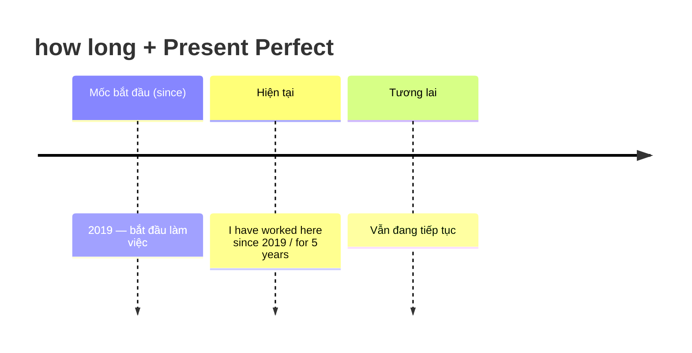

# ⏱️ Unit 11: how long have you (been) … ?

> [!abstract] Trọng tâm Part 5 TOEIC
> - Dùng **`How long have/has + S + V3 / been + V-ing`** để hỏi một việc **đã kéo dài bao lâu** tính tới hiện tại.
> - Câu trả lời luôn là **Present Perfect (đơn hoặc tiếp diễn)** + `for` / `since`.
> - Với **stative verbs** (`know, have, be, like…`) bắt buộc dùng **dạng đơn**: *How long **have** you **known** him?* (không dùng ~~have you been knowing~~).
> - Không dùng thì hiện tại đơn cho câu hỏi `How long`: ~~How long do you know him?~~
> - `How long … ?` cũng đi với **hiện tại tiếp diễn** khi hỏi về một kế hoạch/dự định tạm thời (*How long are you staying in Hanoi?*).

---

## A. Cấu trúc và cách dùng

$$\mathbf{How\ long\ +\ have/has\ +\ S\ +\ V_3\ (hoặc\ been\ +\ V\text{-}ing)\ ?}$$

| Câu hỏi | Trả lời | Ghi chú |
| :--- | :--- | :--- |
| *How long **have** you **been** married?* | *We**'ve been** married **for** 20 years.* | Trạng thái kéo dài (`be`) $\rightarrow$ dạng đơn. |
| *How long **have** you **been learning** English?* | *I**'ve been learning** it **for** six months.* | Hành động kéo dài $\rightarrow$ tiếp diễn. |
| *How long **have** you **known** Jane?* | *I**'ve known** her **since** 2019.* | `know` là stative verb $\rightarrow$ dạng đơn. |
| *How long **have** you **had** your car?* | *I**'ve had** it **for** three years.* | `have` = sở hữu $\rightarrow$ dạng đơn. |

> [!tip] Song song hai cách hỏi tương đương
> - *How long **have** you **been working** here?* $\approx$ *How long **have** you **worked** here?*
> - Chọn **tiếp diễn** khi muốn nhấn mạnh **quá trình đang tiếp diễn**; chọn **đơn** khi muốn nhấn mạnh **kết quả/thành tựu** hoặc khi động từ không chia tiếp diễn.

---

## B. Phân biệt với Hiện tại tiếp diễn

| Câu | Ý nghĩa | Thì |
| :--- | :--- | :--- |
| *How long **have** you **been** in Hanoi?* | Bạn ở Hà Nội bao lâu rồi (tính từ lúc đến tới giờ)? | Present Perfect |
| *How long **are** you **staying** in Hanoi?* | Bạn sẽ ở Hà Nội bao lâu (dự định, tạm thời)? | Present Continuous |
| *How long **have** you **been staying** at this hotel?* | Bạn ở khách sạn này bao lâu rồi (đang ở)? | Present Perfect Continuous |

> [!caution] Bẫy thường gặp trong Part 5
> 1. **Dùng hiện tại đơn với `How long`** (sai):
>    - ~~How long **do** you **know** Mr. Park?~~ $\rightarrow$ **How long have you known Mr. Park?**
> 2. **Chia tiếp diễn stative verb** (sai):
>    - ~~How long have you been having this laptop?~~ $\rightarrow$ **How long have you had this laptop?**
> 3. **Sai trợ động từ số ít/số nhiều**:
>    - *How long **has** the manager **been** with the company?* (`the manager` số ít).
> 4. **Lẫn `for` và `since`:** `for + khoảng thời gian` (*for three years*), `since + mốc thời gian` (*since 2021*, *since he joined*).

---

## C. Ứng dụng TOEIC Part 5 & 6

1. **Câu hỏi phỏng vấn / khảo sát khách hàng** (rất hay gặp ở Part 6 dạng email/thư):
   - *How long **have** you **been** a member of our loyalty program?*
2. **Câu hỏi về kinh nghiệm làm việc**:
   - *How long **has** Ms. Ito **been working** in the accounting department?*
3. **Câu trả lời có `for` / `since`** — chọn dạng đúng của động từ trong ngoặc:
   - *We **have been using** this supplier since 2018.*
   - *He **has been** the director for five years.*
4. **Câu bị động + how long** (ít gặp nhưng có ở Part 6):
   - *How long **has** the position **been** vacant?*

> [!tip] Mẹo 3 giây
> Thấy `How long` + chủ ngữ + động từ trạng thái (`know / have / be / like`) $\rightarrow$ chọn **have/has + V3**.
> Thấy `How long` + động từ hành động và trong đáp án có `been + V-ing` $\rightarrow$ chọn **dạng tiếp diễn**.

---

## 📎 Liên kết trong hệ thống

- Nền tảng thì: [[Unit 07 - Present Perfect 1 (I have done)]] · [[Unit 08 - Present Perfect 2 (I have done)]] · [[Unit 09 - Present Perfect Continuous (I have been doing)]]
- Tiếp theo: [[Unit 12 - for and since (when … ? and how long …?)]]

---
Trở về: [[English Grammar in Use MOC]] | [[TOEIC MOC]] | Bài tập: [[Unit 11 - Exercises (how long have you been)]]
