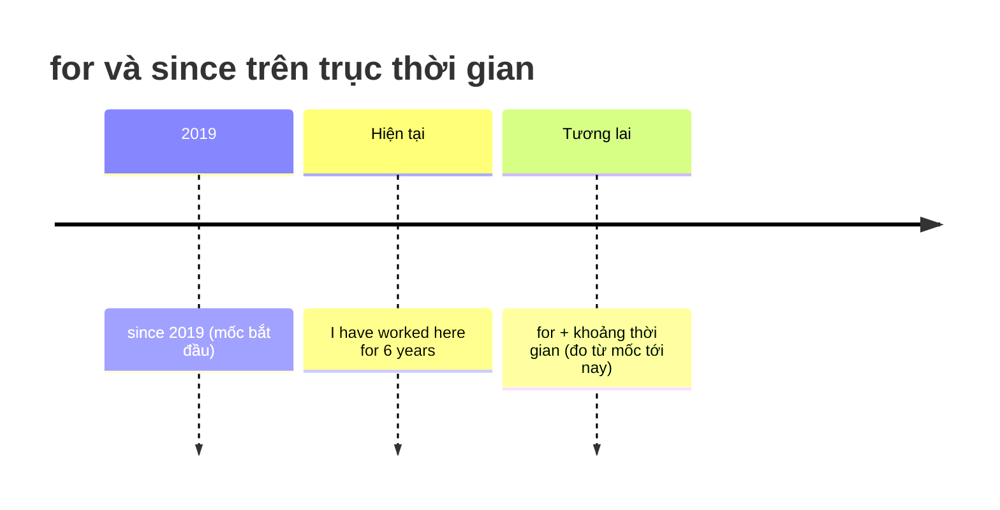

# 📅 Unit 12: for and since — when … ? and how long … ?

> [!abstract] Trọng tâm Part 5 TOEIC
> - **`for` + KHOẢNG thời gian** (for two hours, for three years, for a long time).
> - **`since` + MỐC thời gian** (since 8 o'clock, since Monday, since 2019, since I joined).
> - Cả hai đi với **Present Perfect** (đơn hoặc tiếp diễn) khi hành động **kéo dài tới hiện tại**.
> - **`When … ?`** hỏi **mốc thời gian** (trả lời bằng Past Simple) — **`How long … ?`** hỏi **khoảng thời gian** (trả lời bằng Present Perfect + for/since).
> - Phân biệt: *I**'ve lived** in Paris **for** five years.* (vẫn đang sống) vs *I **lived** in Paris **for** five years.* (đã kết thúc).

---

## A. `for` vs `since` — nguyên tắc gốc

| | `for` | `since` |
| :--- | :--- | :--- |
| **Đi với** | Khoảng thời gian | Mốc thời gian bắt đầu |
| **Ví dụ** | for two hours · for three weeks · for five years · for a long time · for ages | since 8 o'clock · since Monday · since 2019 · since April · since I arrived · since he left |
| **Trả lời cho** | How long …? | Since when …? / When …? |

- *I**'ve been waiting for** the delivery **for** two hours.* / *… **since** 9 a.m.*
- *She**'s worked** at this branch **for** ten years.* / *… **since** she graduated.*
- *We**'ve known** each other **for** a long time.* (`know` = stative verb $\rightarrow$ dạng đơn)

> [!caution] Lỗi thường gặp
> 1. ~~since five years~~ $\rightarrow$ **for five years** (khoảng thời gian phải dùng `for`).
> 2. ~~for 2019~~ $\rightarrow$ **since 2019** (mốc thời gian phải dùng `since`).
> 3. ~~since three weeks ago~~ $\rightarrow$ **for three weeks** (tránh `since … ago`).
> 4. `since` có thể đi với **mệnh đề**: *since **I arrived***, *since **he became** CEO* — `for` thì không.

---

## B. `When … ?` vs `How long … ?`

| Câu hỏi | Hỏi điều gì | Trả lời đúng | Thì của câu trả lời |
| :--- | :--- | :--- | :--- |
| ***When* did** you join the company? | Mốc thời gian | *In 2021.* / *Two years ago.* | Past Simple |
| ***How long* have** you been with the company? | Khoảng thời gian | *For two years.* / *Since 2021.* | Present Perfect (+ for/since) |
| ***Since when* have** you been working remotely? | Mốc bắt đầu | *Since March.* | Present Perfect |

> [!tip] Mẹo nhận diện trong đề thi
> - Thấy đáp án có `ago`, `last …`, `in + năm cũ` $\rightarrow$ câu trả lời thuộc **Past Simple**.
> - Thấy đáp án có `for + khoảng thời gian` hoặc `since + mốc` $\rightarrow$ câu trả lời thuộc **Present Perfect**.

---

## C. Present Perfect (for/since) vs Past Simple (for)

| Câu | Nghĩa | Trạng thái |
| :--- | :--- | :--- |
| *I**'ve worked** here **for** five years.* | Tôi làm ở đây 5 năm rồi. | Vẫn đang làm (chưa kết thúc). |
| *I **worked** here **for** five years.* | Tôi đã từng làm ở đây 5 năm. | Đã nghỉ (đã kết thúc). |
| *He**'s been living** in Tokyo **since** 2020.* | Anh ấy sống ở Tokyo từ 2020. | Vẫn đang sống. |
| *He **lived** in Tokyo **for** three years.* | Anh ấy từng sống ở Tokyo 3 năm. | Đã chuyển đi. |

> [!note] Song song hai dạng thức
> Với `for/since`, **Present Perfect đơn** và **tiếp diễn** thường thay thế được cho nhau:
> - *I**'ve been working** here for five years.* $\approx$ *I**'ve worked** here for five years.*
> - Chỉ dùng **tiếp diễn** khi động từ diễn tả hành động và bạn muốn nhấn mạnh **quá trình liên tục**.
> - Bắt buộc dùng **dạng đơn** với stative verbs: *I**'ve known** her **for** years* (không ~~have been knowing~~).

---

## 🎯 Dấu hiệu nhận biết trong đề thi TOEIC Part 5 & 6

1. `for` / `since` xuất hiện ngay trong câu $\rightarrow$ loại ngay các đáp án chia **hiện tại đơn** và **quá khứ đơn** (trừ khi có mốc thời gian đã kết thúc).
2. **`Since` + mệnh đề (S + V)**: *Sales **have doubled since** the new campaign **was launched**.*
3. Cụm kinh doanh hay gặp: *for the past three quarters*, *since its founding*, *since the merger*, *for over a decade*.
4. Câu bị động + for/since: *The position **has been** vacant **for** six months.*

---

## 📎 Liên kết trong hệ thống

- Trước: [[Unit 11 - how long have you (been)]] · [[Unit 09 - Present Perfect Continuous (I have been doing)]] · [[Unit 10 - Present Perfect Continuous and Simple (I have been doing and I have done)]]

---
Trở về: [[English Grammar in Use MOC]] | [[TOEIC MOC]] | Bài tập: [[Unit 12 - Exercises (for and since)]]
