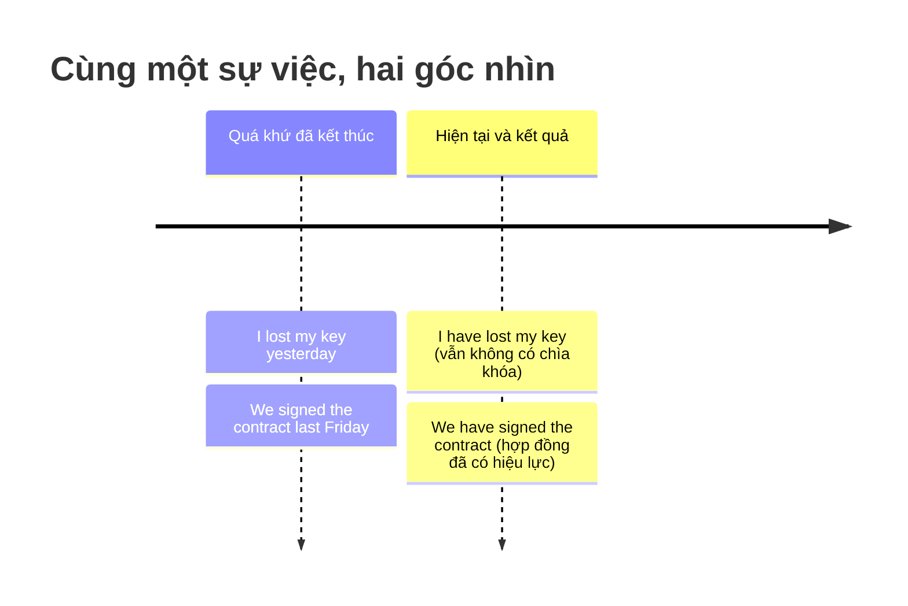
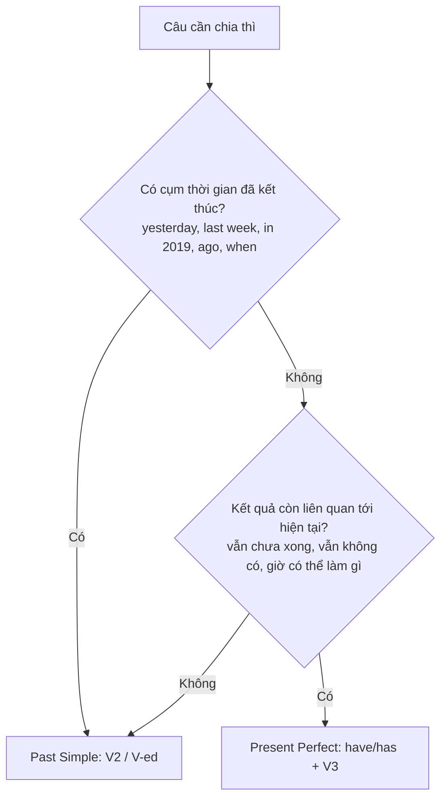

# ⏳ Unit 13: Present Perfect and Past 1 (I have done and I did)

> [!abstract] Trọng tâm Part 5 TOEIC
> - **Hiện tại hoàn thành** (`have/has + V3`) = hành động xảy ra trong quá khứ mà **kết quả còn liên quan tới hiện tại**, thời điểm xảy ra **không được nêu** hoặc **không quan trọng**: *I've lost my key.* (= giờ vẫn không có chìa khóa).
> - **Quá khứ đơn** (`V2 / V-ed`) = hành động xảy ra tại **một thời điểm đã kết thúc** trong quá khứ: *I lost my key yesterday.*
> - **Quy tắc vàng:** gặp cụm thời gian **đã kết thúc** (`yesterday`, `last week`, `in 2019`, `two days ago`, `when I was a child`) → **luôn chia Quá khứ đơn**, tuyệt đối không dùng hiện tại hoàn thành.
> - **`just / already / yet`** đi với hiện tại hoàn thành; nhưng khi **thêm chi tiết thời gian cụ thể** thì phải chuyển sang quá khứ đơn.
> - Bẫy kinh điển: **`since` + mốc/mệnh đề → hiện tại hoàn thành**; **`ago / last / in + mốc` → quá khứ đơn**; câu hỏi với **`When`** luôn dùng quá khứ đơn.

---

## A. Nguyên tắc cốt lõi: kết quả ở hiện tại hay thời gian đã kết thúc?

$$\mathbf{Present\ Perfect:\ S + have/has + V_3} \qquad \text{vs} \qquad \mathbf{Past\ Simple:\ S + V_2/V\text{-}ed}$$

| Thì | Cấu trúc | Khi nào dùng | Ví dụ |
| :--- | :--- | :--- | :--- |
| **Present Perfect** | S + have/has + V3 | Hành động quá khứ, **kết quả còn ở hiện tại**; **không nêu** thời điểm cụ thể | *I **have lost** my key.* (= Tôi mất chìa khóa rồi — giờ vẫn không vào được nhà) |
| **Past Simple** | S + V2 / V-ed | Hành động xảy ra tại **một thời điểm đã kết thúc** trong quá khứ | *I **lost** my key yesterday.* (= chỉ kể sự việc đã xảy ra ngày hôm qua) |

> **Nhớ nhanh:** Hiện tại hoàn thành trả lời câu hỏi *"Bây giờ thì sao?"*; Quá khứ đơn trả lời câu hỏi *"Chuyện gì đã xảy ra, và khi nào?"*
> - *The train **has arrived**.* (Tàu đã tới — giờ có thể lên tàu) · *He **has gone out**.* (Anh ấy đã ra ngoài — giờ không có ở đây).
> - *The train **arrived** at 8:15.* · *He **went out** ten minutes ago.*

---

## B. Quy tắc vàng: cụm thời gian quyết định thì

| Loại cụm thời gian | Thì bắt buộc | Ví dụ |
| :--- | :--- | :--- |
| **Đã kết thúc:** `yesterday`, `last week / month / year`, `in 2019`, `two days ago`, `when I was a child`, `then`, `at 9 A.M.`, `on Monday` | **Past Simple** | *We **signed** the contract last Friday.* · *Ms. Lee **joined** the firm in 2019.* |
| **Chưa kết thúc / tính tới hiện tại:** `today`, `this week`, `this year`, `recently`, `lately`, `so far`, `up to now`, `ever`, `never`, `yet`, `just`, `already` | **Present Perfect** | *We **have signed** three contracts so far this year.* · *Sales **have risen** sharply recently.* |

> **Trường hợp "nửa vời" — `this morning`, `today`:**
> - *I **have made** six calls this morning.* (bây giờ **vẫn là** buổi sáng → khoảng thời gian chưa kết thúc).
> - *I **made** six calls this morning.* (bây giờ **đã là** buổi chiều → buổi sáng đã kết thúc).

---

## C. Các cặp đối chiếu kinh điển trong Part 5

### 1. Have you seen …? vs Did you see …?

| Câu hỏi | Ý nghĩa | Thì |
| :--- | :--- | :--- |
| *Have you **seen** Anna?* | Cậu có gặp Anna **lúc nào đó tính tới giờ** không? (không quan tâm thời điểm) | Present Perfect |
| *Did you **see** Anna?* | Cậu có gặp Anna **ở dịp cụ thể đó** không? (đã biết/đã nêu thời điểm) | Past Simple |

### 2. just / already / yet vs khi thêm chi tiết thời gian

| Có `just / already / yet` → Present Perfect | Thêm thời gian cụ thể → Past Simple |
| :--- | :--- |
| *I**'ve just finished** the report.* | *I **finished** the report ten minutes ago.* |
| *She**'s already sent** the invoice.* | *She **sent** the invoice on Monday.* |
| *Have you **booked** the flight yet?* | *When **did** you **book** the flight?* |

### 3. Tin tức / kết quả mới → hiện tại hoàn thành; chi tiết → quá khứ đơn
- *The shipment **has arrived**.* (thông báo kết quả) → *It **arrived** at the warehouse at 7 A.M.* (chi tiết).
- *Our manager **has resigned**.* → *He **resigned** last Friday.*

### 4. Sơ đồ quyết định nhanh

> **Lưu ý American English:** tiếng Anh Mỹ thường dùng **quá khứ đơn** ở những chỗ tiếng Anh Anh dùng hiện tại hoàn thành — *Did you eat yet?* (Anh–Anh: *Have you eaten yet?*), *I just saw him.* (Anh–Anh: *I've just seen him.*). Đề TOEIC theo chuẩn Mỹ nên đôi khi cả hai đều chấp nhận được, **nhưng hễ có cụm thời gian đã kết thúc thì luôn là quá khứ đơn**.

---

## 🎯 Dấu hiệu nhận biết trong đề thi TOEIC Part 5 & 6

1. **Cụm thời gian đã kết thúc** ở đầu hoặc cuối câu → loại ngay mọi đáp án hiện tại hoàn thành:
   - *The board \_\_\_\_\_\_ the merger proposal **last Tuesday**.* → (A) has approved · (B) **approved** · (C) approves · (D) is approving
2. **`since` + mốc thời gian / mệnh đề** → hiện tại hoàn thành:
   - *Ms. Ito \_\_\_\_\_\_ in the accounting department **since 2021**.* → **has worked / has been working**
3. **`so far / this year / recently / yet`** → hiện tại hoàn thành:
   - *We \_\_\_\_\_\_ three new clients **so far this quarter**.* → **have signed**
4. **Câu hỏi bắt đầu bằng `When`** → quá khứ đơn:
   - ***When did** the package **arrive**?* (không dùng ~~When has the package arrived?~~)
5. **Thông báo kết quả trong email / notice (Part 6)** → hiện tại hoàn thành:
   - *We are pleased to announce that our new branch **has opened** in Singapore.*
6. **`ago / last / in + năm`** → quá khứ đơn:
   - *The company **was founded** in 1998.* · *The copier **broke** down two days ago.*

> [!caution] 5 cạm bẫy thường gặp
> 1. **Thêm cụm thời gian đã kết thúc vào câu hiện tại hoàn thành:**
>    - ~~I have seen him yesterday.~~ $\rightarrow$ **I saw him yesterday.**
>    - ~~We have launched the product last month.~~ $\rightarrow$ **We launched the product last month.**
> 2. **Câu hỏi `When` lại chia hiện tại hoàn thành:**
>    - ~~When have you sent the email?~~ $\rightarrow$ **When did you send the email?**
> 3. **Phủ định với thời gian đã kết thúc:**
>    - ~~I haven't seen him yesterday.~~ $\rightarrow$ **I didn't see him yesterday.**
> 4. **Dùng hiện tại đơn / tiếp diễn với `since`:**
>    - ~~We are using this supplier since 2020.~~ $\rightarrow$ **We have used / have been using this supplier since 2020.**
> 5. **Có `just / already / yet` nhưng lại thêm thời gian cụ thể:**
>    - ~~I have just finished the report ten minutes ago.~~ $\rightarrow$ **I finished the report ten minutes ago.** / **I have just finished the report.**

> [!tip] Mẹo chọn đáp án trong 5 giây
> 1. **Khoanh vùng cụm thời gian trước, chia thì sau.** Thấy `yesterday / last / ago / in + năm` → loại ngay mọi đáp án `have/has + V3`.
> 2. Thấy `since / for / so far / recently / yet / already / just / ever / never` → loại ngay đáp án quá khứ đơn `V2 / V-ed`.
> 3. Không có cụm thời gian? Đọc xem **kết quả có còn liên quan tới hiện tại** không (vẫn không tìm thấy, vẫn chưa xong, giờ có thể làm gì) → **hiện tại hoàn thành**; nếu chỉ kể sự việc đã rồi → **quá khứ đơn**.
> 4. Câu hỏi `When …?` → luôn **quá khứ đơn**.

---

## 📎 Liên kết trong hệ thống

- Ôn lại thì Quá khứ đơn: [[Unit 05 - Past Simple (I did)]] · [[Unit 06 - Past Continuous (I was doing)]]
- Nền tảng Hiện tại hoàn thành: [[Unit 07 - Present Perfect 1 (I have done)]] · [[Unit 08 - Present Perfect 2 (I have done)]] · [[Unit 10 - Present Perfect Continuous and Simple (I have been doing and I have done)]]
- Trước đó: [[Unit 12 - for and since (when and how long)]]
- Tiếp theo: [[Unit 14 - Present Perfect and Past 2 (I have done and I did)]]

---
Trở về: [[English Grammar in Use MOC]] | [[TOEIC MOC]] | Bài tập: [[Unit 13 - Exercises (Present Perfect and Past 1)]]
