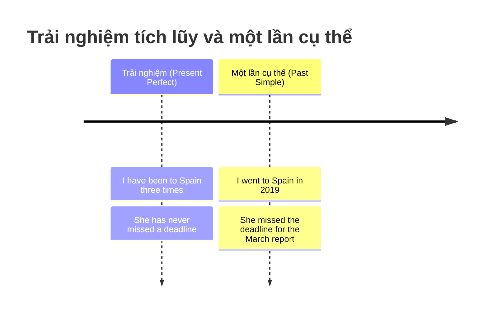
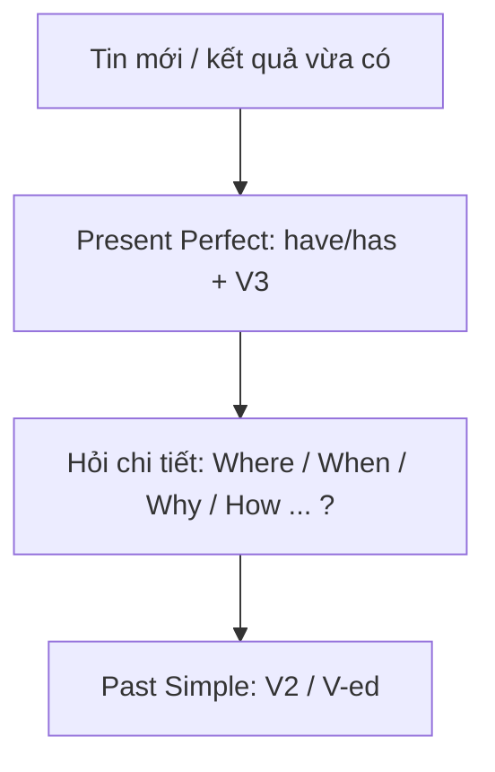

# 🕰️ Unit 14: Present Perfect and Past 2 (I have done and I did)

> [!abstract] Trọng tâm Part 5 TOEIC
> - **Không dùng hiện tại hoàn thành với thời gian đã kết thúc**: ~~I have seen him yesterday.~~ $\rightarrow$ **I saw him yesterday.**
> - Hỏi về **một thời điểm đã kết thúc** → quá khứ đơn: *What time **did** you **get up**?* (không dùng ~~What time have you got up?~~).
> - **Hiện tại hoàn thành = trải nghiệm trong đời** (`ever / never / before / it's the first time`); **Quá khứ đơn = một lần cụ thể kèm chi tiết**.
> - **Trộn hai thì trong một hội thoại:** lần đầu nêu tin bằng hiện tại hoàn thành, sau đó hỏi và kể chi tiết bằng quá khứ đơn (bản tin / thông báo cũng vậy).
> - Bẫy: `ever / never / recently / so far` → hiện tại hoàn thành; `last …, in …, … ago, then` → quá khứ đơn; **`Have you ever…?` hỏi trải nghiệm, không hỏi thời điểm cụ thể**.

---

## A. Lỗi kinh điển: hiện tại hoàn thành + thời gian đã kết thúc

| Câu sai | Câu đúng | Vì sao |
| :--- | :--- | :--- |
| ~~I have seen him yesterday.~~ | **I saw him yesterday.** | `yesterday` là thời gian đã kết thúc → Past Simple |
| ~~She has called me two hours ago.~~ | **She called me two hours ago.** | `ago` → Past Simple |
| ~~We have moved to a new office last month.~~ | **We moved to a new office last month.** | `last month` → Past Simple |
| ~~What time have you got up?~~ | **What time did you get up?** | Hỏi thời điểm cụ thể đã qua → Past Simple |
| ~~Did you have ever been to Japan?~~ | **Have you ever been to Japan?** | `ever` + trải nghiệm → Present Perfect |

> **Nguyên tắc:** Hiện tại hoàn thành **không bao giờ** đi với một mốc thời gian đã kết thúc. Nếu muốn giữ mốc thời gian đó, phải đổi sang quá khứ đơn; nếu muốn giữ hiện tại hoàn thành, phải **bỏ mốc thời gian** hoặc thay bằng `ever / never / before / so far / recently / yet`.

---

## B. Trải nghiệm trong đời vs một lần cụ thể

| Present Perfect — trải nghiệm, không nêu thời điểm | Past Simple — một lần cụ thể, có chi tiết |
| :--- | :--- |
| *I**'ve been** to Spain three times.* | *I **went** to Spain in 2019.* |
| *She**'s never missed** a deadline.* | *She **missed** the deadline for the March report.* |
| *Have you **ever worked** abroad?* | *Did you **work** in the Tokyo branch?* |
| *It**'s the first time** I**'ve flown** business class.* | *I **flew** business class on my last trip.* |
| *I**'ve known** Mr. Park for years.* (quen tới giờ) | *I **met** Mr. Park at a conference in 2021.* |

> **Phân biệt `have been to` và `have gone to`:**
> - *She **has been to** the Seoul office.* (Cô ấy **đã từng tới** đó và **đã về** — trải nghiệm).
> - *She **has gone to** the Seoul office.* (Cô ấy **đã đi** và **đang ở đó** — hiện không có mặt ở đây).

---

## C. Trộn hai thì: tin tức trước, chi tiết sau

| Lượt nói | Thì | Ví dụ |
| :--- | :--- | :--- |
| Nêu tin / kết quả mới | **Present Perfect** | *A: I**'ve bought** a new car.* |
| Hỏi chi tiết | **Past Simple** | *B: Really? Where **did** you **buy** it?* |
| Kể chi tiết | **Past Simple** | *A: I **bought** it at the dealer on Main Street.* |

**Trong bản tin và thông báo nội bộ:**
- *The company **has announced** a new CEO.* → *The board **appointed** Ms. Chen at yesterday's meeting.*
- *Our team **has won** the contract.* → *We **submitted** the final bid on Friday.*

---

## 🎯 Dấu hiệu nhận biết trong đề thi TOEIC Part 5 & 6

1. **`ever / never / before / it's the first time`** → hiện tại hoàn thành:
   - *Have you **ever** attended the annual sales conference?*
2. **`last … / in … / … ago / then / when`** → quá khứ đơn:
   - *The auditors **visited** our branch **last Wednesday**.*
3. **`recently / lately / so far / up to now / over the past …`** → hiện tại hoàn thành:
   - *We **have received** more than 200 applications **so far**.*
4. **`This is the first time …`** → mệnh đề sau chia hiện tại hoàn thành:
   - *This is the first time our store **has offered** a loyalty discount.*
5. **Hội thoại / email Part 6:** câu đầu nêu tin (hiện tại hoàn thành), câu sau nêu chi tiết (quá khứ đơn):
   - *I am pleased to inform you that we **have resolved** the shipping issue. Our logistics team **contacted** the carrier immediately after your call.*
6. **`Have you ever …?` hỏi trải nghiệm** — trả lời bằng hiện tại hoàn thành, rồi chuyển sang quá khứ đơn khi thêm chi tiết:
   - *Have you ever negotiated a contract in English? — Yes, I **have**. I **negotiated** three last year.*

> [!caution] 5 cạm bẫy thường gặp
> 1. **Hiện tại hoàn thành + mốc thời gian đã kết thúc:**
>    - ~~I have seen him yesterday.~~ $\rightarrow$ **I saw him yesterday.**
> 2. **Hỏi thời điểm cụ thể bằng hiện tại hoàn thành:**
>    - ~~What time have you got up?~~ $\rightarrow$ **What time did you get up?**
> 3. **Nhầm `ever` với một mốc cụ thể:**
>    - ~~Have you ever gone to the trade fair last year?~~ $\rightarrow$ **Did you go to the trade fair last year?** / **Have you ever been to the trade fair?**
> 4. **Dùng `have gone to` cho trải nghiệm:**
>    - ~~I have gone to Japan twice.~~ $\rightarrow$ **I have been to Japan twice.** (đã tới và đã về)
> 5. **Sai dạng sau `It's the first time`:**
>    - ~~It's the first time I visited the headquarters.~~ $\rightarrow$ **It's the first time I have visited the headquarters.**

> [!tip] Mẹo 3 giây
> - Thấy `ever / never / before / so far / recently / yet / already / just / it's the first time` → chọn **have/has + V3**.
> - Thấy `last / in + năm / ago / then / when / yesterday` → chọn **V2 / V-ed**.
> - Câu hỏi `Have you ever …?` **không bao giờ** đi với một mốc thời gian cụ thể; nếu trong câu đã có mốc cụ thể thì phải đổi sang **`Did you …?`**.
> - Trong đoạn văn Part 6: **câu nêu tin → hiện tại hoàn thành; câu kể chi tiết → quá khứ đơn**.

---

## 📎 Liên kết trong hệ thống

- Trước đó: [[Unit 13 - Present Perfect and Past 1 (I have done and I did)]]
- Ôn tập nền tảng: [[Unit 07 - Present Perfect 1 (I have done)]] · [[Unit 08 - Present Perfect 2 (I have done)]] · [[Unit 05 - Past Simple (I did)]]
- Tiếp theo: [[Unit 15 - Past Perfect (I had done)]]

---
Trở về: [[English Grammar in Use MOC]] | [[TOEIC MOC]] | Bài tập: [[Unit 14 - Exercises (Present Perfect and Past 2)]]
