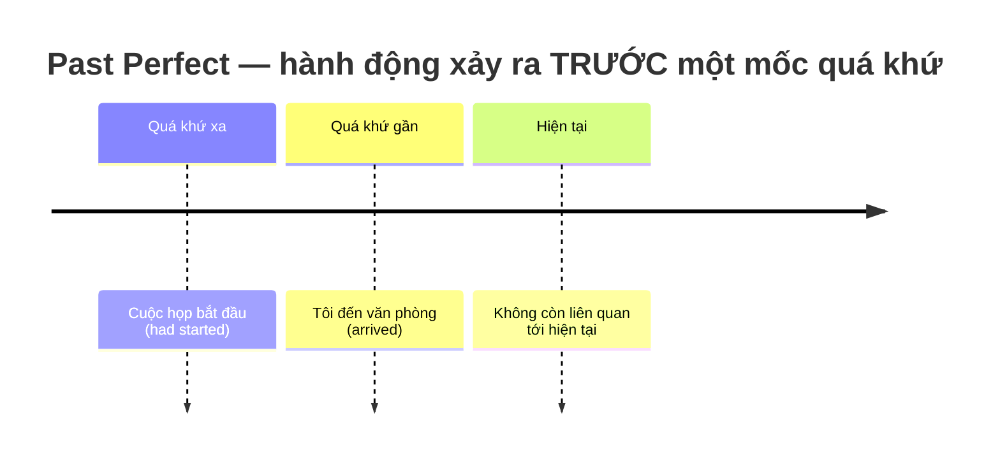
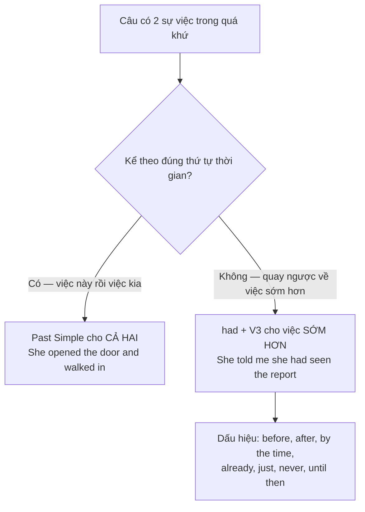

# ⏪ Unit 15: Past Perfect (I had done)

> [!abstract] Trọng tâm Part 5 TOEIC
> - **Hành động xảy ra TRƯỚC một hành động / mốc thời gian khác trong quá khứ** (quá khứ của quá khứ): `had + V3`.
> - **Công thức bất biến cho mọi chủ ngữ**: `I / you / he / she / it / we / they + had + V3` — không có `has` / `have`.
> - Đi kèm các dấu hiệu **`before, after, when, by the time, already, just, never, until then`**.
> - **Hai việc quá khứ kể theo đúng thứ tự thời gian** thì cả hai đều chia Quá khứ đơn; chỉ dùng `had + V3` khi **quay ngược lại sự việc xảy ra sớm hơn**.
> - Bẫy kinh điển: **`had` + V3 (past participle)**, không phải `had` + V-ed / V-ing — ~~had went~~ $\rightarrow$ **had gone**.

---

## A. Công thức & Dòng thời gian

$$\mathbf{S + had + V\text{-}3\ (past\ participle)}$$

| Loại câu | Cấu trúc | Ví dụ |
| :--- | :--- | :--- |
| Khẳng định | S + had + V3 | *When I arrived at the office, the meeting **had already started**.* |
| Phủ định | S + had not (hadn't) + V3 | *She **hadn't finished** the report when the deadline passed.* |
| Nghi vấn | Had + S + V3? | ***Had** the manager **approved** the budget before the meeting?* |

> **Nguyên tắc "hai lớp thời gian":** mốc quá khứ gần hơn làm **điểm neo** (thường chia Quá khứ đơn), sự việc xảy ra **sớm hơn** điểm neo đó mới chia **`had + V3`**.
> - *When I arrived at the office, the meeting **had already started**.* (Họp bắt đầu **trước** khi tôi đến).
> - *She **had left** before I called.* (Cô ấy đi **trước** khi tôi gọi).

---

## B. Ba ngữ cảnh dùng Past Perfect

### 1. Hành động xảy ra trước một hành động quá khứ khác
- *The train **had left** when we got to the station.*
- *By the time the auditors arrived, the accountants **had prepared** all the documents.*
- *After the manager **had reviewed** the proposal, she approved it.*

### 2. Hành động xảy ra trước một mốc thời gian trong quá khứ (`by`, `by the time`, `until then`)
- *By 9 A.M. the technicians **had repaired** the server.*
- *Until then, the company **had never faced** such strong competition.*

### 3. Trong câu gián tiếp, mẫu `It was the first time…` và câu điều kiện loại 3
- **Câu gián tiếp:** *She told me she **had seen** the report.* (Trực tiếp: *"I saw the report."*)
- **`It was the first time…`:** *It was the first time I **had attended** a shareholders' meeting.*
- **Điều kiện loại 3:** *If I **had known** about the deadline, I would have finished the proposal earlier.*

> **Hai việc quá khứ kể theo thứ tự — dùng Quá khứ đơn cho cả hai:**
> - *She **opened** the door and **walked** in.* (mở cửa trước, bước vào sau — kể tuần tự nên không cần `had`).
> - Nhưng khi **quay ngược** về việc sớm hơn: *She told me she **had seen** the report.*

---

## C. Bảng phân biệt nhanh — Past Perfect vs Past Simple

| Cặp câu | Nghĩa | Thì dùng |
| :--- | :--- | :--- |
| *When I got to the station, the train **had left**.* | Tàu đã chạy **trước khi** tôi tới $\rightarrow$ tôi **bị trễ**. | **Past Perfect** (việc sớm hơn). |
| *When I got to the station, the train **left**.* | Tôi tới nơi **rồi mới thấy** tàu chạy. | **Past Simple** (hai việc gần như đồng thời). |
| *By the time the shipment arrived, the store **had sold out**.* | Cửa hàng bán hết **trước** khi hàng mới về. | **Past Perfect** (`by the time`). |
| *The shipment **arrived** and the staff **unpacked** it.* | Hai việc kể lần lượt theo thứ tự. | **Past Simple** (chuỗi sự kiện). |
| *She **had been** the branch manager for three years before she resigned.* | Trạng thái kéo dài **trước** một mốc quá khứ. | **Past Perfect** (`be` $\rightarrow$ `had been`). |

> [!caution] 4 cạm bẫy thường gặp
> 1. **Dùng V-ed thay vì V3 sau `had`:**
>    - ~~The meeting had already started when I had arrived.~~ $\rightarrow$ **The meeting had already started when I arrived.**
>    - ~~had went~~ / ~~had wrote~~ / ~~had spoke~~ $\rightarrow$ **had gone** / **had written** / **had spoken**.
> 2. **Dùng `have/has + V3` cho việc trước một mốc quá khứ:**
>    - ~~By the time the auditors arrived, the accountants have prepared the documents.~~ $\rightarrow$ **…the accountants had prepared the documents.**
> 3. **Thêm `had` không cần thiết khi hai việc kể theo thứ tự:**
>    - ~~She had opened the door and had walked in.~~ $\rightarrow$ **She opened the door and walked in.**
> 4. **Nhầm `after` + Past Perfect khi chủ ngữ hai vế trùng nhau** (thường dùng Quá khứ đơn là đủ):
>    - ~~After she had had lunch, she had returned to the office.~~ $\rightarrow$ **After she had had lunch, she returned to the office.**

> [!tip] Mẹo chọn đáp án trong 5 giây
> Thấy **`by the time` / `before` / `after` / `already` / `until then`** $\rightarrow$ xác định **việc nào xảy ra trước**, rồi quét đáp án tìm **`had + V3`**.
> Nếu trong 4 đáp án có cả `had + V3` và `V-ed`, hãy hỏi: *"Câu này quay ngược về việc sớm hơn, hay chỉ kể tuần tự?"* — quay ngược $\rightarrow$ `had + V3`.

---

## 🎯 Dấu hiệu nhận biết trong đề thi TOEIC Part 5 & 6

1. **`By the time + mệnh đề quá khứ`** — gần như luôn cần `had + V3` ở vế còn lại:
   - *By the time the auditors arrived, the accountants **had prepared** all the documents.*
   - *By the time the manager returned from the trade fair, her team **had completed** the quarterly report.*
2. **`After + S + had + V3`** ở đầu câu:
   - *After the manager **had reviewed** the proposal, she approved it.*
   - *After the vendor **had confirmed** the order, the shipping department issued an invoice.*
3. **Câu gián tiếp trong email / biên bản họp** (`told`, `said`, `reported`, `announced`) $\rightarrow$ lùi thì về Past Perfect:
   - *Mr. Cole **said** that he **had submitted** the expense claim the previous day.*
   - *The director **announced** that the firm **had signed** a new contract with a supplier.*
4. **`It was the first time…` / `never … before` / `until then`:**
   - *It was the first time the company **had exhibited** at an international trade show.*
   - *Until then, the department **had never missed** a single deadline.*
5. **Phân biệt với Quá khứ đơn khi câu chỉ kể chuỗi sự kiện** (động từ nối bằng `and`, `then`):
   - *The courier **arrived**, **handed** over the package, and **left**.* — **không** dùng `had`.

> [!tip] Bẫy chủ ngữ trong Part 5
> `had` **không đổi theo chủ ngữ**, nên đáp án nhiễu thường là `has / have + V3`. Chỉ cần nhìn **mốc thời gian quá khứ** trong câu là loại ngay `has/have`.

---

## 📎 Liên kết trong hệ thống

- Thì nền tảng cần nắm trước: [[Unit 05 - Past Simple (I did)]] · [[Unit 06 - Past Continuous (I was doing)]]
- Liên quan tới `for / since` trong quá khứ: [[Unit 12 - for and since (when and how long)]]
- Bước tiếp theo — nhấn mạnh quá trình trước một mốc quá khứ: [[Unit 16 - Past Perfect Continuous (I had been doing)]]
- So sánh với nhóm Hiện tại hoàn thành: [[Unit 09 - Present Perfect Continuous (I have been doing)]] · [[Unit 10 - Present Perfect Continuous and Simple (I have been doing and I have done)]]

---
Trở về: [[English Grammar in Use MOC]] | [[TOEIC MOC]] | Bài tập: [[Unit 15 - Exercises (Past Perfect)]]
