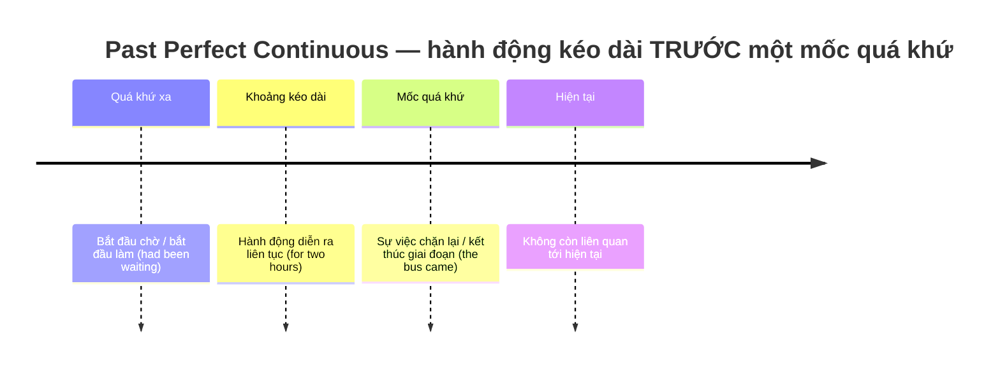
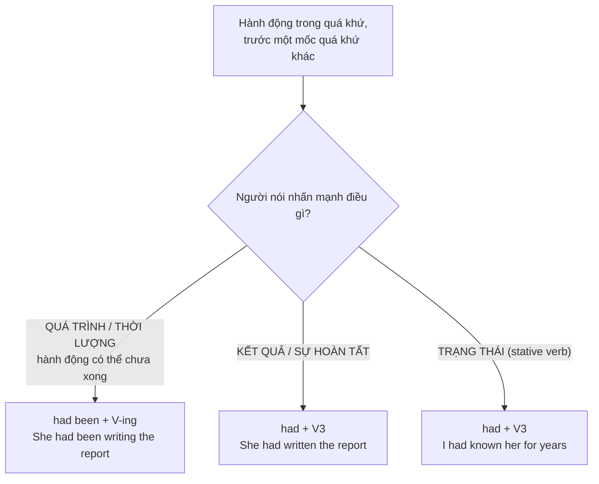

# ⏳ Unit 16: Past Perfect Continuous (I had been doing)

> [!abstract] Trọng tâm Part 5 TOEIC
> - **Một hành động đã diễn ra liên tục một khoảng thời gian TRƯỚC một sự việc khác trong quá khứ**: `had been + V-ing`.
> - **Nhấn mạnh QUÁ TRÌNH và THỜI LƯỢNG** (hành động có thể **chưa kết thúc** tại mốc quá khứ đó).
> - Đối lập với `had + V3`: **`had been doing` = HÀNH ĐỘNG** · **`had done` = KẾT QUẢ / SỰ HOÀN TẤT**.
> - Đi kèm **`for + khoảng thời gian`, `how long`, `all morning / all day`, `before`, `when`, `by the time`** đặt trong bối cảnh quá khứ.
> - Bẫy kinh điển: **động từ trạng thái (stative verbs) KHÔNG chia tiếp diễn** — ~~had been knowing~~ $\rightarrow$ **had known**.

---

## A. Công thức & Dòng thời gian

$$\mathbf{S + had + been + V\text{-}ing}$$

| Loại câu | Cấu trúc | Ví dụ |
| :--- | :--- | :--- |
| Khẳng định | S + had been + V-ing | *He **had been waiting** for two hours when the bus finally came.* |
| Phủ định | S + had not (hadn't) been + V-ing | *The store **hadn't been receiving** regular deliveries that month.* |
| Nghi vấn | Had + S + been + V-ing? | ***How long had** the team **been working** on the campaign before the launch?* |

> **Công thức không đổi theo chủ ngữ:** `had been + V-ing` dùng cho **mọi** chủ ngữ (I / he / she / it / we / they).
> - *The company **had been losing** money for years before it was restructured.*
> - *The employees **had been asking** for flexible hours long before the policy changed.*

---

## B. Ba ngữ cảnh dùng Past Perfect Continuous

### 1. Hành động kéo dài một khoảng thời gian trước một sự việc quá khứ khác
- *He **had been waiting** for two hours when the bus finally came.*
- *The company **had been losing** money for years before it was restructured.*
- *By the time the shipment arrived, the store **had been waiting** for three weeks.*

### 2. Hành động lặp đi lặp lại nhiều lần trước một mốc quá khứ
- *He **had been calling** the client all morning before he finally got through.*
- *She **had been sending** follow-up emails for weeks before the buyer replied.*

### 3. Suy đoán nguyên nhân / dấu hiệu ở một mốc quá khứ
- *The staff were exhausted because they **had been working** overtime all week.*
- *The office smelled of paint — the maintenance crew **had been repainting** the lobby.*

> **Khác biệt cốt lõi với Past Perfect Simple:**
> - *She **had been writing** the report.* $\rightarrow$ Nhấn mạnh **hành động / thời lượng**, có thể **vẫn chưa viết xong**.
> - *She **had written** the report.* $\rightarrow$ Nhấn mạnh **kết quả**, báo cáo **đã xong**.

---

## C. Bảng phân biệt nhanh — Past Perfect Continuous vs Past Perfect Simple

| Cặp câu | Nghĩa | Thì dùng |
| :--- | :--- | :--- |
| *She **had been writing** the report.* | Cô ấy **đang viết** báo cáo (chưa chắc xong). | **Past Perfect Continuous** — nhấn mạnh hành động / thời lượng. |
| *She **had written** the report.* | Cô ấy **đã viết xong** báo cáo. | **Past Perfect Simple** — nhấn mạnh kết quả / hoàn tất. |
| *The team **had been preparing** the campaign for months.* | Nhấn mạnh quãng thời gian chuẩn bị kéo dài. | **Past Perfect Continuous**. |
| *The team **had prepared** the campaign.* | Chiến dịch đã chuẩn bị xong. | **Past Perfect Simple**. |
| *The auditors **had been checking** the accounts all afternoon.* | Hoạt động kiểm tra kéo dài suốt buổi chiều. | **Past Perfect Continuous**. |
| *The auditors **had checked** the accounts.* | Việc kiểm tra đã hoàn tất. | **Past Perfect Simple**. |
| *I **had known** her for years.* | Trạng thái biết ai đó bao lâu. | **Past Perfect Simple** (stative verb). |

> [!caution] 4 cạm bẫy thường gặp
> 1. **Chia tiếp diễn động từ trạng thái** (sai kinh điển):
>    - ~~I had been knowing her for years.~~ $\rightarrow$ **I had known her for years.**
>    - Các động từ cần nhớ: `know, like, love, hate, want, need, believe, belong, own, possess, consist, contain, seem, understand`.
> 2. **Sai dạng phân từ:** luôn là `had been + V-ing`, không phải `had been + V3` và cũng không phải `had being`.
>    - ~~had being working~~ / ~~had been worked~~ $\rightarrow$ **had been working**.
> 3. **Nhầm với Present Perfect Continuous khi câu có mốc quá khứ:**
>    - ~~The team has been working on the campaign for months before the launch.~~ $\rightarrow$ **The team had been working on the campaign for months before the launch.**
> 4. **Dùng tiếp diễn khi vế sau nói kết quả đã hoàn tất:**
>    - ~~She had been finishing the report, so she emailed it to the client.~~ $\rightarrow$ **She had finished the report, so she emailed it to the client.**

> [!tip] Mẹo chọn đáp án trong 5 giây
> Thấy **`for + khoảng thời gian` / `how long` / `all morning`** trong một câu **đã ở quá khứ** (`when`, `before`, `by the time` + V-ed) $\rightarrow$ quét đáp án tìm **`had been + V-ing`**.
> Nếu vế sau nói **kết quả đã xong**, hoặc động từ là **stative verb** $\rightarrow$ chọn **`had + V3`**.

---

## 🎯 Dấu hiệu nhận biết trong đề thi TOEIC Part 5 & 6

1. **`for + khoảng thời gian` đặt trong bối cảnh quá khứ** — dấu hiệu mạnh nhất:
   - *The team **had been working** on the campaign for months before the launch.*
   - *Ms. Reed **had been managing** the branch for five years before she was promoted.*
2. **`By the time + mệnh đề quá khứ`** + hành động chờ đợi/chuẩn bị kéo dài:
   - *By the time the shipment arrived, the store **had been waiting** for three weeks.*
   - *By the time the new system was installed, the staff **had been using** the old software for a decade.*
3. **`before` + mệnh đề quá khứ**, vế trước nhấn mạnh quãng thời gian:
   - *The company **had been losing** money for years before it was restructured.*
   - *He **had been calling** the client all morning before he finally got through.*
4. **Câu có dấu hiệu / nguyên nhân ở quá khứ** (`were exhausted`, `smelled of`, `was soaking wet`):
   - *The staff were exhausted because they **had been working** overtime all week.*
   - *Her eyes were red because she **had been staring** at the spreadsheet for hours.*
5. **Phân biệt với Hiện tại hoàn thành tiếp diễn:** nếu câu có **mốc quá khứ đã kết thúc** (`last month`, `in 2021`, `before the merger`) $\rightarrow$ phải dùng `had been + V-ing`, **không** dùng `has/have been + V-ing`.

> [!tip] Bẫy chủ ngữ & thì trong Part 5
> `had` **không đổi theo chủ ngữ**, nên đáp án nhiễu thường là `has been / have been + V-ing`. Chỉ cần thấy **mốc thời gian quá khứ** trong câu là loại ngay `has/have been`.

---

## 📎 Liên kết trong hệ thống

- Lý thuyết nền trực tiếp: [[Unit 15 - Past Perfect (I had done)]]
- Thì nền tảng cần nắm trước: [[Unit 05 - Past Simple (I did)]] · [[Unit 06 - Past Continuous (I was doing)]]
- Đối chiếu với nhóm Hiện tại hoàn thành tiếp diễn: [[Unit 09 - Present Perfect Continuous (I have been doing)]] · [[Unit 10 - Present Perfect Continuous and Simple (I have been doing and I have done)]]
- Ôn lại `for / since`: [[Unit 12 - for and since (when and how long)]]

---
Trở về: [[English Grammar in Use MOC]] | [[TOEIC MOC]] | Bài tập: [[Unit 16 - Exercises (Past Perfect Continuous)]]
