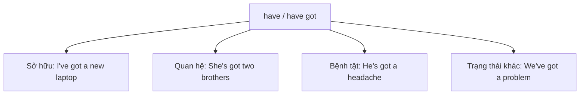
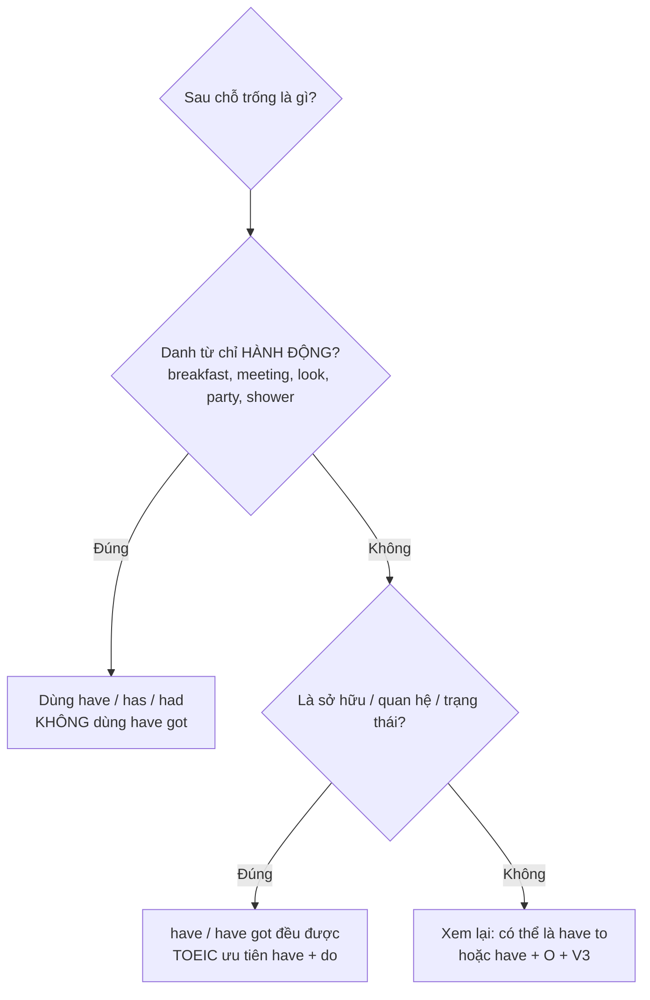
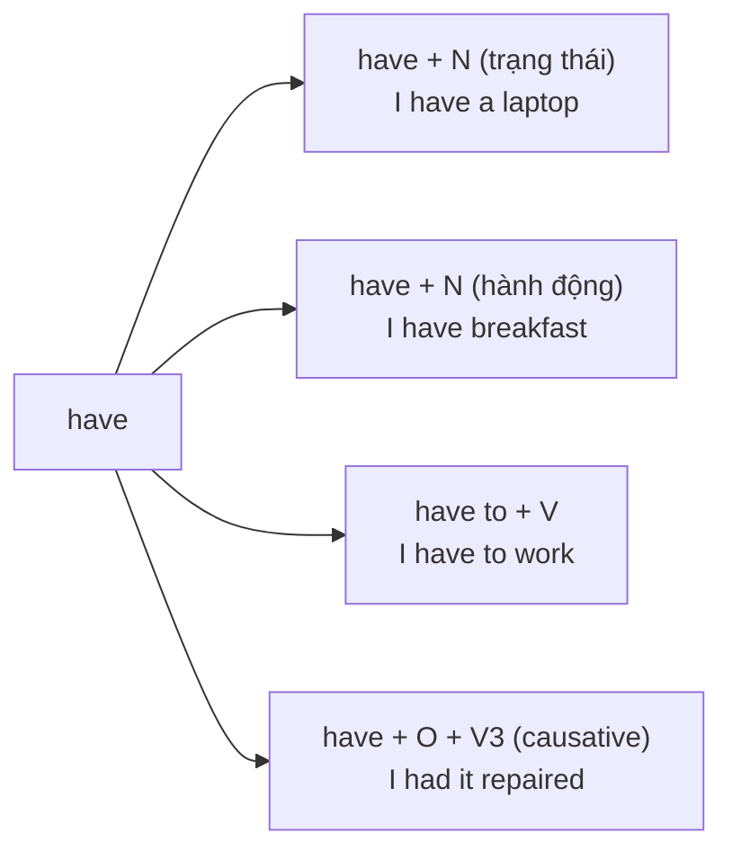

# 🔑 Unit 17: have and have got

> [!abstract] Trọng tâm Part 5 TOEIC
> - **`have` và `have got` đều diễn tả SỞ HỮU, QUAN HỆ, BỆNH TẬT và trạng thái:** *I **have** a new laptop.* = *I**'ve got** a new laptop.* / *She **has** two brothers.* = *She**'s got** two brothers.*
> - **`have got` phổ biến trong tiếng Anh–Anh;** tiếng Anh–Mỹ (chuẩn ETS TOEIC) ưu tiên **`have` / `do you have …?`**.
> - **`have got` KHÔNG dùng cho HÀNH ĐỘNG/TRẢI NGHIỆM** — phải dùng `have + danh từ`: *have breakfast, have a shower, have a meeting, have a good time, have a look, have a party.*
> - **`have got` không có dạng quá khứ:** quá khứ luôn là **`had`** — *I **had** a bicycle when I was a child.* (không ~~had got~~).
> - Phân biệt **`have to`** (nghĩa vụ, dùng được mọi thì) với **`have got to`** (nghĩa vụ, văn nói BrE) và **`have + object + V3`** (causative — sẽ học ở phần Passive).

---

## A. `have` và `have got` — sở hữu, quan hệ, bệnh tật, trạng thái

$$\text{S + have / has + N} \qquad \approx \qquad \text{S + have / has got + N}$$

| Loại câu | Dạng `have` (AmE / trung tính) | Dạng `have got` (BrE, văn nói) |
| :--- | :--- | :--- |
| Khẳng định | *I **have** a new laptop.* / *She **has** two brothers.* | *I**'ve got** a new laptop.* / *She**'s got** two brothers.* |
| Phủ định | *I **don't have** a car.* / *He **doesn't have** a car.* | *I **haven't got** a car.* / *He **hasn't got** a car.* |
| Nghi vấn | ***Do** you **have** a minute?* / ***Does** she **have** a visa?* | ***Have** you **got** a minute?* / ***Has** she **got** a visa?* |
| Trả lời ngắn | *Yes, I **do**.* / *No, I **don't**.* | *Yes, I **have**.* / *No, I **haven't**.* |

**Bốn nghĩa cốt lõi (đều là trạng thái, không phải hành động):**
- **Sở hữu:** *The company **has** three branches in Asia.* / *Our office **has got** a large meeting room.*
- **Quan hệ:** *Mr. Park **has** two business partners in Singapore.*
- **Bệnh tật / cảm giác:** *I**'ve got** a headache.* / *She**'s got** a bad cold.*
- **Trạng thái, đặc điểm:** *This printer **has** a two-year warranty.* / *We**'ve got** plenty of time before the deadline.*

> [!note] Anh–Anh vs Anh–Mỹ
> - **BrE (văn nói):** *Have you got a pen?* — *Yes, I have.*
> - **AmE (chuẩn ETS TOEIC):** *Do you have a pen?* — *Yes, I do.*
> - Trong đề TOEIC, **cả hai dạng đều có thể là đáp án đúng**, nhưng nếu câu đã có trợ động từ `do / does / did` thì **bắt buộc dùng `have`**, không được thêm `got`.

---

## B. `have + danh từ` cho HÀNH ĐỘNG và TRẢI NGHIỆM — không dùng `have got`

Đây là **mảng bẫy lớn nhất** của Unit 17 trong Part 5: khi `have` mang nghĩa **hành động/trải nghiệm**, ta **không** dùng `have got`.

| Cụm hành động | Ví dụ công sở |
| :--- | :--- |
| have breakfast / lunch / dinner | *The meeting is at 9, so I'll **have breakfast** at 7:30.* |
| have a shower / a bath | *He **had a shower** before the interview.* |
| have a meeting | *The board **will have a meeting** on Friday.* |
| have a good time / a great time | *The whole team **had a great time** at the company retreat.* |
| have a look (at) | *Could you **have a look** at these figures, please?* |
| have a party / a drink / a rest / a chat | *We**'re having** a small party for Ms. Lee's retirement.* |
| have a problem / a word with | *I **have a problem** with the new invoicing system.* |

> [!tip] Phân biệt nhanh `have` trạng thái và `have` hành động
> - *She **has** a meeting at 2 p.m.* (trạng thái — có một cuộc họp trong lịch)
> - *She **is having** a meeting with a client right now.* (hành động — đang họp, có thể chia tiếp diễn)
> - *I **have** a car.* (sở hữu — ~~I am having a car~~ là sai)

---

## C. `had` (quá khứ), `have to` / `have got to`, và `have + object + V3`

### 1. `have got` không có quá khứ → dùng `had`
| Đúng | Sai |
| :--- | :--- |
| *I **had** a bicycle when I was a child.* | ~~I had got a bicycle when I was a child.~~ |
| *The firm **had** only five employees in 2015.* | ~~The firm had got only five employees in 2015.~~ |
| *Did you **have** a company car at your previous job?* | ~~Did you have got a company car …?~~ |

### 2. Nghĩa vụ: `have to` vs `have got to`
| Cấu trúc | Sắc thái | Ví dụ |
| :--- | :--- | :--- |
| `have to / has to` | Nghĩa vụ khách quan, **dùng được mọi thì** (kể cả quá khứ `had to`) | *I **have to finish** the report today.* / *We **had to reschedule** the shipment.* |
| `have got to` | Nghĩa vụ, **chỉ ở hiện tại**, văn nói BrE | *I**'ve got to** go now — the client is waiting.* |
| `don't have to` | **Không cần thiết** (khác hẳn `mustn't` = bị cấm) | *You **don't have to** attend the orientation.* |

### 3. `have + object + V3` (causative) — cấu trúc khác hoàn toàn
- *The director **had** the contract **translated** into Korean.* (Ông ấy thuê người dịch hợp đồng).
- *We**'re having** the office **repainted** next month.*
- Đây **không phải** `have got` cũng **không phải** sở hữu — đây là cấu trúc **nhờ ai làm gì**, sẽ học kỹ ở **phần Passive (`have something done`)** phía sau.

---

## 🎯 Dấu hiệu nhận biết trong đề thi TOEIC Part 5 & 6

1. **Sở hữu nguồn lực / tài sản** — chủ ngữ quyết định `has` hay `have`:
   - *Our new branch **has** three conference rooms and a spacious parking lot.*
   - *All full-time employees **have** access to the company gym.*
2. **Kinh nghiệm, quan hệ, đặc điểm** (không dùng tiếp diễn):
   - *Ms. Alvarez **has** over ten years of experience in supply chain management.*
   - *The model **has** a longer battery life than its predecessor.*
3. **`have + danh từ` chỉ hành động** — ETS rất hay chèn cụm này vào câu dài:
   - *The board **will have** a meeting on Friday to discuss the merger.*
   - *Please **have** a look at the attached file before the conference call.*
   - *Applicants must **have** a valid driver's license.* (yêu cầu — trạng thái)
4. **Nghĩa vụ trong nội quy công ty** (`have to / has to / had to / don't have to`):
   - *All visitors **have to** sign in at the front desk.*
   - *New hires **don't have to** submit the form until Friday.*
5. **Câu hỏi và phủ định** — nhìn trợ động từ:
   - ***Does** the accounting department **have** a copy of the invoice?*
   - *We **don't have** enough staff to handle the holiday orders.*
6. **Causative `have + object + V3`** — thấy `have` + tân ngữ + động từ dạng **V3**:
   - *The manager **had** the sales figures **verified** by an outside auditor.*

> [!caution] 6 cạm bẫy thường gặp
> 1. Dùng `have got` cho hành động: ~~I have got breakfast at 7 a.m.~~ → **I have breakfast at 7 a.m.**
> 2. Dùng `had got` cho quá khứ: ~~I had got a bicycle when I was a child.~~ → **I had a bicycle when I was a child.**
> 3. Trộn `do` với `got`: ~~Do you have got a moment?~~ → **Do you have a moment?** / **Have you got a moment?**
> 4. Chia tiếp diễn `have` chỉ sở hữu: ~~I am having a new laptop.~~ → **I have a new laptop.**
> 5. Lặp `got` trong câu trả lời ngắn: ~~Yes, I have got.~~ → **Yes, I have.** / **Yes, I do.**
> 6. Nhầm `have to` với `have got to` ở quá khứ: ~~I had got to work late yesterday.~~ → **I had to work late yesterday.**

> [!tip] Mẹo chọn đáp án trong 5 giây
> Nhìn **từ ngay sau chỗ trống**:
> - Là **danh từ hành động** (*breakfast, lunch, shower, meeting, look, party, rest*) → chọn **`have / has / had`**, loại mọi đáp án có `got`.
> - Là **danh từ sở hữu/trạng thái** (*car, laptop, experience, warranty, problem*) → `have` / `have got` đều đúng; nếu câu đã có `do / does / did` thì chỉ chọn **`have`**.
> - Là **động từ nguyên mẫu** (*finish, sign, attend*) và câu nói về nghĩa vụ → chọn **`have to / has to / had to`**.
> - Là **V3** (*reviewed, translated, repaired*) → đây là **causative** `have + object + V3`.

---

## 📎 Liên kết trong hệ thống

- Trước: [[Unit 16 - Past Perfect Continuous (I had been doing)]] · [[Unit 15 - Past Perfect (I had done)]]
- Tiếp theo: [[Unit 18 - used to (do)]] — quá khứ `had` vs `used to + V` (thói quen trong quá khứ).
- Nền tảng thì Hiện tại đơn (`have / has`, `do / does`): [[Unit 02 - Present Simple (I do)]]
- Trạng thái vs hành động (stative verbs — không chia tiếp diễn): [[Unit 04 - Present Continuous and Present Simple 2]]
- Thì Quá khứ đơn (`had`, `did you have`): [[Unit 05 - Past Simple (I did)]]
- Cụm thời gian đi kèm trạng thái sở hữu: [[Unit 12 - for and since (when and how long)]]

---
Trở về: [[English Grammar in Use MOC]] | [[TOEIC MOC]] | Bài tập: [[Unit 17 - Exercises (have and have got)]]
