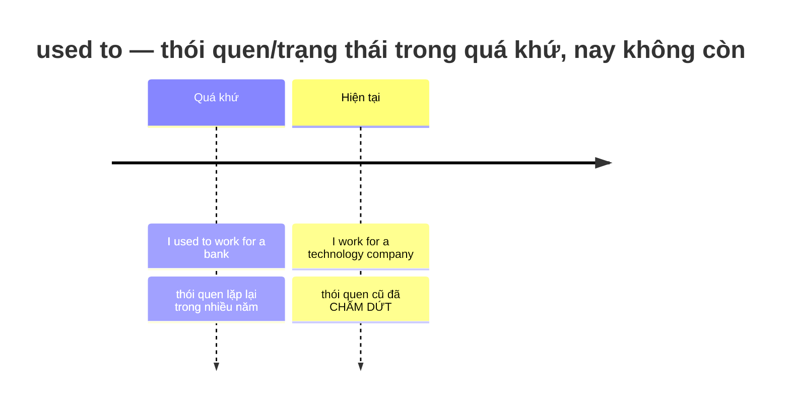
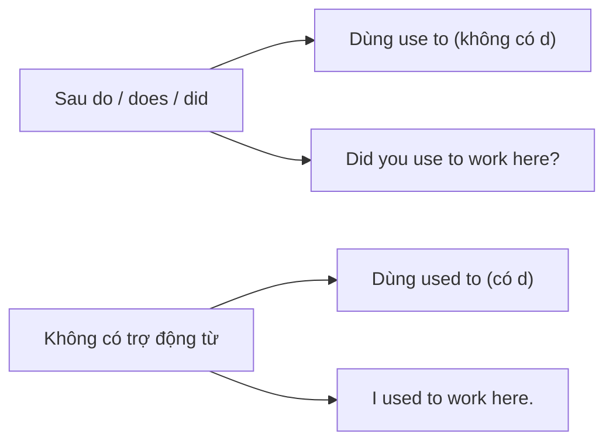
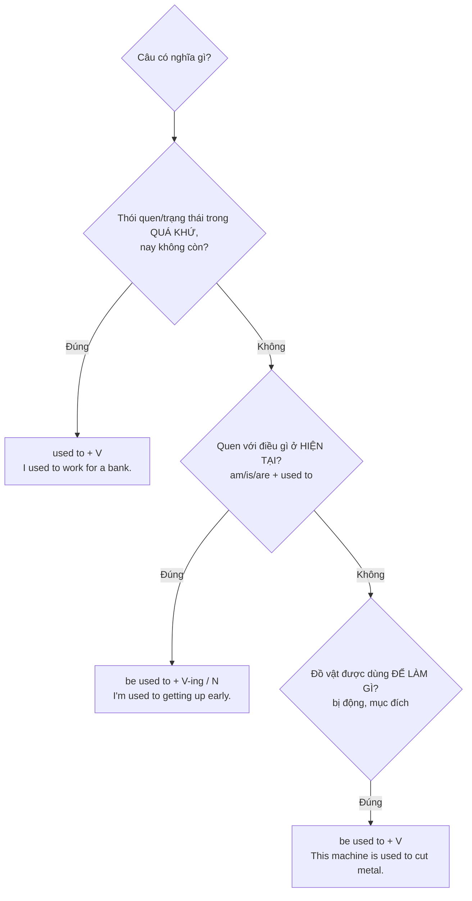

# ⏪ Unit 18: used to (do)

> [!abstract] Trọng tâm Part 5 TOEIC
> - **`used to + V` (động từ nguyên mẫu):** một điều **đã đúng hoặc đã xảy ra đều đặn trong quá khứ nhưng nay KHÔNG còn nữa** — *I **used to work** for a bank.* / *There **used to be** a cinema here.*
> - **Phủ định & nghi vấn:** *didn't **use to*** / *Did you **use to** …?* — chú ý **chính tả `use to`** (không có `d`) sau `do / does / did`. Dạng trang trọng BrE: *used not to*.
> - **`used to + V` chỉ dùng cho trạng thái và thói quen trong quá khứ**, KHÔNG dùng cho một sự việc xảy ra một lần → dùng **Past Simple**.
> - **Ba cấu trúc dễ lẫn:** (1) `used to + V` (thói quen quá khứ); (2) `be used to + V-ing / N` (quen với); (3) `be used to + V` (bị động, dùng để làm gì).
> - **`get used to + V-ing / N`** = trở nên quen dần: *She**'s getting used to** the new software.*

---

## A. `used to + V` — công thức và ý nghĩa

$$\mathbf{S + used\ to + V\ (bare\ infinitive)}$$

| Loại câu | Cấu trúc | Ví dụ |
| :--- | :--- | :--- |
| Khẳng định | S + used to + V | *I **used to work** for a bank.* / *There **used to be** a cinema here.* |
| Phủ định | S + didn't use to + V *(informal)* / S + used not to + V *(formal BrE)* | *Our office **didn't use to have** a flexible-hours policy.* |
| Nghi vấn | Did + S + use to + V? | ***Did** the department **use to** outsource its payroll?* |

**Hai cách dùng chính:**
- **Thói quen lặp lại trong quá khứ (nay không còn):**
  - *When the company was small, we **used to hold** meetings in the break room.*
  - *Ms. Park **used to commute** to the Osaka office twice a month.*
- **Trạng thái/đặc điểm trong quá khứ (nay đã khác):**
  - *The firm **used to be** a family-owned business.*
  - *There **used to be** a photocopier near the elevator, but it was removed.*
  - *This building **used to belong** to a logistics company.*

> [!note] `used to` không có dạng hiện tại
> Muốn nói **thói quen ở hiện tại**, dùng **Present Simple** (thường có `usually`, `normally`, `every …`):
> - *I **usually work** from home now.* (không ~~I use to work from home now~~)
> - *She **normally takes** the subway to the office.*

---

## B. Phủ định, nghi vấn và chính tả `use to`

| Dạng | Viết đúng | Viết sai |
| :--- | :--- | :--- |
| Khẳng định | *I **used to** work here.* | ~~I use to work here.~~ |
| Phủ định | *I **didn't use to** work here.* | ~~I didn't used to work here.~~ |
| Nghi vấn | ***Did** you **use to** work here?* | ~~Did you used to work here?~~ |
| Trang trọng (BrE) | *I **used not to** work here.* | ~~I used not to worked here.~~ |
| Trả lời ngắn | *Yes, I **did**.* / *No, I **didn't**.* | ~~Yes, I used.~~ |

- **Không dùng `ago`, `last week`, `yesterday` với `used to`** — vì `used to` diễn tả thói quen kéo dài, không phải mốc thời gian cụ thể:
  - ~~I used to visit the factory last Tuesday.~~ → **I visited the factory last Tuesday.**
- **`there used to be`** (không dùng ~~there used to have~~):
  - *There **used to be** a staff canteen on this floor.*

---

## C. Ba cấu trúc dễ lẫn nhau — và `get used to`

| # | Cấu trúc | Nghĩa | Dấu hiệu nhận biết | Ví dụ |
| :--- | :--- | :--- | :--- | :--- |
| 1 | **`used to + V`** | Thói quen/trạng thái trong **quá khứ**, nay không còn | Thường có `when I was…`, `in the past`, `years ago`; chủ ngữ **trực tiếp làm hành động** | *I **used to work** for a bank.* |
| 2 | **`be used to + V-ing / N`** | **Quen với** điều gì đó (ở hiện tại) | Trước `used to` là **`am / is / are / was / were`**; theo sau là **V-ing** hoặc **danh từ** | *I**'m used to getting** up early.* / *He**'s used to** pressure.* |
| 3 | **`be used to + V`** (bị động chỉ mục đích) | Được **dùng để** làm gì | Chủ ngữ là **vật / công cụ / phần mềm**; theo sau là **động từ nguyên mẫu** | *This machine **is used to cut** metal.* / *Email **is used to send** documents.* |

### `get used to + V-ing / N` — trở nên quen dần (quá trình thay đổi)
- *She**'s getting used to** the new software.* (Cô ấy đang dần quen với phần mềm mới).
- *It took me two weeks to **get used to working** the night shift.*
- *New employees usually **get used to** the security procedures within a few days.*

### `be used to + V-ing` vs `used to + V` — cặp bẫy kinh điển
| Câu | Nghĩa |
| :--- | :--- |
| *I **used to get** up at 5 a.m.* | Tôi **từng** dậy lúc 5 giờ sáng (trước đây, nay không). |
| *I**'m used to getting** up at 5 a.m.* | Tôi **đã quen** với việc dậy lúc 5 giờ sáng (hiện tại). |
| *This tool **is used to measure** temperature.* | Dụng cụ này **được dùng để** đo nhiệt độ (bị động). |

---

## 🎯 Dấu hiệu nhận biết trong đề thi TOEIC Part 5 & 6

1. **Cụm thời gian quá khứ + thói quen lặp lại** → chọn `used to + V`:
   - *When the company was small, we **used to hold** meetings in the break room.*
   - *Mr. Kim **used to manage** the distribution center before his promotion.*
2. **Trạng thái quá khứ nay đã khác** (đặc biệt với `be` và `there`):
   - *The firm **used to be** a family-owned business.*
   - *There **used to be** a photocopier near the elevator.*
3. **Có trợ động từ `did / didn't`** → động từ sau đó phải là **`use to`** (không có `d`):
   - *Our office **didn't use to have** a remote-work policy.*
   - ***Did** the department **use to** outsource payroll?*
4. **`be used to + V-ing / N`** (quen với) — trước đó luôn có dạng của `be`:
   - *Most of our staff **are used to working** with international clients.*
   - *New employees **are getting used to** the new scheduling system.*
5. **`be used to + V`** (bị động chỉ mục đích) — chủ ngữ là **vật/công cụ**:
   - *This software **is used to track** inventory levels in real time.*
   - *Barcode scanners **are used to record** incoming shipments.*
6. **Sự việc xảy ra MỘT LẦN trong quá khứ** → **Past Simple**, tuyệt đối không dùng `used to`:
   - *We **attended** the trade fair in Berlin last month.* (không ~~used to attend … last month~~)

> [!caution] 6 cạm bẫy thường gặp
> 1. Thiếu `d` ở câu khẳng định: ~~I use to work for a bank.~~ → **I used to work for a bank.**
> 2. Thừa `d` sau trợ động từ: ~~Did you used to work here?~~ → **Did you use to work here?**
> 3. Nhầm "quen với" thành thói quen quá khứ: ~~I'm used to get up early.~~ → **I'm used to getting up early.**
> 4. Nhầm bị động mục đích với "quen với": ~~This machine is used to cutting metal.~~ → **This machine is used to cut metal.**
> 5. Dùng `used to` cho sự việc một lần: ~~I used to go to Japan last year.~~ → **I went to Japan last year.**
> 6. Dùng `have` thay `be` trong cấu trúc tồn tại: ~~There used to have a cinema here.~~ → **There used to be a cinema here.**

> [!tip] Mẹo chọn đáp án trong 5 giây
> Nhìn **từ ngay sau `used to`** và **từ ngay trước nó**:
> - Trước là **`did / didn't`** → trong đáp án phải là **`use to`** (không `d`).
> - Trước là **`am / is / are / was / were`** + sau là **V-ing / danh từ** → nghĩa **"quen với"** (`be used to`).
> - Trước là **`am / is / are`** + chủ ngữ là **vật** + sau là **động từ nguyên mẫu** → nghĩa **"được dùng để"** (bị động).
> - Không có `be`, không có `do/did`, câu nói về **quá khứ** → **`used to + V`**.

---

## 📎 Liên kết trong hệ thống

- Trước: [[Unit 17 - have and have got]] — quá khứ `had` vs `used to + V` (trạng thái trong quá khứ).
- Thì Quá khứ đơn (dùng cho sự việc một lần): [[Unit 05 - Past Simple (I did)]]
- Thì Quá khứ tiếp diễn (hành động đang diễn ra trong quá khứ): [[Unit 06 - Past Continuous (I was doing)]]
- Trạng thái vs hành động (stative verbs): [[Unit 04 - Present Continuous and Present Simple 2]]
- Cụm thời gian trong quá khứ và hiện tại: [[Unit 12 - for and since (when and how long)]]

---
Trở về: [[English Grammar in Use MOC]] | [[TOEIC MOC]] | Bài tập: [[Unit 18 - Exercises (used to)]]
