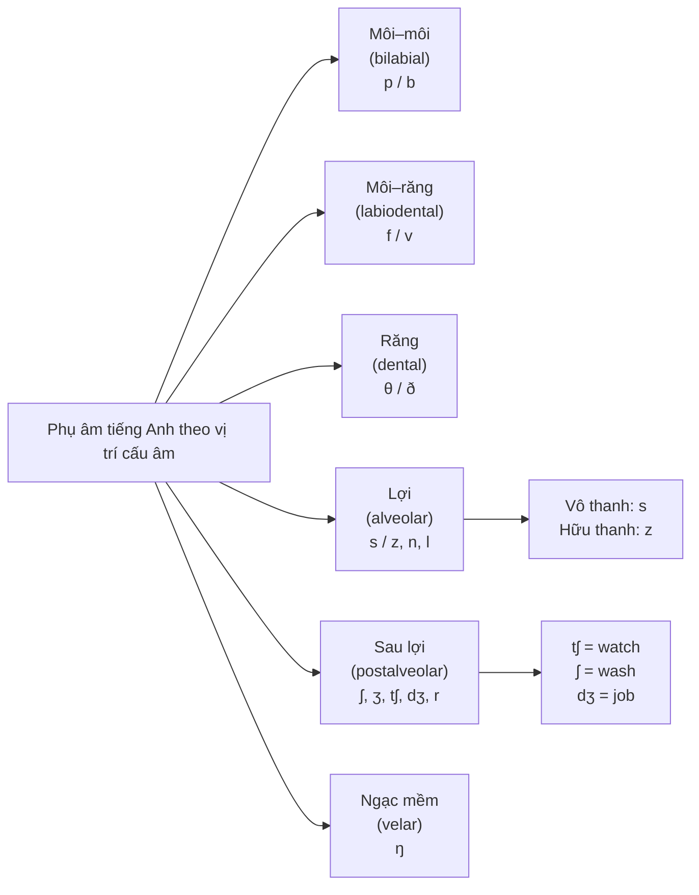

# 🗣️ Consonant Sounds — Phụ âm và cụm phụ âm

> [!abstract] Vì sao quan trọng với TOEIC
> - Người Việt thường **không phân biệt** các cặp phụ âm hữu thanh/vô thanh (`/p/-/b/`, `/f/-/v/`, `/s/-/z/`) vì tiếng Việt không có hệ đối lập hữu thanh–vô thanh giống tiếng Anh ở vị trí cuối từ.
> - **Part 2** (Hỏi–Đáp) và **Part 1** (Mô tả tranh) đầy bẫy tối thiểu cặp (minimal pairs): nghe nhầm `light` ↔ `right`, `sink` ↔ `zinc`, `cap` ↔ `cab` là chọn sai đáp án.
> - Âm cuối `-s`/`-ed`/`-ing` và **cụm phụ âm** (`street`, `tests`, `facts`) hay bị nuốt khi người Việt nói/nghe, ảnh hưởng trực tiếp đến **số ít/số nhiều**, **thì động từ** trong Part 5 và khả năng nghe **Part 3–4**.
> - Nguồn: *English Pronunciation in Use – Elementary (U11–27)*.

---

## A. Cặp phụ âm cơ bản dễ nhầm — hữu thanh vs vô thanh

> [!tip] Quy tắc cốt lõi
> Mỗi cặp dưới đây có **cùng vị trí cấu âm** (môi, răng, lợi...) nhưng khác nhau **duy nhất** ở việc dây thanh có rung (hữu thanh - *voiced*) hay không (vô thanh - *voiceless*). Đặt tay lên cổ họng: rung = hữu thanh.

### /p/ vs /b/ — âm môi–môi (bilabial plosive)

| Đặc điểm | /p/ (vô thanh) | /b/ (hữu thanh) |
| :--- | :--- | :--- |
| Cấu âm | Hai môi khép rồi bật hơi, **không** rung dây thanh | Hai môi khép rồi bật hơi, **có** rung dây thanh |
| Ví dụ tối thiểu cặp | `pack` /pæk/, `cap` /kæp/, `pin` /pɪn/ | `back` /bæk/, `cab` /kæb/, `bin` /bɪn/ |

### /f/ vs /v/ — âm môi–răng (labiodental fricative)

| Đặc điểm | /f/ (vô thanh) | /v/ (hữu thanh) |
| :--- | :--- | :--- |
| Cấu âm | Răng trên chạm môi dưới, hơi ma sát, không rung | Răng trên chạm môi dưới, hơi ma sát, có rung |
| Ví dụ tối thiểu cặp | `fan` /fæn/, `safe` /seɪf/, `proof` /pruːf/ | `van` /væn/, `save` /seɪv/, `prove` /pruːv/ |

### /s/ vs /z/ — âm lợi (alveolar fricative)

| Đặc điểm | /s/ (vô thanh) | /z/ (hữu thanh) |
| :--- | :--- | :--- |
| Cấu âm | Đầu lưỡi gần lợi, hơi xì qua khe hẹp, không rung | Đầu lưỡi gần lợi, hơi xì qua khe hẹp, có rung |
| Ví dụ tối thiểu cặp | `sink` /sɪŋk/, `price` /praɪs/, `loose` /luːs/ | `zinc` /zɪŋk/, `prize` /praɪz/, `lose` /luːz/ |

> [!caution] Bẫy đuôi `-s` trong TOEIC (số nhiều, ngôi 3 số ít, sở hữu cách)
> Âm `-s` cuối từ **không phải luôn đọc /s/** — quy tắc phụ thuộc âm đứng ngay trước nó:
> - Sau âm **vô thanh** (`/p, t, k, f, θ/`) → đọc `/s/`: `books` /bʊks/, `stops` /stɒps/.
> - Sau âm **hữu thanh** hoặc nguyên âm (`/b, d, g, v, m, n, l/`...) → đọc `/z/`: `jobs` /dʒɒbz/, `runs` /rʌnz/.
> - Sau âm **rít** (`/s, z, ʃ, ʒ, tʃ, dʒ/`) → thêm âm tiết `/ɪz/`: `boxes` /ˈbɒksɪz/, `watches` /ˈwɒtʃɪz/.
> - Người Việt hay đọc **mọi** đuôi `-s` thành /s/ hoặc bỏ hẳn — khiến giám khảo/người nghe hiểu nhầm số ít ↔ số nhiều.

### /θ/ vs /ð/ — âm răng (dental fricative) — "think" vs "this"

| Đặc điểm | /θ/ (vô thanh, "think") | /ð/ (hữu thanh, "this") |
| :--- | :--- | :--- |
| Cấu âm | Đầu lưỡi đặt giữa hai hàm răng, hơi xì ra, không rung | Đầu lưỡi đặt giữa hai hàm răng, hơi xì ra, có rung |
| Xuất hiện trong | Từ nội dung: `think` /θɪŋk/, `three` /θriː/, `through` /θruː/, `teeth` /tiːθ/ | Từ chức năng (rất phổ biến): `this` /ðɪs/, `that` /ðæt/, `they` /ðeɪ/, `mother` /ˈmʌðə(r)/, `teethe` /tiːð/ |

> [!caution] Bẫy "think" vs "sink" và "th" thành "t"/"d"
> Vì tiếng Việt không có âm răng `/θ, ð/`, người học thường thay bằng `/t/`, `/d/`, hoặc `/s/`, `/z/`: `think` /θɪŋk/ nói nhầm thành `sink` /sɪŋk/, `this` /ðɪs/ nói nhầm thành `dis`. Trong Part 2, câu hỏi có `Do you think...` mà phát âm sai `/θ/` dễ khiến người nghe tưởng từ khác.

---

## B. Các phụ âm khác dễ nhầm với người Việt

### /r/ vs /l/ — approximant vs lateral approximant

| Đặc điểm | /r/ | /l/ |
| :--- | :--- | :--- |
| Cấu âm | Đầu lưỡi cong lên gần vòm miệng, **không chạm** lợi | Đầu lưỡi chạm lợi, luồng hơi thoát hai bên lưỡi |
| Ví dụ tối thiểu cặp | `right` /raɪt/, `arrive` /əˈraɪv/, `correct` /kəˈrekt/ | `light` /laɪt/, `alive` /əˈlaɪv/, `collect` /kəˈlekt/ |

### /n/ vs /ŋ/ — alveolar nasal vs velar nasal

| Đặc điểm | /n/ | /ŋ/ |
| :--- | :--- | :--- |
| Cấu âm | Đầu lưỡi chạm lợi, hơi thoát qua mũi | Gốc lưỡi chạm ngạc mềm (vòm miệng sau), hơi thoát qua mũi — **không** có âm /g/ đi kèm |
| Ví dụ tối thiểu cặp | `sin` /sɪn/, `ban` /bæn/, `ran` /ræn/ | `sing` /sɪŋ/, `bang` /bæŋ/, `rang` /ræŋ/ |

> [!caution] Bẫy đuôi `-ing`
> `-ing` đọc là **một âm** /ŋ/ ở cuối lưỡi, **không** phải /n/ + /g/ tách rời. `reading` là /ˈriːdɪŋ/, không phải /ˈriːdin/ hay /ˈriːdiŋg/. Nghe nhầm `sing` /sɪŋ/ thành `sin` /sɪn/ trong Part 1/2 làm đổi nghĩa hoàn toàn.

### /tʃ/ vs /ʃ/ vs /dʒ/ — affricate vs fricative

| Âm | Loại | Ví dụ |
| :--- | :--- | :--- |
| `/tʃ/` | Vô thanh, âm tắc–xát (bật + ma sát) | `watch` /wɒtʃ/, `choose` /tʃuːz/, `cheap` /tʃiːp/ |
| `/ʃ/` | Vô thanh, âm xát đơn thuần | `wash` /wɒʃ/, `shoes` /ʃuːz/, `sheep` /ʃiːp/ |
| `/dʒ/` | Hữu thanh, âm tắc–xát | `job` /dʒɒb/, `large` /lɑːdʒ/, `jeep` /dʒiːp/ |

> [!caution] Bẫy `watch` vs `wash`, `cheap` vs `sheep`
> `/tʃ/` có động tác "bật hơi" ngắn ở đầu, `/ʃ/` chỉ là luồng hơi xát liên tục, không bật. Người Việt hay phát âm cả hai giống nhau (gần với "s" tiếng Việt), khiến `watch TV` và `wash the car` nghe lẫn lộn trong Part 3.

---

## C. Cụm phụ âm (consonant clusters) đầu/cuối từ

> [!abstract] Vì sao người Việt hay "nuốt" cụm phụ âm
> Tiếng Việt là ngôn ngữ **đơn âm tiết**, mỗi âm tiết chỉ có **một phụ âm đầu** và **cuối âm tiết chỉ giới hạn** ở một số ít phụ âm không bật hơi (`p, t, c/k, m, n, ng`). Tiếng Anh cho phép **2–3 phụ âm đứng liền nhau** ở đầu từ (`str-`, `spl-`) và cuối từ (`-sts`, `-kts`) — cấu trúc này **không tồn tại** trong tiếng Việt, nên người học có xu hướng **bỏ bớt** một phụ âm hoặc **chêm nguyên âm** vào giữa (ví dụ nói `sit-udent` thay vì `student`).

### Cụm phụ âm đầu từ (word-initial clusters)

| Cụm | Ví dụ | IPA |
| :--- | :--- | :--- |
| `str-` | `street` | /striːt/ |
| `spl-` | `split` | /splɪt/ |
| `scr-` | `screen` | /skriːn/ |
| `thr-` | `three` | /θriː/ |
| `spr-` | `spring` | /sprɪŋ/ |

### Cụm phụ âm cuối từ (word-final clusters)

| Cụm | Ví dụ | IPA |
| :--- | :--- | :--- |
| `-sts` | `tests` | /tests/ |
| `-kts` | `facts` | /fækts/ |
| `-mpt` | `attempt` | /əˈtempt/ |
| `-nts` | `students` | /ˈstjuːdənts/ |
| `-lds` | `builds` | /bɪldz/ |

> [!caution] Hậu quả khi bỏ cụm phụ âm cuối trong TOEIC
> - `tests` bị đọc thành "tes" (chỉ còn /tes/) khiến người nghe không rõ **số nhiều**.
> - `attempts` mất đuôi thành "attempt" làm sai **thì/thể** câu (Part 5 điền từ, Part 3 nghe hiểu).
> - Cách khắc phục: đọc **chậm và rõ từng phụ âm cuối** (không cần bật hơi mạnh, chỉ cần chạm đúng vị trí lưỡi/môi), đặc biệt với các từ có hậu tố `-s`, `-ed`, `-ts`.

---

## 🎯 Luyện tập & áp dụng vào TOEIC

1. **Minimal pairs drill**: đọc to từng cặp sau và tự thu âm lại để so sánh:
   - `pin` /pɪn/ – `bin` /bɪn/
   - `fan` /fæn/ – `van` /væn/
   - `sink` /sɪŋk/ – `zinc` /zɪŋk/
   - `think` /θɪŋk/ – `this` /ðɪs/
   - `light` /laɪt/ – `right` /raɪt/
   - `sin` /sɪn/ – `sing` /sɪŋ/
   - `watch` /wɒtʃ/ – `wash` /wɒʃ/
2. **Đuôi `-s` theo 3 nhóm âm** (`/s/`, `/z/`, `/ɪz/`): phân loại 10 từ vựng TOEIC mới học mỗi tuần vào đúng nhóm phát âm.
3. **Shadowing cụm phụ âm** 10'/ngày: `street`, `split`, `screen`, `tests`, `facts`, `attempts` — đọc chậm, giữ đủ mọi phụ âm trong cụm.
4. **Part 2 practice**: nghe câu hỏi có cặp tối thiểu gần nghĩa (`Can you collect the report?` vs `Can you correct the report?`) và chọn đáp án đúng ngữ cảnh.
5. **Tự kiểm tra**: xác định phụ âm IPA và phân loại vô thanh/hữu thanh cho 5 từ dưới đây:
   - `products`
   - `these`
   - `strong`
   - `washing`
   - `thirty`

> [!success]- 🔑 Đáp án nhanh phần tự kiểm tra
> | Từ | IPA | Ghi chú |
> | :--- | :--- | :--- |
> | `products` | /ˈprɒdʌkts/ | Cụm phụ âm cuối `-kts`; đuôi `-s` đọc `/s/` vì sau âm vô thanh `/t/` |
> | `these` | /ðiːz/ | Âm đầu `/ð/` hữu thanh (giống "this"), không phải `/θ/` |
> | `strong` | /strɒŋ/ | Cụm phụ âm đầu `str-`; âm cuối `/ŋ/` (velar nasal), không phải `/n/` + `/g/` |
> | `washing` | /ˈwɒʃɪŋ/ | Âm `/ʃ/` (fricative đơn), không phải `/tʃ/`; đuôi `-ing` = một âm `/ŋ/` |
> | `thirty` | /ˈθɜːti/ | Âm đầu `/θ/` vô thanh (giống "think"), không phải `/ð/` hay `/t/` |

---
Trở về: [[TOEIC MOC]] | [[English Pronunciation in Use MOC]]
