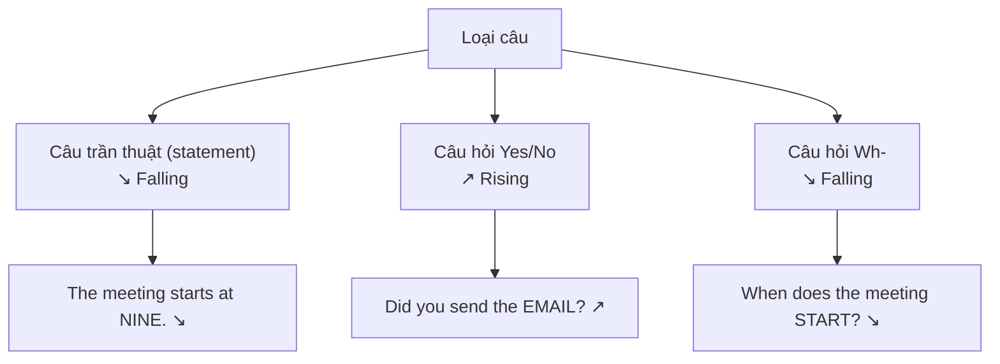

# 🎵 Intonation & Active Listening — Ngữ điệu và nghe chủ động

> [!abstract] Vì sao quan trọng với TOEIC
> - Ngữ điệu (intonation) là "giai điệu" của câu — nó báo hiệu thông tin nào **mới/quan trọng** (giọng xuống, nhấn mạnh) và thông tin nào **đã biết** (giọng giữ nguyên/lên nhẹ), giúp người nghe bắt đúng trọng tâm.
> - Câu hỏi Yes/No thường **lên giọng** cuối câu, câu hỏi Wh- và câu trần thuật thường **xuống giọng** — nhận diện sai kiểu câu làm mất điểm **Part 2** (Question-Response).
> - **Part 3/4** là các đoạn hội thoại/độc thoại dài: nếu chỉ nghe từng từ mà không bắt được ngữ điệu và mạch kể chuyện, người học dễ lạc giữa chừng và bỏ lỡ câu trả lời.
> - Nguồn: *English Pronunciation in Use – Intermediate — intonation: old and new information* và *…— storytelling and active listening*.

---

## A. Ngữ điệu đánh dấu thông tin cũ vs thông tin mới

Trong một câu nói tự nhiên, người nói dùng ngữ điệu để "tô đậm" phần thông tin **mới** (new information — điều người nghe chưa biết) và "làm mờ" phần thông tin **cũ** (given information — điều đã nhắc tới hoặc suy ra được từ ngữ cảnh).

| Loại thông tin | Ngữ điệu | Ví dụ (phần in đậm mang trọng âm câu + giọng xuống) |
| :--- | :--- | :--- |
| **Thông tin mới / quan trọng** | Giọng **xuống** (falling tone ↘), trọng âm câu rơi vào đây | *A: Where's the report?* → *B: I left it on your **DESK**.* ↘ |
| **Thông tin cũ / đã nhắc** | Giọng **giữ phẳng hoặc hơi lên** (flat/rising ↗), không nhấn | *A: Did you finish the **REPORT**?* ↘ → *B: Yes, the **report**'s ↗ on your **DESK**.* ↘ |

- Câu trả lời của B lặp lại từ *report* (thông tin cũ, đã có trong câu hỏi của A) nên được đọc nhẹ, giọng phẳng; từ *desk* là thông tin mới nên được nhấn mạnh và xuống giọng rõ.
- Đây chính là lý do TOEIC Part 2/3 hay "đánh lừa" bằng cách lặp một từ khóa trong câu hỏi ở đáp án sai — nếu chỉ nghe thấy từ quen mà không để ý ngữ điệu (từ đó có được nhấn hay không), rất dễ chọn nhầm.

> [!tip] Mẹo nhận diện nhanh
> Từ mang trọng âm câu (sentence stress) — thường là danh từ/động từ/số liệu chính, được kéo dài + xuống giọng — luôn là **từ khóa** cần ghi nhớ để trả lời đúng câu hỏi Part 3/4.

---

## B. Ngữ điệu câu trần thuật, câu hỏi Yes/No và câu hỏi Wh-

| Kiểu câu | Hướng ngữ điệu cuối câu | IPA minh họa (ngữ điệu trên nguyên âm cuối) |
| :--- | :--- | :--- |
| Câu trần thuật | ↘ xuống | *The train has already **left**.* /left/ ↘ |
| Câu hỏi Yes/No | ↗ lên | *Have you **met** him?* /met/ ↗ |
| Câu hỏi Wh- | ↘ xuống | *Where did you **park**?* /pɑːk/ ↘ |
| Lời mời/đề nghị lịch sự (dạng Yes/No nhưng lịch sự) | ↗ lên nhẹ | *Would you like some **coffee**?* /ˈkɒfi/ ↗ |
| Liệt kê (trước từ cuối) | ↗ … ↗ … ↘ (từ cuối xuống) | *We need **pens**, ↗ **paper**, ↗ and **staplers**. ↘* |

> [!caution] Bẫy kinh điển trong Part 2
> - Câu hỏi Wh- (*What*, *Where*, *When*, *Why*, *Who*, *How*) **xuống giọng** giống câu trần thuật — người mới học hay nhầm là phải lên giọng như mọi câu hỏi, dẫn đến nghe sai trọng tâm câu và bỏ lỡ từ để hỏi (Wh-word) ở đầu câu.
> - Câu hỏi đuôi kiểu tu từ (*You finished the report, didn't you?* ↘) thường xuống giọng vì người hỏi đã gần như chắc chắn câu trả lời — khác với câu hỏi đuôi thật sự cần xác nhận (↗).

---

## C. Storytelling và phương pháp nghe chủ động (active listening)

Shadowing một đoạn **kể chuyện ngắn** (short narrative/anecdote) là cách luyện tập hiệu quả nhất để nội hóa **cùng lúc ba yếu tố**: nhịp điệu (rhythm), nối âm (linking) và ngữ điệu (intonation) — vì trong một câu chuyện thật, ba yếu tố này luôn xuất hiện đan xen tự nhiên, không tách rời như khi luyện từng câu mẫu riêng lẻ.

### Quy trình shadowing một đoạn narrative (10–15 phút/ngày)

1. **Nghe toàn bộ** đoạn kể chuyện 1 lần, không nhìn transcript — chỉ để nắm mạch chuyện: ai, làm gì, khi nào, kết quả ra sao.
2. **Nghe lại + đọc transcript**, đánh dấu: từ nào được nhấn (trọng âm câu), chỗ nào nối âm (`turn_off`, `check_it_out`), chỗ nào giọng lên/xuống.
3. **Shadowing câu ngắn**: nghe 1 câu, dừng, nhại lại ngay lập tức — bắt chước cả tốc độ, ngữ điệu, không chỉ phát âm từng từ.
4. **Shadowing liên tục** (không dừng): vừa nghe vừa nói theo gần như đồng thời, chấp nhận trễ vài giây — mục tiêu là bám được *dòng chảy* của câu chuyện, không phải phát âm hoàn hảo từng âm.
5. **Tự kể lại** đoạn chuyện bằng lời của mình (retelling), cố gắng giữ đúng ngữ điệu đã luyện ở các câu chốt (câu mở đầu, câu cao trào, câu kết).

> [!tip] Vì sao chọn narrative (kể chuyện) thay vì câu đơn lẻ
> Một câu chuyện có **mạch logic thời gian** (trước – sau, nguyên nhân – kết quả) buộc người nghe phải theo dõi liên tục thay vì nghe rời rạc từng câu — đây chính là kỹ năng "nghe chủ động" (active listening): dự đoán điều sắp xảy ra dựa vào ngữ điệu và từ khóa được nhấn, thay vì thụ động chờ nghe hết mới hiểu.

### Liên hệ trực tiếp với TOEIC Part 3 và Part 4

| Kỹ năng luyện qua storytelling | Cách áp dụng vào Part 3/4 |
| :--- | :--- |
| Bắt từ khóa nhờ trọng âm câu + giọng xuống | Nghe đúng số liệu, tên người, địa điểm — thường là thông tin mới, được nhấn rõ |
| Theo dõi mạch thời gian/nguyên nhân-kết quả | Bám sát trình tự sự kiện trong đoạn hội thoại/thông báo dài để trả lời câu hỏi "What happened next?", "Why…?" |
| Dự đoán câu tiếp theo qua ngữ điệu | Đoán trước loại thông tin sắp đến (câu hỏi Wh- xuống giọng → sắp có câu trả lời cụ thể) để chuẩn bị tinh thần nghe tiếp trong khi mắt đang đọc câu hỏi trên đề |
| Nghe liên tục không dừng lại ở từ lạ | Tránh "khựng" khi gặp từ không quen trong đoạn Part 4 dài — giữ mạch nghe để không mất luôn câu hỏi sau |

---

## 🎯 Luyện tập & áp dụng vào TOEIC

1. **Đánh dấu ngữ điệu** (↘/↗) cho 5 câu hội thoại văn phòng mỗi ngày, ví dụ: *Did you finish the **REPORT**? ↗* / *I left it on your **DESK**. ↘*
2. **Phân loại nhanh 6 câu** dưới đây là trần thuật, Yes/No hay Wh-, rồi đánh dấu hướng ngữ điệu cuối câu:
   - *Are you attending the meeting today?*
   - *When will the shipment arrive?*
   - *The invoice was sent yesterday.*
   - *Could you review this contract?*
   - *Who signed the agreement?*
   - *Would you like to reschedule?*
3. **Shadowing** một đoạn hội thoại/thông báo ngắn (30–60 giây, dạng Part 3/4) trong 10 phút, theo đúng quy trình 5 bước ở mục C.
4. **Tự kiểm tra Part 2 giả lập**: nghe 5 câu hỏi ngẫu nhiên (ghi âm hoặc audio có sẵn), chỉ dựa vào ngữ điệu để đoán trước là câu hỏi Yes/No hay Wh- *trước khi* nghe hết câu, sau đó đối chiếu lại.

> [!success]- 🔑 Đáp án nhanh phần tự kiểm tra (mục 2)
> | Câu | Loại câu | Ngữ điệu cuối câu |
> | :--- | :--- | :--- |
> | *Are you attending the meeting today?* | Yes/No | ↗ lên |
> | *When will the shipment arrive?* | Wh- | ↘ xuống |
> | *The invoice was sent yesterday.* | Trần thuật | ↘ xuống |
> | *Could you review this contract?* | Yes/No | ↗ lên |
> | *Who signed the agreement?* | Wh- | ↘ xuống |
> | *Would you like to reschedule?* | Yes/No (lời mời lịch sự) | ↗ lên nhẹ |

---
Trở về: [[TOEIC MOC]] | [[English Pronunciation in Use MOC]]
