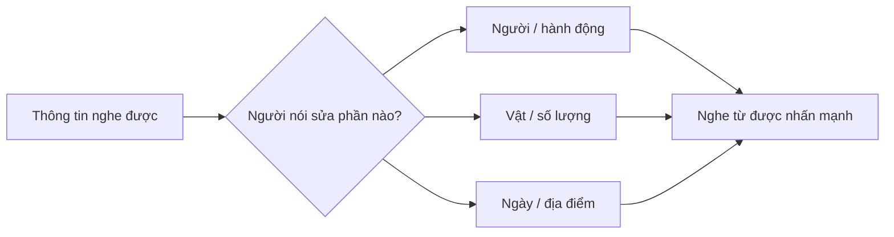

# 🎙️ Sentence Stress & Functional Intonation — Trọng âm câu và ngữ điệu chức năng

> [!abstract] Trọng tâm TOEIC Listening
> - **Contrastive stress** đổi từ được nhấn để sửa hoặc đối chiếu thông tin: số lượng, ngày, địa điểm, người thực hiện.
> - **Emphatic stress** nhấn mạnh thái độ hoặc mức độ quan trọng của thông tin.
> - **Functional intonation** giúp nhận ra chức năng câu nói: xác nhận, sửa thông tin, đề nghị, cảnh báo hoặc kết thúc ý.
> - Trong Part 2–4, từ mang trọng âm chính thường chứa đáp án; từ bị giảm âm thường chỉ là thông tin nền.

---

## A. Contrastive stress — trọng âm tương phản

Cùng một câu nhưng đổi từ được nhấn sẽ đổi điều người nói muốn sửa:

| Câu nói | Hàm ý |
| :--- | :--- |
| ***I** sent the invoice on Tuesday.* | Tôi gửi, không phải người khác. |
| *I **SENT** the invoice on Tuesday.* | Tôi đã gửi, không chỉ chuẩn bị. |
| *I sent the **INVOICE** on Tuesday.* | Gửi hóa đơn, không phải hợp đồng. |
| *I sent the invoice on **TUESDAY**.* | Thứ Ba, không phải thứ Hai. |

> [!tip] Mẹo Part 2–3
> Khi người nói đáp *No, I said **THIRTEEN**, not thirty*, đừng bám từ lặp lại. Từ được nhấn sau lời sửa mới là thông tin đúng.

---

## B. Emphatic stress — trọng âm nhấn mạnh

Emphatic stress không nhất thiết đối chiếu hai lựa chọn; nó làm nổi bật thái độ hoặc mức độ:

- *The safety briefing is **EXTREMELY** important.*
- *We **DO** appreciate your patience.*
- *The shipment is **FINALLY** here.*
- *You **MUST** submit the form by noon.*

| Dấu hiệu âm thanh | Ý nghĩa thường gặp |
| :--- | :--- |
| Âm tiết dài hơn | Từ khóa quan trọng |
| Cao độ thay đổi rõ | Sửa thông tin hoặc thể hiện thái độ |
| Âm lượng mạnh hơn | Cảnh báo, yêu cầu, xác nhận mạnh |
| Từ chức năng được nhấn (`do`, `did`, `must`) | Phủ nhận nghi ngờ hoặc nhấn mạnh nghĩa vụ |

> [!caution] Không nhấn mọi từ
> Nếu mọi từ đều mạnh như nhau, người nghe không biết đâu là thông tin chính. Giữ danh từ/động từ/số liệu quan trọng rõ; giảm âm mạo từ, giới từ và trợ động từ không mang tương phản.

---

## C. Functional intonation — ngữ điệu theo chức năng giao tiếp

| Chức năng | Mẫu ngữ điệu phổ biến | Ví dụ |
| :--- | :--- | :--- |
| Thông báo / kết thúc ý | Xuống giọng ↘ | *The office closes at **SIX**. ↘* |
| Yes/No question | Lên giọng ↗ | *Did you receive the **EMAIL**? ↗* |
| Wh-question | Xuống giọng ↘ | *When will the shipment **ARRIVE**? ↘* |
| Kiểm tra/xác nhận chưa chắc | Lên giọng ↗ | *The meeting is on **THURSDAY**? ↗* |
| Sửa thông tin | Từ sửa được nhấn + xuống giọng ↘ | *No, it starts at **THREE**. ↘* |
| Danh sách chưa kết thúc | Lên ở từng mục, xuống ở mục cuối | *Pens ↗, folders ↗, and badges ↘.* |
| Đề nghị lịch sự | Lên nhẹ ↗ | *Could you resend the **FILE**? ↗* |

### Một câu hỏi đuôi, hai ý nghĩa

- *You sent the invoice, **didn’t you**? ↗* — người nói thật sự cần xác nhận.
- *You sent the invoice, **didn’t you**? ↘* — người nói gần như chắc chắn, chỉ mong người nghe đồng ý.

---

## D. Quy trình nghe nhanh trong Part 2–4

1. Xác định **từ được nhấn mạnh nhất**.
2. Nghe hướng giọng cuối câu: **↗ chưa hoàn tất/cần xác nhận**, **↘ hoàn tất/chắc chắn**.
3. Kiểm tra xem câu trả lời có **sửa** số, ngày, tên hay địa điểm không.
4. Ghi từ khóa, không cố chép toàn bộ câu.
5. Shadowing lại câu với đúng một trọng âm chính.

## 🎯 Luyện tập

Đánh dấu từ cần nhấn và hướng ngữ điệu:

1. *The interview is on Friday, not Thursday.* []
2. *Did the supplier confirm the order?* []
3. *Where should visitors leave their badges?* []
4. *No, we ordered fifteen chairs, not fifty.* []
5. *Could you send the revised schedule?* []

> [!success]- 🔑 Đáp án gợi ý
> 1. **FRIDAY** ↘ — sửa ngày.
> 2. **ORDER** ↗ — Yes/No question.
> 3. **BADGES** ↘ — Wh-question.
> 4. **FIFTEEN** ↘ — sửa số lượng; tránh nhầm *fifteen/fifty*.
> 5. **SCHEDULE** ↗ — yêu cầu lịch sự.

---
Trở về: [[English Pronunciation in Use MOC]] | [[TOEIC MOC]] | Liên quan: [[Intonation and Active Listening - Ngu dieu va nghe chu dong]]
