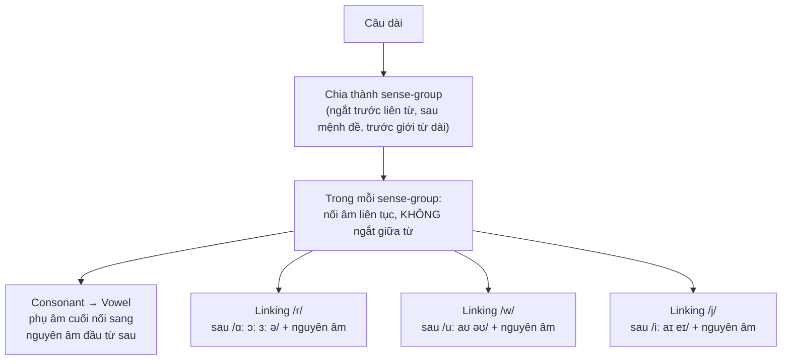
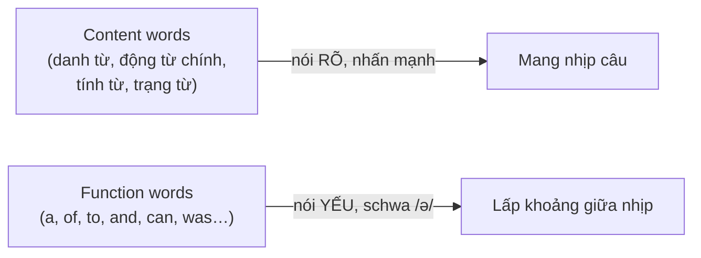

# 🔗 Syllables & Connected Speech — Âm tiết và Nối Âm

> [!abstract] Vì sao quan trọng với TOEIC
> - Người bản ngữ **không nói từng từ tách rời** — họ nối âm, nuốt âm và làm yếu các từ chức năng. Nghe theo "từ điển" từng chữ sẽ **thua ngay Part 2 & Part 3–4**.
> - **Schwa /ə/** là nguyên âm xuất hiện nhiều nhất trong tiếng Anh — nhận ra nó giúp bắt đúng trọng âm và không bị "rối" bởi các âm tiết yếu.
> - **Nối âm (linking)** khiến `turn off` nghe như một từ `/tɜːˈnɒf/`, `pick up` nghe như `/pɪˈkʌp/` — đây là lý do Part 1–2 TOEIC luôn khó hơn khi nghe thật so với đọc transcript.
> - **Weak forms** (a, of, to, and, can…) gần như biến mất trong câu nói nhanh — nghe sai `can` / `can't` là bẫy kinh điển của Part 2.
> - **-s / -ed endings** có 3 cách đọc khác nhau tùy âm cuối — đọc sai làm lệch cả thì (quá khứ hay hiện tại) khi nghe Part 3–4.
> - Nguồn: *English Pronunciation in Use – Elementary (U28–29: syllables & word stress)* và *Intermediate (chunking, linking, rhythm, weak forms, contractions, -s/-ed endings)*.

---

## A. Đếm âm tiết & Schwa /ə/ — nguyên âm phổ biến nhất

**Âm tiết (syllable)** không đếm theo số nguyên âm *viết ra* mà theo số nguyên âm *phát âm ra*. Ví dụ `comfortable` viết có 4 nguyên âm nhưng người bản ngữ thường nói chỉ **3 âm tiết**: `/ˈkʌmftəbl/`.

> [!tip] Mối liên hệ với trọng âm
> Mỗi từ có nhiều âm tiết chỉ có **một âm tiết mạnh (trọng âm)** — các âm tiết còn lại thường bị **làm yếu** thành schwa `/ə/` hoặc `/ɪ/`. Đây chính là lý do quy tắc trọng âm ở [[Word Stress - Quy tac trong am tu]] và nguyên âm yếu ở đây luôn đi cùng nhau: **biết trọng âm rơi vào đâu → biết ngay các âm tiết khác sẽ bị "làm yếu" thành schwa.**

### Nguyên âm mạnh (strong vowel) vs nguyên âm yếu (weak vowel/schwa)

| Từ (TOEIC office vocab) | Phiên âm đầy đủ | Âm tiết MẠNH (trọng âm, nguyên âm rõ) | Âm tiết YẾU (schwa `/ə/` hoặc `/ɪ/`) |
| :--- | :--- | :--- | :--- |
| `computer` | `/kəmˈpjuːtə/` | `-PU-` `/pjuː/` | `com-` `/kəm/`, `-ter` `/tə/` |
| `manager` | `/ˈmænɪdʒə/` | `MA-` `/mæ/` | `-nager` `/nɪdʒə/` |
| `document` | `/ˈdɒkjumənt/` | `DOC-` `/dɒk/` | `-ument` `/jʊmənt/` |
| `available` | `/əˈveɪləbl/` | `-VAI-` `/veɪ/` | `a-` `/ə/`, `-lable` `/ləbl/` |
| `photograph` | `/ˈfəʊtəɡrɑːf/` | `PHO-` `/fəʊ/` | `-to-` `/tə/` |
| `attention` | `/əˈtenʃn/` | `-TEN-` `/ten/` | `a-` `/ə/`, `-tion` `/ʃn/` |

> [!caution] Bẫy nghe kinh điển: schwa không phải là "âm bị mất"
> Người học hay bỏ hẳn âm tiết yếu khi nói, nhưng khi **nghe**, schwa vẫn tồn tại — chỉ ngắn và mờ. `about` không phải `/baʊt/` mà là `/əˈbaʊt/`. Nếu quen tai chờ nguyên âm rõ ràng ở mọi âm tiết, bạn sẽ **nghe hụt** các từ có 3+ âm tiết trong Part 3–4.

- Nguồn: *English Pronunciation in Use Elementary U28–29*.

---

## B. Chunking (ngắt cụm ý) & Linking (nối âm giữa các từ)

Người bản ngữ không nói cả câu liền một hơi — họ chia câu thành các **sense-group** (cụm mang một ý), ngắt hơi ở ranh giới cụm, còn **bên trong** mỗi cụm thì các từ được **nối âm** liền mạch với nhau.

**Ví dụ chunking** (dấu `//` = ranh giới ngắt hơi):

> *If you have any questions // please contact our office // before Friday afternoon.*

### 4 kiểu nối âm thường gặp

| Kiểu nối | Quy tắc | Ví dụ | Phiên âm nối liền |
| :--- | :--- | :--- | :--- |
| **Consonant → Vowel** | Phụ âm cuối từ trước "nhảy" sang đầu nguyên âm từ sau | `turn off` | `/tɜːn ɒf/` → `[tɜːˈnɒf]` |
| **Consonant → Vowel** | (giống trên) | `pick up` | `/pɪk ʌp/` → `[pɪˈkʌp]` |
| **Linking /r/** | Từ trước kết thúc `/ɑː, ɔː, ɜː, ə/`, từ sau bắt đầu nguyên âm → chêm `/r/` | `far away` | `/fɑː əˈweɪ/` → `[fɑːr əˈweɪ]` |
| **Linking /r/** | (intrusive r, rất phổ biến trong lời nói tự nhiên) | `law and order` | `/lɔː ənd ˈɔːdə/` → `[lɔːr ənd ˈɔːdə]` |
| **Linking /w/** | Từ trước kết thúc `/uː, aʊ, əʊ/`, từ sau bắt đầu nguyên âm → chêm `/w/` | `go on` | `/ɡəʊ ɒn/` → `[ɡəʊ wɒn]` |
| **Linking /j/** | Từ trước kết thúc `/iː, aɪ, eɪ/`, từ sau bắt đầu nguyên âm → chêm `/j/` | `my idea` | `/maɪ aɪˈdɪə/` → `[maɪ jaɪˈdɪə]` |

> [!caution] Vì sao đây là bẫy Part 1–2 TOEIC
> `turn off` nối âm nghe gần như một từ mới `[tɜːˈnɒf]` — nếu não bạn chờ nghe hai từ tách rời `/tɜːn/` rồi `/ɒf/`, bạn sẽ bỏ lỡ mất một trong hai. Luyện nghe **theo cụm nối âm**, không theo từng từ đơn lẻ.

- Nguồn: *English Pronunciation in Use Intermediate — chunking and linking*.

---

## C. Sentence rhythm & Weak forms của từ chức năng

Tiếng Anh là ngôn ngữ **stress-timed**: **content words** (danh từ, động từ chính, tính từ, trạng từ, từ hỏi) mang trọng âm câu và được nói rõ; **function words** (mạo từ, giới từ, liên từ, trợ động từ, đại từ) thường bị **làm yếu (weak form)** — nguyên âm biến thành schwa `/ə/` và bị nuốt nhanh.

### Bảng weak forms thường gặp trong câu nói

| Từ | Strong form (khi đứng riêng/nhấn mạnh) | Weak form (trong câu thường) | Ví dụ câu |
| :--- | :--- | :--- | :--- |
| `a` | `/eɪ/` | `/ə/` | *I need **a** pen.* → `/ə/` |
| `of` | `/ɒv/` | `/əv/`, `/ə/` | *a cup **of** tea* → `/əv/` |
| `to` | `/tuː/` | `/tə/` | *go **to** work* → `/tə wɜːk/` |
| `and` | `/ænd/` | `/ənd/`, `/ən/`, `/n/` | *bread **and** butter* → `/ˈbred‿n ˈbʌtə/` |
| `can` | `/kæn/` | `/kən/` | *I **can** help.* → `/aɪ kən help/` |
| `for` | `/fɔː/` | `/fə/` | *wait **for** me* → `/weɪt fə mi/` |
| `was` | `/wɒz/` | `/wəz/` | *he **was** late* → `/hi wəz leɪt/` |

> [!caution] Bẫy `can` vs `can't` trong Part 2
> - `can` dạng yếu chỉ còn `/kən/`, gần như "lướt" qua tai.
> - `can't` (phủ định) **không** bị làm yếu — vẫn giữ nguyên âm đầy đủ `/kɑːnt/` (Anh-Anh) hoặc `/kænt/` (Anh-Mỹ), và phần `-t` cuối thường bị nuốt trước phụ âm.
> - Nếu nghe *"I ken help you"* (nhẹ, nhanh) → đó là **"I CAN help you"** (khẳng định); nếu nghe rõ nguyên âm dài `/kɑːnt/` → đó là phủ định. Nhầm hai âm này là mất điểm oan ở Part 2.

- Nguồn: *English Pronunciation in Use Intermediate — rhythm and weak forms*.

---

## D. Contractions & 3 cách đọc đuôi -s / -ed

### Contractions (rút gọn) thường gặp trong hội thoại TOEIC Part 2–3

| Dạng đầy đủ | Contraction | Phiên âm |
| :--- | :--- | :--- |
| I am | I'm | `/aɪm/` |
| you are | you're | `/jʊə/`, `/jɔː/` |
| he is / he has | he's | `/hiːz/` |
| do not | don't | `/dəʊnt/` |
| does not | doesn't | `/ˈdʌzənt/` |
| cannot | can't | `/kɑːnt/`, `/kænt/` |
| will not | won't | `/wəʊnt/` |
| I have | I've | `/aɪv/` |
| they will | they'll | `/ðeɪl/` |

### Đuôi `-s` (số nhiều, ngôi 3 số ít, sở hữu cách) — 3 cách đọc

| Âm cuối gốc | Cách đọc | Ví dụ |
| :--- | :--- | :--- |
| Phụ âm **vô thanh** (`/p, t, k, f, θ/`) | `/s/` | `works` `/wɜːks/`, `meets` `/miːts/` |
| Nguyên âm + phụ âm **hữu thanh** (`/b, d, g, v, m, n, l, r/`…) | `/z/` | `runs` `/rʌnz/`, `goes` `/ɡəʊz/` |
| Âm rít (`/s, z, ʃ, ʒ, tʃ, dʒ/`) | `/ɪz/` (thêm 1 âm tiết) | `watches` `/ˈwɒtʃɪz/`, `prices` `/ˈpraɪsɪz/` |

### Đuôi `-ed` (quá khứ/phân từ của động từ thường) — 3 cách đọc

| Âm cuối động từ gốc | Cách đọc | Ví dụ |
| :--- | :--- | :--- |
| Phụ âm **vô thanh** (trừ `/t/`) | `/t/` | `worked` `/wɜːkt/`, `watched` `/wɒtʃt/`, `stopped` `/stɒpt/` |
| Nguyên âm hoặc phụ âm **hữu thanh** (trừ `/d/`) | `/d/` | `played` `/pleɪd/`, `arrived` `/əˈraɪvd/`, `changed` `/tʃeɪndʒd/` |
| Kết thúc bằng `/t/` hoặc `/d/` | `/ɪd/` (thêm 1 âm tiết) | `wanted` `/ˈwɒntɪd/`, `needed` `/ˈniːdɪd/`, `decided` `/dɪˈsaɪdɪd/` |

> [!caution] Đọc sai `-ed` = đổi nghĩa cả câu
> `wanted` có **2 âm tiết** `/ˈwɒntɪd/`, còn `worked` chỉ có **1 âm tiết** `/wɜːkt/` (âm `-ed` không tạo âm tiết mới). Đọc `worked` thành `/ˈwɜːkɪd/` (2 âm tiết) là lỗi phát âm phổ biến của người Việt — và khi *nghe*, nếu không phân biệt được số âm tiết này, dễ nhầm thì của động từ.

- Nguồn: *English Pronunciation in Use Intermediate — contractions and -s/-ed endings*.

---

## 🎯 Luyện tập & áp dụng vào TOEIC

1. **Đếm âm tiết thật** (không đếm nguyên âm viết) cho 5 từ: `comfortable`, `interesting`, `chocolate`, `vegetable`, `different`.
2. **Nối âm**: đọc to các cụm sau và gạch nối chỗ nối âm: `turn off the light`, `pick up the phone`, `go on ahead`, `my idea`.
3. **Weak form**: đọc câu *"I can wait for you, but I can't wait for him."* — phân biệt `can` (yếu) và `can't` (mạnh) khi nói.
4. **Đuôi `-ed`**: xếp các từ sau vào 3 nhóm `/t/ /d/ /ɪd/`: `talked`, `arrived`, `needed`, `stopped`, `played`, `wanted`, `watched`, `decided`.
5. **Đuôi `-s`**: xếp các từ sau vào 3 nhóm `/s/ /z/ /ɪz/`: `works`, `runs`, `watches`, `meets`, `goes`, `prices`.

> [!success]- 🔑 Đáp án
> **1. Số âm tiết thực tế:**
> | Từ | Âm tiết thực tế | Phiên âm |
> | :--- | :--- | :--- |
> | `comfortable` | 3 | `/ˈkʌmftəbl/` |
> | `interesting` | 3 | `/ˈɪntrəstɪŋ/` |
> | `chocolate` | 2 | `/ˈtʃɒklət/` |
> | `vegetable` | 3 | `/ˈvedʒtəbl/` |
> | `different` | 2–3 | `/ˈdɪfrənt/` |
>
> **2. Nối âm:** `turn‿off` `[tɜːˈnɒf]`, `pick‿up` `[pɪˈkʌp]`, `go‿w‿on` `[ɡəʊ wɒn]`, `my‿j‿idea` `[maɪ jaɪˈdɪə]`.
>
> **3. Weak form:** `can` → `/kən/` (yếu, lướt nhanh); `can't` → `/kɑːnt/` hoặc `/kænt/` (mạnh, nguyên âm rõ, giữ nguyên).
>
> **4. Đuôi `-ed`:**
> | `/t/` | `/d/` | `/ɪd/` |
> | :--- | :--- | :--- |
> | `talked`, `stopped`, `watched` | `arrived`, `played` | `needed`, `wanted`, `decided` |
>
> **5. Đuôi `-s`:**
> | `/s/` | `/z/` | `/ɪz/` |
> | :--- | :--- | :--- |
> | `works`, `meets` | `runs`, `goes` | `watches`, `prices` |

---
Trở về: [[TOEIC MOC]] | [[English Pronunciation in Use MOC]]
