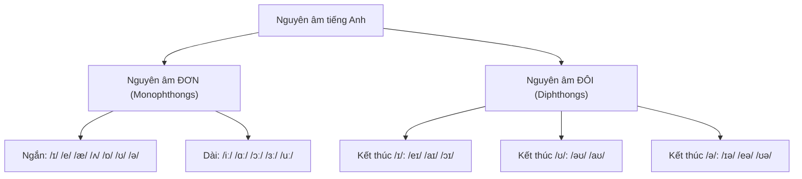

# 🔤 Vowel Sounds — Nguyên âm cơ bản

> [!abstract] Vì sao quan trọng với TOEIC
> - Tiếng Anh có **20 nguyên âm** (12 nguyên âm đơn + 8 nguyên âm đôi) nhưng chỉ có **5 chữ cái nguyên âm** (`a, e, i, o, u`) → chính tả **không** phản ánh trực tiếp cách đọc, phải học theo âm chứ không học theo chữ.
> - **Part 1** hay đánh lừa bằng cặp từ gần âm: *sheep/ship*, *sit/seat* — nghe sai nguyên âm là chọn sai ảnh.
> - **Part 2–4** dùng các cặp *cat/cut*, *full/fool*, *not/nought* để bẫy người nghe không phân biệt được nguyên âm ngắn – dài.
> - Buổi 1: chính tả – phát âm và cặp `/iː/` vs `/ɪ/` — Nguồn: *English Pronunciation in Use Elementary U1-2*.
> - Buổi 2: các cặp nguyên âm ngắn/dài dễ nhầm khác + nguyên âm đôi — Nguồn: *English Pronunciation in Use Elementary U3-6*.

---

## A. Chính tả không bằng cách đọc & cặp `/iː/` vs `/ɪ/`

### 1 chữ cái → nhiều âm, 1 âm → nhiều cách viết

| Hiện tượng | Ví dụ |
| :--- | :--- |
| Chữ `a` đọc khác nhau | `cat` /kæt/ · `make` /meɪk/ · `want` /wɒnt/ · `about` /əˈbaʊt/ |
| Chữ `o` đọc khác nhau | `not` /nɒt/ · `no` /nəʊ/ · `move` /muːv/ · `son` /sʌn/ |
| Âm `/iː/` viết nhiều kiểu | `see` (ee) · `seat` (ea) · `me` (e) · `piece` (ie) · `key` (ey) |
| Âm `/uː/` viết nhiều kiểu | `food` (oo) · `blue` (ue) · `June` (u-e) · `soup` (ou) |

> [!tip] Nguyên tắc học nguyên âm
> Luôn học từ mới cùng **phiên âm IPA**, không đoán cách đọc từ mặt chữ — hai từ viết gần giống nhau (`live` /lɪv/ - sống vs `live` /laɪv/ - trực tiếp) có thể đọc hoàn toàn khác nhau.

### Cặp `/iː/` (dài) vs `/ɪ/` (ngắn) — cặp nguyên âm gây nhầm nhiều nhất

| | `/iː/` — dài, môi giãn, lưỡi cao & căng | `/ɪ/` — ngắn, môi hơi giãn, lưỡi thấp & lỏng hơn |
| :--- | :--- | :--- |
| Khẩu hình | Giữ nguyên âm **lâu**, gần như "kéo dài" | Bật **nhanh**, không kéo dài |
| `sheep` (con cừu) | /ʃiːp/ | — |
| `ship` (con tàu) | — | /ʃɪp/ |
| `seat` (chỗ ngồi) | /siːt/ | — |
| `sit` (ngồi) | — | /sɪt/ |
| `leave` (rời đi) | /liːv/ | — |
| `live` (sống, động từ) | — | /lɪv/ |
| `feel` (cảm thấy) | /fiːl/ | — |
| `fill` (đổ đầy) | — | /fɪl/ |

---

## B. Các cặp nguyên âm ngắn – dài / dễ nhầm khác quan trọng với TOEIC Listening

| Cặp | Mô tả khẩu hình | Ví dụ 1 | Ví dụ 2 |
| :--- | :--- | :--- | :--- |
| `/æ/` vs `/ʌ/` | `/æ/` miệng mở rộng, hàm hạ thấp, âm bẹt · `/ʌ/` miệng mở vừa, ở giữa khoang miệng, âm ngắn gọn | `cat` /kæt/ | `cut` /kʌt/ |
| | | `bag` /bæɡ/ | `bug` /bʌɡ/ |
| | | `ran` /ræn/ | `run` /rʌn/ |
| `/ɒ/` vs `/ɔː/` | `/ɒ/` ngắn, tròn môi nhẹ, hàm mở · `/ɔː/` dài, tròn môi rõ, âm vòm sau | `not` /nɒt/ | `nought` /nɔːt/ |
| | | `cot` /kɒt/ | `caught` /kɔːt/ |
| | | `lock` /lɒk/ | `talk` /tɔːk/ |
| `/ʊ/` vs `/uː/` | `/ʊ/` ngắn, môi tròn lỏng · `/uː/` dài, môi tròn chặt, lưỡi lùi sâu về sau | `full` /fʊl/ | `fool` /fuːl/ |
| | | `pull` /pʊl/ | `pool` /puːl/ |
| | | `look` /lʊk/ | `Luke` /luːk/ |

### Nguyên âm đôi (diphthongs) phổ biến nhất

| Diphthong | Cách đọc | Ví dụ | Cách viết thường gặp |
| :--- | :--- | :--- | :--- |
| `/eɪ/` | trượt từ `/e/` sang `/ɪ/` | `say` /seɪ/, `day` /deɪ/, `late` /leɪt/, `pay` /peɪ/ | `a-e`, `ay`, `ai` |
| `/aɪ/` | trượt từ `/a/` sang `/ɪ/` | `my` /maɪ/, `time` /taɪm/, `price` /praɪs/, `buy` /baɪ/ | `i-e`, `y`, `uy` |
| `/əʊ/` | trượt từ `/ə/` sang `/ʊ/` | `go` /ɡəʊ/, `boat` /bəʊt/, `no` /nəʊ/, `phone` /fəʊn/ | `o`, `oa`, `o-e` |

---

> [!caution] Bẫy nghe TOEIC — nguyên âm ngắn/dài quyết định cả câu
> - **Part 1**: *"There are sheep in the field"* (đàn cừu) khác hoàn toàn *"There is a ship in the water"* (con tàu) — nghe lướt `/iː/`↔`/ɪ/` là chọn sai ảnh ngay.
> - **Part 3–4**: *"He's **leaving** the company next week"* (sắp rời đi) khác *"He's **living** in Singapore"* (đang sống) — nhầm `/iː/` và `/ɪ/` làm sai thông tin về nhân sự/địa điểm.
> - **Part 2**: câu hỏi *"Is it a **cot** or a **caught**?"* kiểu `/ɒ/` vs `/ɔː/`, hay `full`/`fool` — luôn nghe hết cả câu, đừng đoán nghĩa chỉ từ 1 âm tiết.

---

## 🎯 Luyện tập & áp dụng vào TOEIC

1. Đọc to và phân biệt 5 cặp tối thiểu (minimal pairs) sau, chú ý độ **dài** của nguyên âm:
   - `ship` /ʃɪp/ — `sheep` /ʃiːp/
   - `sit` /sɪt/ — `seat` /siːt/
   - `cat` /kæt/ — `cut` /kʌt/
   - `not` /nɒt/ — `nought` /nɔːt/
   - `full` /fʊl/ — `fool` /fuːl/
2. Điền IPA đúng cho các từ sau: `live` (động từ, "to reside") = [], `leave` = [], `bag` = [], `bug` = [], `pool` = [].
3. Nghe một đoạn audio Part 1/2 bất kỳ (EPIU Elementary CD, U1-6) và ghi lại **3 cặp từ gần âm** bạn nghe nhầm — luyện lại bằng shadowing.
4. Xác định nguyên âm đôi trong các từ: `phone`, `price`, `today` → viết IPA đầy đủ.

> [!success]- 🔑 Đáp án
> | Từ | IPA | Ghi chú |
> | :--- | :--- | :--- |
> | `live` (động từ) | /lɪv/ | Ngắn `/ɪ/`, khác `leave` /liːv/ |
> | `leave` | /liːv/ | Dài `/iː/` |
> | `bag` | /bæɡ/ | `/æ/` — miệng mở rộng |
> | `bug` | /bʌɡ/ | `/ʌ/` — âm giữa, ngắn gọn |
> | `pool` | /puːl/ | Dài `/uː/`, khác `pull` /pʊl/ |
> | `phone` | /fəʊn/ | Diphthong `/əʊ/` |
> | `price` | /praɪs/ | Diphthong `/aɪ/` |
> | `today` | /təˈdeɪ/ | Diphthong `/eɪ/` ở âm tiết cuối |

---
Trở về: [[TOEIC MOC]] | [[English Pronunciation in Use MOC]]
