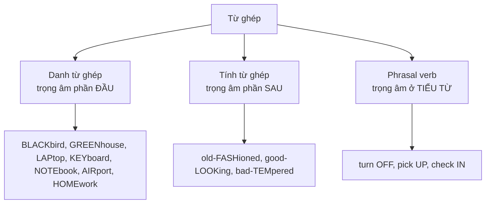

# 🔊 Word Stress — Trọng âm từ

> [!abstract] Vì sao quan trọng với TOEIC
> - Nghe **Part 1–4** sai trọng âm là mất cả câu: `THIRteen` (13) vs `THIRty` (30), `a GREENhouse` (nhà kính) vs `a green HOUSE` (căn nhà sơn xanh).
> - **Part 5** phân biệt từ loại bằng trọng âm: `PHOtograph` (n) → `phoTOgraphy` (n) → `photoGRAPHic` (adj).
> - Nói đúng trọng âm giúp **shadowing** chuẩn, phản xạ nghe nhanh hơn.
> - Nguồn: *English Pronunciation in Use – Elementary (U28–32)* và *Intermediate (U28–31: two-syllable words, compounds, suffixes)*.

---

## A. Từ hai âm tiết (two-syllable words)

| Từ loại | Quy tắc | Ví dụ |
| :--- | :--- | :--- |
| **Danh từ** | Trọng âm **âm 1** | `TAble`, `DOCtor`, `OFfice`, `MANager`, `MEETing` |
| **Tính từ** | Trọng âm **âm 1** | `HAPpy`, `BUSy`, `MODern`, `USEFul` |
| **Động từ** | Trọng âm **âm 2** | `deCIDE`, `reLAX`, `aGREE`, `exPLAIN`, `forGET`, `reTURN` |

### Cặp từ đổi trọng âm theo từ loại — bẫy kinh điển
| Danh từ (âm 1) | Động từ (âm 2) |
| :--- | :--- |
| `REcord` (bản ghi) | `reCORD` (ghi lại) |
| `INcrease` (sự tăng) | `inCREASE` (tăng) |
| `EXport` (hàng xuất) | `exPORT` (xuất khẩu) |
| `IMport` (hàng nhập) | `imPORT` (nhập khẩu) |
| `PERmit` (giấy phép) | `perMIT` (cho phép) |
| `PREsent` (món quà) | `preSENT` (trình bày) |
| `CONtract` (hợp đồng) | `conTRACT` (ký kết) |
| `PROtest` (cuộc phản đối) | `proTEST` (phản đối) |

---

## B. Từ dài (3 âm tiết trở lên)

> [!tip] Quy tắc "đếm ngược 3" (penultimate / ante-penultimate stress)
> Phần lớn từ 3 âm tiết trở lên có trọng âm rơi vào **âm tiết thứ 3 tính từ cuối lên**.

- `PHOtograph` → `phoTOgrapher` → `photoGRAPHic`
- `EConomy` → `ecoNOMic`
- `BIology` → `bioLOGical`
- `comMUnicate` → `communiCAtion`
- `NEcessary` → `neCESSity`

### Đuôi từ HÚT trọng âm về âm tiết NGAY TRƯỚC nó
`-ion`, `-ic`, `-ical`, `-ity`, `-ify`, `-ial`, `-ious`, `-ian`

| Gốc | Thêm đuôi | Trọng âm |
| :--- | :--- | :--- |
| `EDucate` | `eduCAtion` | âm 3 |
| `deCIDE` | `deCIsion` | âm 3 |
| `EConomy` | `ecoNOMic` | âm 3 |
| `Able` | `aBIlity` | âm 3 |
| `OFfice` | `offiCial` | âm 3 |
| `MUsic` | `muSIcian` | âm 3 |

### Đuôi KHÔNG làm đổi trọng âm
`-ing`, `-ed`, `-ly`, `-ful`, `-less`, `-ness`, `-able`, `-ment`, `-er/-est`

- `deVElop` → `deVElopment`
- `CONfort` → `CONfortable`
- `HAPpy` → `HAPpiness`
- `CAREful` → `CAREfully`

---

## C. Compound words (từ ghép)

> [!caution] Danh từ hóa phrasal verb thì trọng âm ĐẢO LẠI
> - Động từ: *Please **turn OFF** the light.* / *Can you **pick me UP** at 8?*
> - Danh từ: *a **TURNoff*** (lối rẽ), *a **PICKup*** (sự đón), *a **CHECK-in*** (quầy làm thủ tục).

### Số `-teen` vs `-ty` — bẫy nghe số kinh điển
| Số | Trọng âm | Cách đọc |
| :--- | :--- | :--- |
| `thirTEEN` (13) | âm **2** | /ˌθɜːˈtiːn/ |
| `THIRty` (30) | âm **1** | /ˈθɜːti/ |
| `fourTEEN` (14) | âm **2** | /ˌfɔːˈtiːn/ |
| `FORty` (40) | âm **1** | /ˈfɔːti/ |

---

## 🎯 Luyện tập & áp dụng vào TOEIC

1. **Đánh dấu trọng âm** (ˈ) cho 10 từ mới mỗi ngày khi học từ vựng: `inˈcrease`, `ˈcontract`, `reˈcord`.
2. **Shadowing 15–20'/ngày**: nghe – nhắc lại nguyên câu, giữ đúng nhịp và trọng âm (dùng audio EPPIU Elementary CD, unit 30–32).
3. **Phân biệt theo ngữ cảnh Part 1**: nghe `ˈGREENhouse` (nhà kính) khác `green ˈHOUSE` (nhà sơn màu xanh).
4. **Part 4 – Talks**: trọng âm câu giúp bắt từ khóa (thường rơi vào danh từ, động từ chính, số liệu).
5. **Tự kiểm tra**: đọc to 5 cặp từ dưới đây và kiểm tra lại bằng từ điển (IPA có dấu ˈ):
   - `ˈexport` (n) / `exˈport` (v)
   - `ˈpresent` (n) / `preˈsent` (v)
   - `ˈphotograph` / `phoˈtographer` / `photoˈgraphic`
   - `ˈcomfortable` / `ˈcomfortably`
   - `ˈthirteen` / `ˈthirty`

> [!success]- 🔑 Đáp án nhanh phần tự kiểm tra
> | Từ | Trọng âm | Ghi chú |
> | :--- | :--- | :--- |
> | `ˈexport` / `exˈport` | âm 1 (n) / âm 2 (v) | Quy tắc danh từ – động từ |
> | `ˈpresent` / `preˈsent` | âm 1 (n) / âm 2 (v) | Quy tắc danh từ – động từ |
> | `ˈphotograph` | âm 1 | Danh từ gốc |
> | `phoˈtographer` | âm 2 | Đuôi `-er` không đổi trọng âm gốc, nhưng gốc đã dịch |
> | `photoˈgraphic` | âm 3 | Đuôi `-ic` hút trọng âm |
> | `ˈcomfortable` | âm 1 | Đuôi `-able` không đổi trọng âm |
> | `ˈthirteen` | âm 2 | `-teen` = trọng âm âm 2 (thực tế /ˌθɜːˈtiːn/) |
> | `ˈthirty` | âm 1 | `-ty` = trọng âm âm 1 |

---
Trở về: [[TOEIC MOC]]
